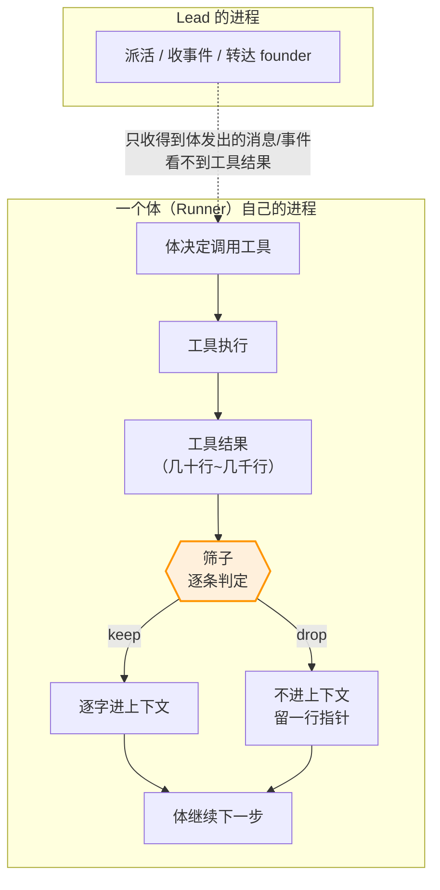
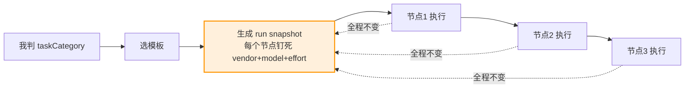
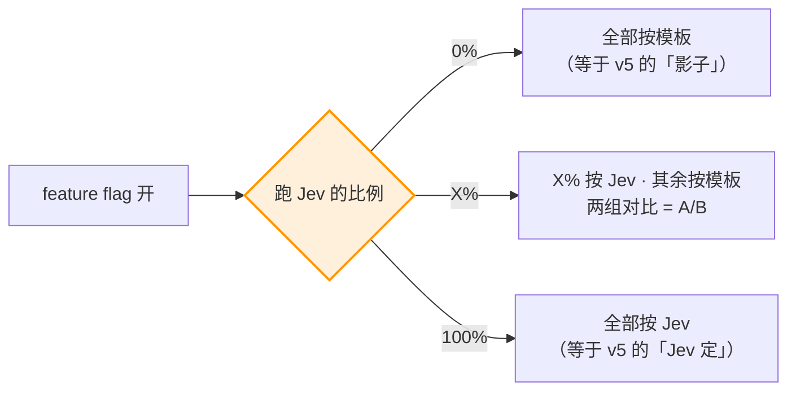
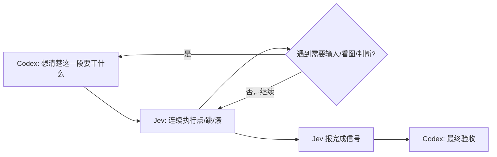

# FLY-2736 把「高频小判断」从大模型身上拆出来 — PRD v12

Issue: FLY-2736 (https://linear.app/geoforge3d/issue/FLY-2736)
日期: 2026-09-24（v12 · 按外部项目 mu 的回测改顺序与设计；八格已重测）；2026-09-22（v11 · 合入前复测已跑完；v10 同日）；v9 于 2026-09-20，v8 于 2026-09-19，v1–v7 于 2026-09-18
基于: **v12**：founder 2026-09-24 23:34Z 回「sg」（✅ 原话；🔶 我理解为 sounds good）批准下文 §4.5 列的改动；
      外部证据 GitHub `qybaihe/mu`（MIT，2026-09-22 开源）仓库 `kyrn/docs/08-jev-retrospective.md`、`09-test-log-admission.md`（✅ 已读原文，作者自写的回测）；
      v1（同日，founder 读后的原话：「写得太精简了，我很难看到说到底要做什么」
      「每一个 option 都需要更详细一点」「每一个 section 底下都要留地方让我留 comments」）；
      founder 2026-09-18 16:19Z 直令；
      research（2026-09-17 夜本机实测，结论已并入本文 §1.3 / §2 / §4 / §6）——
      ⚠️ 原托管页 fbcb5e03 已随 9-18 换号失效，**本文不再引用任何托管页 URL**；
      所有读数为 2026-09-17 夜 ~ 2026-09-18 16:20Z 之间的本机实测

> **v12 改了什么 —— 看了一个把 Jev 接进 harness 的开源项目（mu）的回测，改顺序和设计，不改红线**
> - **顺位**：⑥ Lead 叫醒判定 → **第一**；① 上下文筛子 → 第二，并**改成三层**（规则折叠 → 源头少打印 → 剩下的才问 Jev）
> - **⑤ 浏览器暂缓**：前置加一条「独立的『做成了没』检查」
> - **③ 晚点开**：节点模型 A/B 已于 2026-09-24 上线，③ 在它出结果前只记录、不生效
> - **新增两件所有候选共用的东西**：每项开关改成 **关 / 影子 / 生效** 三档；一本 **判决账本**
> - ②④ 不变；红线（§6）一个字没改；八格已按 §0.2 重测（三格变了，一格读数没变但原因是「没有新数据」）
> - 细节与证据见新增的 **§4.5**；v11 的改动记录见 §10

---

## 0. 这份 PRD 的读法

### 0.1 成色三层，不许混

| 标记 | 含义 |
|---|---|
| ✅ | 她的原话 / 我本机实测的读数 |
| 🔶 | 我或他人的判断、转述 |
| ⬜ | 无出处 / 未验 |

### 0.2 ⚠️ 本文含状态表，保质期以小时计 —— 合入前必须逐格重测

判据来自 FLY-2642 更正 ⑤（含状态表的文档，合入前每一格当场重测）。

🔴 **v9 更正：上一版这里只写了「§2 与 §5.4」，实际会过期的读数分布在六节。** 少写的那几节正是最容易被跳过的 ——
**因为没被点名的格子，读的人不会知道它需要重测。**

**下表是合入 main 的前置条件，不是提醒。** 每行填上复测时间才算数；**任何一行的「复测于」是空的，这份 PRD 就还不能合。**

| # | 读数（写在哪一节） | 上次测于 | 去哪里重测 | 复测于 |
|---|---|---|---|---|
| R1 | Jev 的价格 / 延迟 / evaluate 模态 / 能力边界（§2 表 5 行） | 2026-09-17 夜 | Vercel AI Gateway 的模型页 + 官方博客（第三方，可能改价或改接口） | 2026-09-22 ✅ 价 **$0.042**/1M 输入（原记 0.04，已改）· 输出仍免费 · 仍是 evaluate 模态 · **v12 2026-09-24** ✅ 网关模型目录：仍 $0.042/1M 输入、输出 0、`evaluation` 模态 |
| R2 | 现有 `VERCEL_TOKEN` 打网关返回 401（§2） | 2026-09-17 夜 | 重打一次；**若 founder 期间建了 key，这一格会翻面**，④⑤ 的前置随之变化 | 2026-09-22 ✅ 仍 **401**，结论不变 · **v12 2026-09-24** ✅ 仍 **401** |
| R3 | 模型梯子只剩 fable / opus（§1.3、§5.3） | 2026-09-18 | `~/.flywheel/models.json` + fleet 政策；**这一格变了，§1.3「省钱理由不成立」整段要重写** | 2026-09-22 ✅ `models.json` tiers 仍是 heavy→fable、其余→opus-5，**两个**，结论不变 · **v12 2026-09-24** 🔶 **文件形状变了、结论不变**：`models.json` 的 `tiers` 只剩 `heavy→fable`，其余档走内置默认 → opus（`packages/config/src/model-builtins.ts`），仍是两个模型。⚠️ 另：`modelSplit.enabled=true`（按节点分流做模型 A/B，文件改于 2026-09-24 12:29 PDT），见 §5.3 v12 注 |
| R4 | 告警路由：590 条 / 22 类 / 20 类为 0% 或 100% / 22 行表对 589/590（§4、§6） | 2026-09-18 | 按同一口径重数告警表；⚠️ 口径必须与上次逐字相同，否则是我换了尺子不是世界变了 | 2026-09-22 ⚠️ **口径不一致，未能按原口径重测** —— 见 §4 注 · **v12 2026-09-24** ⚠️ 同 v11：原口径仍未找回，未重测，仍不作强证据 |
| R5 | `task_category` 818 条、`current_qa_attempt` 整列 NULL（§4、§5.2） | 2026-09-18 | `workflow_run`；**NULL 这一格若被补上，候选②从「只能做一致性研究」升级为可做准确率研究** | 2026-09-22 🔴 **变了**：887 条 run，`current_qa_attempt` 非空 **34 条**（不再是整列 NULL）—— 见 §5.2 注 · **v12 2026-09-24** ✅ 987 条 run、`task_category` 非空 890、`current_qa_attempt` 非空仍 **34** —— 两天没增长 |
| R6 | dry run 三道门：2080 快照 / 150 卡 / eligible=0 / `primary_snapshot_missing` 844（§5.4） | 2026-09-18 | `auto_narrow_opinion_snapshot`；**这是候选④硬前置的全部依据**，门1 若已修，④ 的前置条件要整条改写 | 2026-09-22 ✅ 2128 快照 / 164 卡 / `eligible=1` 仍 **0**；`primary_snapshot_missing` 863，结论不变 · **v12 2026-09-24** ⚠️ **读数与 v11 一字不差**（2128 / 164 / eligible 0 / `primary_snapshot_missing` 863），**但原因是这张表最后一行写于 2026-09-19T06:29Z，之后再没新行** —— 「没变」是因为没有新数据，不是情况稳定。Tadashi 确认是**有意停用**（见 §8 Q8） |
| R7 | 真标签：声明 `pure_docs` 9 次 vs 机器 `docs_only` 0 次（§5.4） | 2026-09-18 | `auto_merge_shadow_declaration` / `..._observation`；样本数会随时间增长，**9 这个数只会变大** | 2026-09-22 ✅ `pure_docs` 仍 **9**，机器侧 `docs_only` 仍 0，结论不变 · **v12 2026-09-24** 🔴 `pure_docs` 9 → **15**；机器侧仍无 `docs_only` |
| R8 | Lead 叫醒：7 天 8780 条 / 91% 进模型 / 约 77% 可由类型表判 / 真提问 384 / 引擎告警 413（§5.6） | 2026-09-18 | `lead_events`（flywheel-eng-lead，近 7 天滚动窗口）；⚠️ **滚动窗口 ⇒ 这一格每天都在变**，且 Tadashi 已在直接做那张类型表，**修完之后这些比例必然不同** | 2026-09-22 ✅ 近 7 天 **8110** 条事件（原 8780），同量级，结论不变 · **v12 2026-09-24** 🔴 近 7 天 **6931** 条（原 8110）；进模型 5648（**81%**，原 91%）、只记账 1283（19%）—— 类型表已在起作用，⑥ 剩下那部分的量要按新比例重算（§5.6 v12 注） |

⛔ **不列入重测**：§5.5 引的 jev-use ≈2.6 倍（外部 release 的固定实测值，不随我们变）、founder 的原话、以及所有标 🔶 的判断。

📌 为什么写成表而不是一句话：一句「合入前重测」要求合入的人**在那一刻想起来**；一张带空栏的表，**没填就看得出来没填** —— 包括被别人看出来。

> **founder 批注（§0）**：
> _（留空）_

---

## 1. 问题定义

### 1.1 她要解决的是什么（✅ 原话）

> 「我觉得你说的这3个option都可以。然后 ship 的那个，其实我也想试一下可不可以用 Jev 来做……
> 那我们讲的所有这些 option 都是可以出 PRD，之后让 Tadashi 去做，
> 因为这些东西我想到时候都可以开个 feature flag 看一下效果。」

### 1.2 真正的问题，用一个我们自己的场景说清楚（🔶）

今天一个体在干活时，会不停地做这样的小判断：

```
这条 grep 出来的 800 行，有用吗？
这个任务算 code 还是 simple_code？
这一轮需要想多深？
这个 PR 是不是只改了文档？
```

**每一个这样的判断，今天都由一个前沿大模型顺带做掉。** 代价不只是钱：

- 它要**读进上下文**才能判（于是上下文被它判断的材料本身撑大）；
- 它判完还要**说出来**（于是占掉输出与轮次）；
- 它**没有固定格式**（于是下游只能再解析一次）。

**Jev 这类 System One 模型专门做这一类**：不生成文本，只往预先定义好的槽位里填值 + 给概率。

### 1.3 ⛔ 但网上最响的那个理由对我们不成立（✅ 实测）

主流玩法是「判难度 → 路由到更便宜的模型省钱」（`jev-codex-router` 实测省约 60%）。
**我们省不出这 60%**：`~/.flywheel/models.json` 的四个难度档只映射到 **fable 与 opus 两个模型**（Sonnet 由 founder 明令禁用）。

⇒ **本 PRD 不以省钱为主张。** 要的是三样：**不丢活、少打扰人、把判断和生成拆开。**

> **founder 批注（§1 问题定义）**：
> _（留空）_

---

## 2. Jev 的事实（✅ 全部实查，2026-09-17 夜）

| 项 | 读数 | 出处 |
|---|---|---|
| 调用方式 | `typesafe-ai/jev`，走 AI SDK 7 的 **evaluate** 模态（不是 chat） | Vercel AI Gateway |
| 价格 | **$0.042**/1M 输入（2026-09-22 复测；9-17 记的是 0.04），输出免费；单次决策 ≈ $0.00003 | 同上 / `jev-codex-router` 作者实测 |
| 延迟 | 官方 70–500ms；真实路由器实测 ≈0.6s/次 | 官方博客 / 同上 |
| 我们能不能调 | ❌ 现有 `VERCEL_TOKEN` 打网关 **401**，需单独建 AI Gateway key（只有 founder 能建） | 我实测 |
| 不能做什么 | 无文本、无理由、无 agentic；**可返回类型合法但值是错的结果** | 独立评测 |

⚠️ 厂商自称 193 倍快 / 444 倍便宜是**内部自造对比**；外部一次实测中它漏掉了一个 Fable 能抓到的缺陷。

> **founder 批注（§2 Jev 事实）**：
> _（留空）_

---

## 3. 目标 / 非目标

**目标**
- G1 **不丢活**：体不再因上下文被垃圾撑爆而被换掉。
- G2 **判断与生成分离**：高频小判断不再占前沿模型的轮次与上下文。
- G3 **每项独立开关、独立证伪**：一候选 = 一 flag = 一组可离线复算的读数。**v12：每个 flag 是「关 / 影子 / 生效」三档，所有判决进同一本账（§4.5）。**

**非目标（⛔）**
- ⛔ 省钱不是主张（§1.3）。⛔ 不做通用模型路由器。⛔ 不碰任何闸（§6）。
- ⛔ 不选实现方案、不拆工程单（归 Tadashi）。⛔ PM 验收 = 未来 FLY-830。

> **founder 批注（§3 目标）**：
> _（留空）_

---

## 4. 一条贯穿全篇的准入判据

**每个候选在写实验方案前必须先答两问：**

```
Q-A  这件事今天是【确定性】的吗？   是 → 不许用模型替掉
Q-B  有没有【真标签】？谁核的？     没有 → 只能做一致性研究，不能声称准确率
```

**两次实测证明它不是空话：**
- ⚠️ **告警路由被否掉**（9-18 读数：590 条 / 22 类 / 20 类为 0% 或 100% / 22 行表对 589/590）。
  **2026-09-22 复测没能按同一口径重跑**：现库 `alert_threads` 1063 条 / 43 类，按 `lead_id` 取每类多数的查找表只覆盖 **941/1063（88.5%）**，18 类不唯一。
  ⚠️ 但我**不确定 `lead_id` 就是当初那次量的那个字段**——很可能是我换了尺子，而不是世界变了。
  ⇒ **在按原口径重测之前，这条不再作为「一张表就够了」的强证据使用。** §6 的红线本身不依赖它（红线的理由是「别用模型替掉确定性判据」，与这次读数无关）。
- ✅ **类型预判被降级**：818 条历史有 `task_category`，但对错标签 `current_qa_attempt` 当时**整列 NULL**。
  🔴 **2026-09-22 复测：已经不是零** —— 887 条 run 里 34 条有值（3.8%）。样本仍然太少，「只能做一致性研究」这个结论**暂时不变**，但它从「不可能」变成了「还不够」，**下一轮复测要重新看**。

> **founder 批注（§4 准入判据）**：
> _（留空）_

---

## 4.5 v12 新增：一个外部项目的回测告诉我们什么

### 4.5.1 mu 是什么（✅ 读原文，2026-09-24）

- GitHub `qybaihe/mu`，MIT，2026-09-22 开源，基于编码 agent pi；作者自称「还没正式发布」。
- 它在每一轮对话里设了 **35 个判断点**交给 Jev：这段输出要不要进上下文、这条命令你要过吗、真做完了吗……
- 每个判断点可以单独切 **关 / 影子 / 生效**，可以单独指定「由谁来判」；每一次判决（问题、答案、概率、耗时）都进账本。

### 4.5.2 作者自己的回测（✅ 原文数字 · 出处 `kyrn/docs/08-jev-retrospective.md`、`09-test-log-admission.md`）

| 它家的判断点 | 读数 | 对应我们 |
|---|---|---|
| 工具输出逐段判「留不留」 | 194 批、2,412 段，判「删」的 **0** 段；却占了 Jev 全部已记录输入的 **54%**；每批耗时中位 1.35 秒 | ① |
| 测试日志：把一字不差的重复段折成一行（**不调 Jev**） | 7 份真实长失败日志净省 **51.0%**；15 份展开后逐字节还原全部通过；真实日志上留给 Jev 判的候选 **0** 个 | ① |
| 藏掉与当前任务无关的技能说明 | 13 个会话实际藏掉 511 个实例，每会话中位数约 40 | 与⑥同类 |
| 多个 agent 的发现要不要放上共享白板 | 662 条候选、89 条通过（13.4%） | 与⑥同类 |
| 浏览器：Jev 选下一步点哪里 | 14 次真实浏览任务：2 次做成、10 次卡住、2 次异常；单次判定中位 0.29 秒；「做完了」由同一个 Jev 判 | ⑤ |
| 判消息类型、给子 agent 选模型档 | 有在用；作者写明「缺对照，暂不量化收益」 | ②③ |

**成色（必须和数字一起读）**：样本是作者 **2 天、32 份会话记录**；**没有「开 Jev / 不开 Jev」的对照**。作者原文：「没有依据宣称 Jev 已带来某个百分比的成本或成功率提升。」
⇒ 这些数字只用来**调整我们的顺序和设计**，不用来证明 Jev 有没有用。

### 4.5.3 据此的改动（✅ founder 2026-09-24 23:34Z「sg」）

| 候选 | v12 | 一句话理由 |
|---|---|---|
| ① 上下文筛子 | **改成三层；第二顺位** | 收益来自不调模型的规则折叠；Jev 在它家一段没删却最费（§5.1 v12 注） |
| ② 类型预判 | 不变 | 本来就只记分歧、不改派活；mu 无可对照数据 |
| ③ vendor / model / effort | **晚点开** | 节点模型 A/B 已上线，同时开会分不清谁的功劳（§5.3 v12 注；不是 mu 带来的） |
| ④ 自动批第二意见 | 不变 | mu 无可对照数据 |
| ⑤ 浏览器 | **暂缓** | 14 次只做成 2 次，且没有独立的「做成了没」检查（§5.5 v12 注） |
| ⑥ Lead 叫醒判定 | **第一顺位** | Jev 在 mu 真正见效的，都是「这条信息谁需要看」（§5.6 v12 注） |

### 4.5.4 所有候选共用的两件新东西

**A. 三档开关：关 / 影子 / 生效。** 影子档 = 照样判、照样记账，**不改变任何走向**（与 §6 最后一条红线同义）。等于先不冒风险地看它判得准不准。自动批那边已经是同样的三档（off / dry_run / enabled）。③ 原有的「跑 Jev 的比例」旋钮是**生效档内部**的比例，两者不冲突。

**B. 一本判决账本。** Jev 每判一次，记下：哪个候选、问的是什么、答的是什么、有多大把握、花了多久、最后有没有真的被采用。
理由：没有这本账，§7 里每一条「成功的样子」都量不出来；mu 正是翻这本账，才发现工具输出那一项一段都没删。
⛔ 账本不存凭据，不存 founder 消息正文。

### 4.5.5 方案外的三个点子（只记下，不进本方案）

- 「模型说做完了，有没有东西核过」—— 我们每张单已有独立 QA 节点在核，重复。
- 「一条经验反复被调出来却从没被遵守，就退役」—— 得先能记录「哪条经验被调出来过」，我们没有这个记录。
- 「单独一个模型负责把进度讲成人话」—— 戳中 founder 的痛点，但它是一个独立产品，要做就单独开题。

> **founder 批注（§4.5 mu 与 v12 改动）**：
> _（留空）_

---

## 5. 六个候选

### 5.1 候选一 · 上下文筛子（v12：第二顺位 · 改成三层）

> **v12 改动（✅ founder 2026-09-24「sg」）：筛子改成三层，Jev 只管最后一层**
> 依据 §4.5.2：mu 的同款功能判了 2,412 段、一段没删，却占 Jev 输入的 54%；真正的收益来自**不调模型**的规则折叠（真实失败日志净省 51%）。这也是本文 §4 Q-A（确定性的事不许用模型替）的又一次印证。
> ```
> 第 1 层  规则无损折叠：与前文逐字相同的重复段 → 一行回指「同上第 a–b 行，重复 k 次」
>          第一份永远保留；展开回指必须能逐字还原原文
> 第 2 层  源头少打印：能让工具只报失败、少输出的，调用时默认这样开
> 第 3 层  剩下仍然很长的，才问 Jev（下文的 keep / truncate / drop 三档不变）
> ```
> 两条护栏（照 mu）：省下的比回指标记还短就不省；整次净节省太少就原样返回。
> 🔑 **第 1、2 层不需要 Jev，也不需要 AI Gateway key，可以先做先量。** 第 3 层先开到**影子档**，看它到底有没有东西可判（mu 在真实日志上是 0 个），再决定开不开生效。
> 下文 v4 的设计，描述的是第 3 层。


> **✅ founder 批注（v3）**：「你可能要用 mermaid 给我画一下，它实际上是怎么样去调用的。
> 就比如说，它是 lead 会用这个，还是说每一个 runner 会用这个？那它每一次输出的时候，
> 是怎么样去决定说哪一些要去压缩，哪一些又是要去 filter？你现在这个太简略了。」
> **↓ 本节按这三问重写。**

#### 先回答「谁用它」：每一个体自己用，Lead 根本看不到（✅ 结构事实）



**⇒ 筛子必须住在体自己的进程里，每个体各有一份。** 理由是结构性的：**工具结果从来不经过 Lead** —— 体在自己的进程里跑工具、结果直接进自己的上下文；Lead 只收得到体主动发出的消息和引擎事件。**Lead 想筛也筛不到。**

📌 由此推出三条产品性质的结论：
1. **它是「每个体一份」的东西**，不是集中式服务 ⇒ 开关也应该是每体可关（按项目/按节点类型），不是一个全局开关。
2. **它必须极快**，因为它挡在体的每一次工具调用之后 ⇒ 一次 ≈0.6 秒的判断，在一个动辄几百次工具调用的体上是可感的成本。⚠️ 这条我在 v3 没写，是漏的。
3. **它失败时体不能卡住** ⇒ 判不出来、超时、服务不可用 —— 一律**原样放行**（默认是留，不是丢）。

#### 再回答「每次怎么决定」：判什么、输出什么（🔶 产品规格，实现归工程）

**每一条工具结果触发一次判定**，输入是「这次调用的意图 + 结果本身」，输出是固定槽位：

```
输入给筛子：
  体这一步想干什么      （例：找 delivery_contract 在源码里的定义）
  工具是什么 / 参数      （例：grep -rn "delivery_contract" packages/）
  结果本体              （400 行）

筛子输出（固定 schema，不是自由文本）：
  decision:  keep | truncate | drop
  keep_span: 若 truncate，保留哪一段（行号区间）
  confidence: 0~1
```

**三档而不是两档，是这一节的关键**（v3 只写了「留/丢」，太粗）：

| 档 | 什么时候用 | 结果 |
|---|---|---|
| `keep` | 与当前意图直接相关 | **逐字全留**，一个字不改 |
| `truncate` | 大部分无关、但有一小段相关 | 只留相关那一段 + 一行「此处截断，完整内容可重取」 |
| `drop` | 与当前意图无关 | 不进上下文，留一行指针（工具 + 参数 + 时间） |

**默认与兜底：**
```
confidence 低于阈值        → keep（不丢）
筛子超时 / 不可用          → keep（不丢）
体明确要求完整输出         → 跳过筛子
用户消息 / 体自己的输出     → 永不进入筛子
```

#### 一个真实例子（🔶 用我们自己的形状举）

体在查一个病根，跑 `grep -rn "delivery_contract" packages/` 拿回 400 行：380 行是测试文件命中、20 行是源码命中。
```
筛子判 truncate：留源码那 20 行 + 一行「此处截断了 380 行测试命中，可用同一条命令重取」
体的下一步不受影响，上下文少了 380 行
```

#### 它什么时候不作用 / 出错长什么样

- 不作用：体要求完整输出、非工具内容、判不准或服务不可用（一律放行）。
- **唯一致命的失败：丢掉了后文真的被引用到的内容。** ⇒ 验证方式不是「省了多少」，而是回放一个已完成体的全流程，逐条检查被丢的内容有没有在后文出现过。**出现一次即否决。**
- 次要失败：**筛子本身太慢**，把省下的上下文换成了等待。⇒ 验证要同时记每次判定耗时。

#### flag 与最小验证

| | |
|---|---|
| **flag** | 独立 flag，默认 off；**按项目 / 按节点类型**可单独开，不是一个全局开关 |
| **标签** | ✅ 不需要历史标签，离线回放即可 |
| **最小验证** | 回放一个已完成体的全部工具结果：① 三档各占多少；② **有无丢掉后文引用到的内容**（唯一失败判据）；③ 每次判定耗时分布。不接生产 |
| **⛔ 不许** | 不许摘要或改写保留内容；不许碰用户/助手文本；不许在体运行中途改动已在上下文里的东西；不许在判不准时丢 |

> **founder 批注（§5.1 上下文筛子）**：
> _（留空）_

---

### 5.2 候选二 · 派活时的任务类型预判

#### 今天是什么样

我（Lead）在派活时判一个 `taskCategory`（`code` / `simple_code` / `prd` / `product_design_flow` / `prototype` / `generic`），这个值**决定了整条流水线的形状**：走哪个模板、几个节点、每个节点用什么模型和 effort。判错的代价是整条链子跑错形状。

#### 改完是什么样

派活前先拿到一份**建议 + 概率**，例如：

```
建议: simple_code   0.71
次选: code          0.24
其余合计            0.05
```

**我仍然是决定者。** 建议只被记录，不改变任何派发行为。当我的决定与建议不一致时，这条分歧被单独记下来。

#### 为什么值得做，即使它不能替我决定（🔶）

**分歧样本本身就是产物。** 818 条历史里我判过的每一次，都藏着一条没写下来的规则。当机器与我长期在某一类上分歧，说明**那一类的判据本来就含糊**——该改的是规矩，不是模型。

#### 它什么时候不作用

- ⬜ 类别枚举将来若变化，历史建议不可跨版本比较（版本要记进记录）。
- 派活来自 founder 直接指定时 → 不建议、不记录。

#### 出错长什么样

它不会造成生产事故（不改变行为），**它的失败方式是「无用」**：如果只产出一个一致率数字而没有可读的分歧样本，这一项就白做。

#### flag 与最小验证

| | |
|---|---|
| **flag** | 独立 flag，默认 off；开启后只写建议 |
| **标签** | ⚠️ **无独立对错标签**（`current_qa_attempt` 整列 NULL）⇒ **只能做一致性研究** |
| **最小验证** | 818 条历史离线跑一遍，只看分歧率 + 分歧样本 |
| **⛔ 不许** | 不许替 Lead 决定；不许把建议写进任何下游会当事实读的字段 |

> **founder 批注（§5.2 类型预判）**：
> _（留空）_

---

### 5.3 候选三 · 派活时定的那三个维度：vendor / model / effort（v12：晚点开）

> **v12 注（不是 mu 带来的，是这两天的新情况）**：节点模型 A/B 已于 2026-09-24 上线（`models.json` 的 `modelSplit.enabled=true`：设计三组各 1/3、实现 2:2、QA 3:1）。
> ③ 若同时按任务调 effort，两个实验的效果会混在一起，**分不清是模型的功劳还是 effort 的**。
> ⇒ **模型 A/B 出结果之前，③ 最多开到影子档**（只记录建议和差异，不生效）；下文「跑 Jev 的比例」旋钮在那之前保持 0%。


> **✅ founder 批注（v3）**：「我没有完全明白，你能画个图给我解释一下它是什么时候来定这个档位吗？
> 是指我们在把这个 task schedule 出去的时候，就定好每一个节点要用什么 effort？还是说 task 已经跑出去了，
> 在中间实际执行的过程中动态调整？另外，既然都定 effort 了，为什么只定 effort，
> 而不把 model（用 Claude 还是 Codex）也一起定下来呢？」
> **↓ 本节重写，并且：你这一问指出了我 v3 的一个漏洞，见下面的更正。**

#### 🔴 更正：v3 只写 effort 是我漏了，vendor 这一维我没考虑（✅ 代码确认）

我 v3 的原话是「模型那一维被政策锁死了，但 effort 是活的」。**这句话只对了一半。**
`workflow-run-snapshot.ts:506-519` 明确要求每个执行节点**三个维度都必须钉死**：

```
if (!node.vendor || !node.model || !node.effort) throw
  "workflow node <id> requires pinned vendor, model, and effort"
⇒ dispatchPinned: true, dispatch: { vendor, model, effort }
WorkflowVendor = "claude" | "codex"
```

⇒ **三个维度在同一个地方、同一时刻被定死**，而我只讨论了其中一个。**vendor 那一维是活的，我漏了。**

#### 回答「什么时候定」：派活那一刻定死，整条 run 不再变（✅ 代码确认）



**今天是「静态」的：派活那一刻由模板一次性钉死，跑起来之后引擎没有任何改这三样的路径。**
⇒ 所以你问的两种可能里，**今天是第一种**（schedule 出去时就定好），第二种（跑的过程中动态调整）**现在根本不存在**。

#### 所以这里其实是两条完全不同的路，请你选（🔶 这是本节要你定的）

| | **A · 派活时定得更准**（静态） | **B · 跑的过程中动态调整**（动态） |
|---|---|---|
| 决定时刻 | 还是那一刻，但多一份 Jev 的建议 | 每一轮开始前重判一次 |
| 改动面 | 小：多写一份建议，形态同候选② | **大**：引擎今天要求 snapshot 钉死，这条路要先让「可变」成为合法状态 |
| 风险 | 低：判错就是照旧 | 中：一条 run 里前后节点行为不一致，复盘时更难归因 |
| 我的建议 | ✅ **先做 A** | 等 A 的分歧样本证明「派活时确实经常判错」再考虑 |

#### ✅ founder 已选 A，并问下一步（2026-09-18 21:27Z 原话）

> 「A is fine, but at some point maybe we could just rely on jev? if it is working well?」

**回答：可以，而且应该把这条路现在就写下来 —— 否则「工作得好」永远没有定义，要么永远到不了那天，要么在没有证据的时候悄悄滑过去。**

#### 🔴 一个关键事实：光靠 A，证明不了 Jev 更好（🔶 但这是结构性的）

A 路下，run **实际执行的是模板的选择**，Jev 的建议只被记录。所以 A 能测出的只有：

```
✅ 能测：Jev 和模板【一不一致】（一致率 + 分歧样本）
❌ 测不出：如果听了 Jev，结果会不会【更好】  ← 因为从来没有按它跑过
```

⇒ **「working well」在 A 阶段是不可测的。** 要回答它，必须有一小部分 run **真的按 Jev 的选择跑**。所以毕业路径必须多一步。

#### 毕业路径：一个开关 + 一个「跑 Jev 的比例」（✅ founder 2026-09-19 04:04Z 定）

> 「我觉得不用金丝雀发布，直接开一个 Feature Flag，到时候直接做 A/B testing 去调节。
> 当然，这也可能叫金丝雀，就是做 A/B testing 的时候，只要去调节跑 Jev 的比例就可以了。」

**⇒ v5 的三段（影子 / 金丝雀 / Jev 定）收成一个旋钮。** 三段本来就是同一个旋钮的三个位置，她的写法更简单，**没有丢任何东西**：



**比例由 founder 调。** A/B 看的三个量（🔶 我的建议，口径待定）：
```
QA 通过率 · 返工次数 · 耗时        ← Jev 组 vs 模板组
```

**无论比例调到多少，下面三条都不变（是写死的规则，旋钮越不过去）：**
```
⛔ QA / ship 节点的 effort 永远不降
⛔ 厂商必须先过能力规则（见下）
⛔ 判不准 → 用模板原值
```

**我建议补一条自动保护（🔶 等她确认）：** 任何一条护栏被触发 → 比例**自动归零**并通知 founder，不等人发现。
理由：比例是她手动调的，调上去之后没人盯着；护栏被触发恰恰是「Jev 在做它不该做的事」的信号。

**一个很小的建议（🔶）：** 在按模板跑的那一组里，**也把 Jev 的建议记下来**（不执行）。零成本，好处是能看到「如果那一组也听 Jev，会在哪里不一样」—— 让 A/B 的结果更好解读。

#### 三个维度，毕业的终点不一样

| 维度 | 能不能毕业到「Jev 定」 | 理由 |
|---|---|---|
| **effort** | ✅ **能**，走上面三段 | 选错的代价是质量波动，会被 QA 拦住，可测可退 |
| **模型** | ✅ 能，但**意义不大** | 可选空间只有 fable / opus 两个 |
| **厂商** | ⚠️ **只能部分毕业** | **能力需求是确定性事实**（这个节点要不要语音 / 浏览器）⇒ 按 §4 准入判据 Q-A，确定性的不交给模型 |

**厂商的折中方案（🔶 我的建议）：**
```
第一步  能力规则先筛：这个节点需要什么能力 → 只留下能干这活的厂商
第二步  若只剩一家 → 直接定，不问 Jev
       若两家都能干 → 才让 Jev 在两家之间选（这时选错只是「更慢/更贵」，不是「干不了」）
```
⇒ **Jev 永远只在「两个都能干」的范围里挑，永远不会把一个语音节点派给起不了语音的载体。**

#### 三个维度各自的可动空间不一样（✅ 实测 + 🔶 判断）

| 维度 | 今天怎么定 | 可动空间 | 备注 |
|---|---|---|---|
| **effort** | 模板按节点钉 | ✅ 真活 | ⛔ QA / ship 节点不许降 |
| **model** | 模板按节点钉 | ⚠️ 小 | 四个难度档只映射到 fable / opus 两个（Sonnet 被你禁）⇒ 省钱空间接近零 |
| **vendor** | 模板按节点钉，`claude` \| `codex` | ✅ 真活，**但不是成本问题** | 见下 |

**vendor 这一维的性质和另外两个不同：它是能力匹配，不是省钱。** 已知的真实差异（✅ 均有出处）：
```
语音会话      Claude 载体结构性起不了（FLY-2711），Codex 可以
浏览器        Codex 有原生 Chrome DevTools MCP；候选⑤ 的 jev-use 也是 Codex 的 skill
```
⇒ **选 vendor 的判据应该是「这个节点要用到什么能力」，而不是「哪个便宜」。** 这一条我建议写成规则，不是交给模型去猜。

#### 出错长什么样

- effort 降错 → 这一轮质量下降，会被既有 QA / 复审拦住。**真正的风险是把 QA 也降了** ⇒ 禁令是核心约束。
- **vendor 选错 → 体根本干不了这个活**（例：给一个要开语音的节点选了 Claude 载体）。**这是比降错 effort 严重得多的失败**，且不会被质量检查拦住——它表现为「体卡住」。

#### flag 与最小验证

| | |
|---|---|
| **flag** | 独立 flag，默认 off；A 路只写建议不改行为 |
| **标签** | ⬜ **未核** —— 我尚未确认历史里能否还原「这一轮用了什么 effort / 结果如何」。**核不出来这一项停在这里。** |
| **最小验证** | 先补标签核查；再拿历史 run 离线跑 A 路，看建议与模板实际钉的值差在哪 |
| **⛔ 不许** | 无标签不许声称省了多少；不许对 QA / ship 节点降 effort；**不许让模型猜 vendor —— vendor 按能力规则定** |

> **founder 批注（§5.3 三个维度）**：
> _（留空）_

---

### 5.4 候选四 · auto-approve 里「判断」那一格（founder 2026-09-18 加；**2026-09-22 由 founder 重划范围**）

#### ⛔ 本节的范围 —— founder 2026-09-22 明确划定

**auto approve 应该怎么判、flag 三个值各做什么，不在本单。**
那是另一条线（Tadashi 负责把它改回正确状态）。**本单不定义它，也不 track 它。**

本节只回答一件事：**当那条线把形状定对之后，Jev 能插在哪一格。**

⚠️ 因此本节刻意不画 auto approve 的判据图 —— 画了就等于在这里定义它，而定义它不是本单的事。

#### 那一格是哪一格

任何一版 auto approve 的判据，条目都分两类：

```
机器事实   CI 绿不绿 · QA PASS · 复审结论 · 文件路径分类
           → 确定性，按 §4 的准入判据【不给模型】
判断       这次改动合不合理 · 符不符合设计
           → 这一类才是 Jev 唯一可能待的地方
```

今天这一格**由 eng Lead 人工出**：每张 ship 卡上手写一行判定 + 一条 shadow-declare 记录。

#### 改完是什么样

在「只出意见、不动作」的那个模式下，**并列记录两份判断**：

```
现行   eng Lead 的判定
并列   Jev 的判定 + 置信度
```

两份**互不覆盖**。真实走向**只认 Lead 那一份**。

#### 现成的真标签（✅ 实测 2026-09-18，与判据形状无关，仍然有效）

```
auto_merge_shadow_declaration 的 declared_class：
   other_code 128 · pure_docs 9 · single_point_change 8 · config_only 4
对照机器侧 machine_class：docs_only 0
⇒ 9 次「人说是纯文档、机器一次都没这么认为」= 一组可离线测的真实分歧样本
```

#### 🔴 硬前置

**auto approve 的正确形状，先由那条线落地。在此之前本候选不实现。**

理由：现在把 Jev 装进去，装的是一套**即将被替换掉的判据**——它会立刻过时，而且会给「这套判据是对的」提供一个假的背书。

#### 它什么时候不作用

- 硬前置未满足 → **flag 不许开**。
- 有 founder 打回或待处理 founder 输入时 → 整条资格判定本就被否决，Jev 也不出意见。

#### 出错长什么样

**最危险的失败不是判错，是「判对了很多次」之后有人想让它直接拍板。**
所以红线写在 §6：**出意见可以，真批准那一下永远不给概率模型。**

#### flag 与最小验证

| | |
|---|---|
| **flag** | 独立 flag，默认 off；**受硬前置约束**：auto approve 的正确形状未落地不得开启 |
| **标签** | ✅ 有真标签（9 条分歧 + 后续 founder 对每张卡的实际处置） |
| **最小验证** | 离线跑那 9 条 + 新增样本，看 Jev 站哪边、置信度多少 |
| **⛔ 不许** | ⛔ Jev 的意见不得成为判据本身；⛔ 不得替代任何一条机器事实；⛔ 出意见的模式下不得改变任何卡的走向 |

> **founder 批注（§5.4）**：
> _（留空）_

---

### 5.5 候选五 · 把机械浏览器动作交给 Jev（✅ founder 2026-09-18 17:19Z 加 · v12：暂缓）

> **v12 注：暂缓，前置多一条。** mu 的 14 次真实浏览任务（由 Jev 选下一步点哪里）：2 次做成、10 次卡住、2 次异常；而且「做完了」由同一个 Jev 判，没有独立核对（§4.5.2）。
> ⇒ 在我们有一个**独立于 Jev 的「这件事做成了没」检查**之前，这一项不开工。下文的 flag、边界与验证方案保留，前置满足后再用。


#### 今天是什么样

我们让体去点网页时（登录别人的后台、点一串设置、跑 E2E），**每一次点击都要一个完整的模型轮次**：读页面 → 推理 → 调工具点一下 → 再读页面。一个「登录 → 进设置 → 开一个开关 → 填两个阈值」的流程要来回十几轮，每一轮都是延迟 + token。

#### 改完是什么样

**Codex 想，Jev 点。** 机械动作（点击、跳转、滚动、切换）交给 Jev 连续执行，不必每一步都等模型；遇到**要输入文字、要看图判断、要做决定**时交回来。



#### 一个真实例子（🔶 用我们手上的活举例）

「在 Ubicloud 后台装 GitHub App、关掉 premium runner 档、设两个花费提醒」——这类活今天是几十次点击、几十个模型轮次；⑤ 的形状是：**Jev 把点击串跑完，Codex 只在要登录、要填数字、要确认截图时接手。**

#### ⚠️ 数字要按实测说，不按宣传说（✅ 我核过）

```
笔记标题写「5–10 倍」          ← 宣传数
作者自己 release 的两组实测：
   Calculator  19.62s → 7.43s
   TextEdit     7.96s → 3.02s   ≈ 2.6 倍，且测的是桌面应用不是我们的流程
同族另一个仓库自称 3–5 倍
笔记里给的仓库地址 404（项目真实存在，但那个链接是坏的）
```
⇒ **本 PRD 只引用 2.6 倍这一档，且注明它不是在我们的流程上测的。**

#### 它什么时候不作用（这一节是这个候选的核心）

```
⛔ 要输入凭据 / 密码 / 支付信息        → 永远交回人，Jev 与体都不碰
⛔ 不可逆的控件（提交/购买/删除/批准）  → Jev 不许点，必须交回
⛔ 要看图判断「这页对不对」            → 交回 Codex
⛔ founder 授权类动作                  → 一律不进这条通路
判不准 / 页面与预期不符                → 立即交回，不猜着点
```

#### 出错长什么样

**它的失败方式是「更快地点错」。** 步骤本来就会点错，只是慢；交给 Jev 之后错误也被加速。
⇒ 所以这个候选的价值**不在速度上限，而在边界写得够不够死**：上面那张「不作用」清单就是它的主体。

#### 🔴 它不解决今天咬我们的那件事

2026-09-18 我们的浏览器通路坏了约 8 小时（`agent-browser` 守护进程僵住，三条报告降级成裸链接发给 founder）。**那是可靠性故障，不是速度问题，⑤ 修不了它**（修法在 FLY-2739 / FLY-2740）。⛔ 不要把这个候选当成那件事的解药。

#### flag 与最小验证

| | |
|---|---|
| **flag** | 独立 flag，默认 off；且**限定用途**：只用于 E2E / 后台设置类多步流程，不用于截图发布通路 |
| **前置** | 与候选④ 相同：需要 TypeSafe 的 key；⬜ 另需核我们哪几条浏览器通路是 Codex 载体（Claude 载体是否覆盖，我未核） |
| **标签** | ✅ 速度可直接测（同一个流程跑两遍比墙钟），**不需要历史标签** |
| **最小验证** | 拿一条真实的多步后台流程跑 A/B：总耗时、模型轮次、**以及有没有点到「不作用清单」里的东西**（后者出现一次即否决） |
| **⛔ 不许** | ⛔ 不许点不可逆控件；⛔ 不许输入任何凭据；⛔ 不许进入 founder 授权类流程；⛔ 不许用它替代截图验收 |

> **founder 批注（§5.5 浏览器动作代跑）**：
> _（留空）_

---

### 5.6 候选六 · Lead 被叫醒前，先判「这条要不要我动脑」（✅ founder 经 Tadashi 转来，2026-09-18 21:32Z · v12：第一顺位）

> **v12 注**
> - **挪到第一顺位。** mu 里 Jev 真正见效的两处（藏掉无关技能说明、agent 之间只转发 13% 的发现）都是「这条信息谁需要看」，和本候选是同一类问题（§4.5.2）。
> - ⚠️ **下文的读数过期了。** R8 重测（2026-09-24）：近 7 天 6931 条，进模型 81%（原 8110 条 / 91%）—— Tadashi 的类型表已经在起作用。本候选要管的剩余量（原约 9%）**要按新比例重数之后**，再写实验方案。


#### 今天是什么样（✅ 实测，`lead_events`，flywheel-eng-lead，近 7 天）

eng Lead 的会话占了 Fable 额度的 **92%**（Tadashi 报的数）。原因：每来一个事件就叫醒一次，每次重读 **50–60 万 token**。
```
7 天事件 8780 条 · delivery_disposition：进模型 8006（91%）· 只记账 776（9%）
```
**更糟的是它会自我放大**：每一次纯通知的叫醒都往会话历史里再加一轮 ⇒ 下一次叫醒要重读的更长。规则文件只占常驻上下文约一成（base 规则合计 ≈213 KB，粗估 5–7 万 token），**其余九成是历史**。

#### 🔴 这件事的大头不在本 PRD 里，也不用 Jev（✅ 已与 Tadashi 对齐）

```
约 77%（≈6,800 条）   按事件类型就能判「不需要动脑」     → Tadashi 直接做，一张类型表，不走 PRD、不用 Jev
                       做法：在 9-15 已上线的「例行事件只记账不叫醒」那套里补齐，不另起一套
规则瘦身               founder 明确说这次不做
本候选只管剩下约 9%    类型判不出来的那部分               → Jev 的真正位置
```
**为什么 9-15 那套没拦住**（✅ 实测，已交 Tadashi）：它只认识 `stage_changed` 与 `session_monitoring_reestablished` 两个类型，且在这两类里也只拦下 34% / 58%；`runner_question`（3835）、`session_started`（509）等**完全没被覆盖**。

⇒ **这是 §4 准入判据 Q-A 的第三次实测**：确定性的部分用表，模型只留给表判不了的部分。

#### 本候选管的那 9% 是什么

```
runner 的真提问 384 条    「这是要我回答，还是它在汇报？」    ← 类型一样，内容才分得出
非旧账的引擎告警 413 条   「这条要我动手，还是知道就行？」
```

#### 改完是什么样

这两类事件在叫醒 Lead 之前先过一次判定，输出固定三档：

| 档 | 含义 | 结果 |
|---|---|---|
| `wake_now` | 需要 Lead 现在判断 | 照常叫醒 |
| `digest` | 需要 Lead 知道，但不急 | 攒进摘要，随下一次真叫醒或 patrol_tick 一起送 |
| `ack_only` | 只需确认收到 | 机器代为 ACK，Lead 不醒 |

**默认是叫醒，不是不叫醒：** 判不准 / 超时 / 服务不可用 → `wake_now`。
理由：**漏掉一个真提问的代价，远大于多叫醒一次** —— 体会卡在那里等一个永远不来的回答。

#### 出错长什么样

**唯一致命的失败：把一个真提问判成了 `digest` 或 `ack_only`。** ⇒ 体等不到回答、卡住，而且不会有任何东西报错。
⇒ 验证不看「省了多少轮」，看**有没有漏掉真提问**，出现一次即否决。

#### flag 与最小验证

| | |
|---|---|
| **flag** | 独立 flag，默认 off；**每个 Lead 单独开**（先只开 eng Lead） |
| **标签** | ⬜ **未核** —— 候选标签是「这条提问事后有没有被 Lead 回答」，但原 CommDB `messages` 表已按 FLY-1572 迁移，我**没核新位置能否还原**。核之前不写实验方案 |
| **最小验证** | 标签核实后：拿近 7 天那 384 + 413 条离线跑，只看「被判成 digest/ack_only 的里面，有没有事后确实被回答了的」 |
| **⛔ 不许** | 不许在判不准时不叫醒；不许碰 `founder_reply`、`gate_question`（这两类永远 wake_now，走类型表，不进模型）；不许替 Lead 回答任何提问 |

> **founder 批注（§5.6 Lead 叫醒判定）**：
> _（留空）_

---

## 6. 🔴 红线（六个候选都适用）

```
⛔ Jev 不进任何闸：ship / merge / 授权识别 / QA 判词 / founder 意图识别
⛔ 不用模型替掉已经确定性的判据
⛔ 没有真标签之前，不写实验方案、不声称准确率
⛔ dry run 的意见不得改变任何真实走向
```

**理由（✅ 独立评测原话）**：它可以返回**类型合法、但值是错的**结果。我们现有门禁是结构化 fail-closed 的；换成概率模型是**降级**，也正是 founder 一贯反对的「再加一层去对账」。

> **founder 批注（§6 红线）**：
> _（留空）_

---

## 7. 成功怎么看

| 候选 | 成功的样子 | 失败的样子 |
|---|---|---|
| ① 筛子 | 回放中**零**「丢掉了后文引用到的内容」，上下文占用明显下降；**v12：先分开量第 1、2 层（规则）省了多少、是否逐字可还原，再看第 3 层有没有东西可判** | 丢掉过任何一条 → 直接否决，不看省了多少 |
| ② 类型预判 | 产出值得看的分歧样本，并据此改清规则 | 只报一个一致率数字 → 无用 |
| ③ 三个维度 | A/B 里 Jev 组不比模板组差，且护栏零触发；标签先拿到 | 护栏被触发 → 比例归零；拿不到标签 → 停止，不进实验 |
| ④ 门2 | 在 9+ 条分歧上给出可解释的站边 | 硬前置未修就开 flag → 违规 |
| ⑤ 浏览器（v12 暂缓） | 同一条流程更快，且一次都没碰到禁令清单里的控件 | 碰到一次 → 直接否决，不看快了多少 |
| ⑥ 叫醒判定 | 零次漏掉真提问，叫醒次数明显下降 | 漏掉一次真提问 → 直接否决 |

⛔ **不设「省了多少钱」的成功指标**（§1.3）。

> **founder 批注（§7 成功判据）**：
> _（留空）_

---

## 8. 未决问题（topic 树与当前位置）

```
FLY-2736
├── T1 六个候选的范围与优先级   ✅ 已收敛（她 16:19Z「3个 option 都可以」+ 新增门2）
├── T2 每个候选的 flag 粒度      ✅ v12：一候选一 flag，三档 关 / 影子 / 生效（founder 2026-09-24「sg」）
├── T3 ④ 的硬前置怎么排期        ⬜ 归工程（门1 快照缺失谁修、排哪）
└── T4 AI Gateway key 何时建     ⬜ 我建议等 ① 离线回放结束；她也可现在建
```

**当前位置（v12）：T1、T2 收敛；T3、T4 待定。**

| # | 未结项 | 状态 |
|---|---|---|
| Q1 | effort 候选有无可用历史标签 | ⬜ 我未核 —— 核前不进实验 |
| Q4 | §5.3 走 A 路还是 B 路 | ✅ **founder 选 A**（2026-09-18 21:27Z） |
| Q6 | 候选⑥ 的标签（「提问事后有没有被回答」）在 FLY-1572 迁移后能否还原 | ⬜ 我未核 |
| Q5 | 跑 Jev 的比例怎么调、A/B 看哪几个量 | ✅ **founder 定**：一个 flag + 比例旋钮，由她调（2026-09-19 04:04Z）；三个量的口径待定 |
| Q7 | 护栏触发时比例是否自动归零 | 🔶 我建议是，等她确认 |
| Q2 | 门1 的 `primary_snapshot_missing` 归谁修 | ⬜ 归 Tadashi |
| Q3 | 我们的 Vercel 账号有无开 AI Gateway 计费 | ⬜ 未验证，不当事实用 |
| Q8 | R6 那张影子记录表自 2026-09-19T06:29Z 起没有新行：是有意停用，还是断了 | ✅ **有意停用**（Tadashi 2026-09-24 23:55Z）：旧的「纯文档自动批」闸换成三点判断的自动批时，写这张表的代码一并删除，随 9-19 00:00 PDT 那班部署上线；表只留作历史（有禁止改写和删除的触发器），新的判断记在三点判断那边。⇒ **R6 以后要换到三点判断的记录上测，换之前先对齐口径** |
| Q9 | ⑥ 的剩余量按 R8 新比例（进模型 81%）重数 | ⬜ 我做，写 ⑥ 的实验方案之前 |

> **founder 批注（§8 未决问题）**：
> _（留空）_

---

## 9. 交给工程的效果清单（**只写要什么效果，不写怎么改**）

**v12 顺位**：E-0、E-7 先行（其余都要用到它们）→ E-6 → E-1（第 1、2 层先于第 3 层）→ E-2 → E-3（模型 A/B 出结果后）→ E-4（前置照旧）→ E-5（暂缓）。

| # | 要什么效果 | 依据 | 前置 |
|---|---|---|---|
| **E-1** | 工具结果进上下文前分三层处理：① 与前文逐字相同的重复段折成一行回指，展开能逐字还原；② 调用时默认让工具少打印（如只报失败）；③ 剩下仍然很长的才判定与丢弃。保留部分逐字不变；丢弃留一行可重取指针；三层可分别开关 | §5.1 | ①② 无；③ 需 key |
| **E-2** | 派活时可产出「建议类型 + 概率」并记录与 Lead 决定的分歧，不改变派发行为 | §5.2 | 无 |
| **E-3** | 派活时可对 vendor / model / effort 三个维度产出建议并记录与模板实际值的差异（A 路 = 毕业路径阶段一，founder 已选）；提供「跑 Jev 的比例」旋钮（0% / X% / 100%，由 founder 调，做 A/B），仅作用于非 QA / 非 ship 节点的 effort，**flag 默认关**；护栏触发时比例自动归零（待确认）；**「跑的过程中动态调整」（B 路）不在本单范围**；effort 只降不升且 QA / ship 节点不参与；**vendor 按能力规则定，不交给模型猜**；拿到标签前不实现 | §5.3 | Q1；**v12：模型 A/B 出结果前最多开到影子档** |
| **E-4** | dry run 可并列记录第二份门2 意见，不影响任何真实走向 | §5.4 | **门1 快照缺失已修**（Q2） |
| **E-5** | 多步浏览器流程中，机械动作可连续执行；遇输入/看图/判断/不可逆控件必须交回；可 flag 关闭 | §5.5 | **v12 暂缓**：先有独立于 Jev 的「做成了没」检查；TypeSafe key + 载体覆盖核实 |
| **E-6** | 对「runner 真提问」与「非旧账引擎告警」两类，在叫醒 Lead 前判 wake_now / digest / ack_only；**判不准一律 wake_now**；founder_reply 与 gate_question 永不进此判定 | §5.6 | 标签核实（Q6）；**另：77% 的类型表归 Tadashi 直接做，不在本效果清单内** |
| **E-7** | 一本判决账本：每次判决记下候选、所问内容、答案、概率、耗时、是否被采用；可按候选查；不存凭据与 founder 消息正文 | §4.5.4 | 无 |
| **E-0** | 六项各自独立 flag，三档：关 / 影子（照样判、记账、不改变任何走向）/ 生效；默认关；可单独切换与回滚 | §3 G3、§4.5.4 | 无 |

> **founder 批注（§9 效果清单）**：
> _（留空）_

---

## 10. 变更记录

| 版本 | 日期 | 改了什么 |
|---|---|---|
| v12 | 2026-09-24 | 读外部项目 mu（`qybaihe/mu`）作者自写的回测后改顺序与设计（founder「sg」）：新增 §4.5；⑥ 升第一顺位；① 改三层（规则折叠 → 源头少打印 → 剩下才问 Jev）降第二；⑤ 暂缓（前置加独立完成检查）；③ 在模型 A/B 出结果前最多开到影子档；每项开关改三档 + 新增判决账本（E-7）。§0.2 八格重测：R3 文件形状变、R7 9→15、R8 进模型 91%→81%；R6 读数未变但该表 09-19 起无新行。红线未改 |
| v11 | 2026-09-22 | 跑完 §0.2 的八格合入前复测并逐格填时间：价 0.04→0.042、`current_qa_attempt` 从整列 NULL 变成 34 条有值、告警路由未能按原口径重测（降级为不作强证据）；其余五格结论不变。候选主张与红线未改 |
| v10 | 2026-09-22 | 按 founder 划定重写 §5.4：auto approve 的判据与 flag 语义移出本单，本节只定义 Jev 的插入格；硬前置改为「正确形状先落地」；删除原判据图与基于旧三闸的设计 |
| v9 | 2026-09-20 | §0.2 由一句提醒改为八行合入前置清单（每行一个读数 + 去哪重测 + 空的「复测于」栏，任一行空则不得合入）；并更正原先只点名 §2/§5.4 而实际有六节含易腐读数。⚠️ 内容与结论未改 |
| v8 | 2026-09-19 | 把 PRD 正文补齐到与 founder 手上那一页（六候选全本）一致：§6 红线由「四项」改「六个候选」、§7 成功判据补上 ⑤⑥ 两行并按 A/B 改写 ③、§8 topic 树 T1 改为六个候选。另把「基于」行里那条已失效的 research 托管页引用换成本文内的小节指向（上一 period 记的「定稿时再改」，提前做掉）。⚠️ 只修正文与页面的口径差，**没有任何新决定** |
| v7 | 2026-09-19 | 按 founder 04:04Z：三段毕业路径收成「一个 flag + 跑 Jev 的比例」做 A/B；护栏不变；新增建议「护栏触发比例自动归零」 |
| v6 | 2026-09-18 | 新增候选⑥（Lead 叫醒判定），只覆盖类型表判不了的约 9%；77% 的类型表与 9-15 那套的漏洞分析交 Tadashi 直接做；规则瘦身按 founder 意见不做 |
| v5 | 2026-09-18 | founder 选 A 并问「以后能不能直接靠 Jev」→ 新增毕业路径（影子→金丝雀→Jev 定）；指出 A 阶段本身测不出「更好」；厂商只能部分毕业（能力规则先筛） |
| v4 | 2026-09-18 | 按 founder 20:03Z 的逐节批注重写 §5.1（谁调用/怎么判/三档）与 §5.3（何时定/静态 vs 动态/三个维度）；**新增更正：v3 漏了 vendor 维度** |
| v3 | 2026-09-18 | 按 founder 17:19Z「add 候选⑤」新增 §5.5（把机械浏览器动作交给 Jev）+ E-5；数字按实测 2.6 倍写、未采信 5–10 倍；标注它不解决当日的可靠性故障 |
| v2 | 2026-09-18 | 按 founder 原话扩写：每个候选补「今天什么样 / 改完什么样 / 真实例子 / 何时不作用 / 出错长什么样」；加两张图；每节加批注槽。⚠️ 读数、红线、非目标一条未改 |
| v1 | 2026-09-18 | 首版。四个候选成型；④ 的硬前置与 9 条分歧样本为实测新增 |
