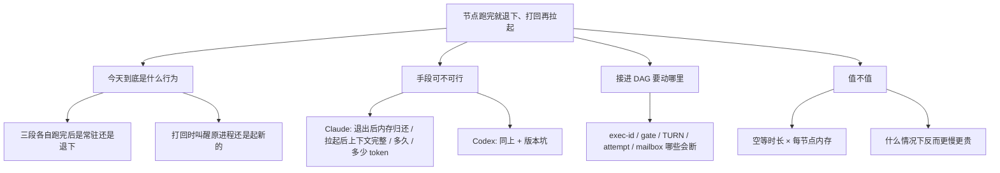

# FLY-2782 节点跑完就退下、被打回再拉起 — 探索

Issue: FLY-2782 (https://linear.app/geoforge3d/issue/FLY-2782/产品研究原型-节点跑完就退下被打回再拉起用-claude-resume-codex-resume-在-mac)
日期: 2026-09-22
基于: 无

## founder 要什么（复述）

Annie 的原话有两层，必须分开看：

1. **她要的效果**：节点那一段跑完就先退下、不占内存；被打回时还能带着原来的上下文重新起来。
2. **她猜的做法**：用 `claude --resume` / `codex resume` 按 session id 把对话拉回来。

第 2 层是手段，不是需求。所以本单要先验第 1 层的前提是否成立（今天到底占了多少、空等多久），
再验第 2 层的手段是否真的能用（实测，不是读文档）。

## 拆成的子问题

## 一开始就要挑战的三个假设

| 假设 | 挑战 | 本单怎么验 |
|---|---|---|
| 「设计、实现、QA 三段都常驻」 | 代码里 `keepalive_park` 只给了 design/implement，qa 没有 | 读节点类型注册表 + 查生产库真实终结时刻 |
| 「常驻 = 保住了上下文，拉起 = 要重新花钱载入」 | prompt cache 是服务端的、有 TTL，跟本地进程活不活无关 | 拿真实 runner transcript 按空闲时长分桶统计缓存命中 |
| 「resume 能把对话原样拉回来」 | 换模型、超窗口、中途被杀的尾巴都可能让 resume 失败 | 真跑，且必须带阴性对照 |

## 交付

research.md（结论 + 实测数据）、plan.md（改动面与风险，不写生产代码）、
prototype/（可复跑的脚本 + 原始回包）、一页 founder HTML。
