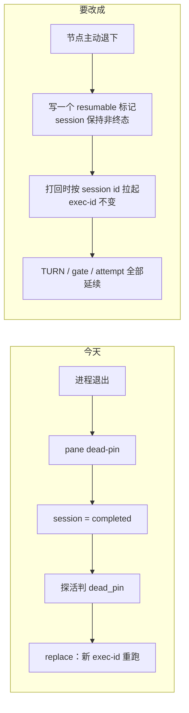

# FLY-2782 接进 DAG 的改动面与风险 — 实施计划（不写生产代码）

Issue: FLY-2782 (https://linear.app/geoforge3d/issue/FLY-2782/产品研究原型-节点跑完就退下被打回再拉起用-claude-resume-codex-resume-在-mac)
日期: 2026-09-22
基于: research.md、prd.md

> 🔻 **这份文档已降级为「建议」，不是规定。** 权威文档是 **prd.md**。
>
> founder 2026-09-22 的指示：PM 交付的是产品上想要的形态（PRD），
> 代码具体怎么改由 Tadashi 评估后自己决定 —— PM 可以给建议，但只是建议。
>
> 另外它是在**旧范围**（只做实现段）下写的。**范围已改成全部 DAG 节点、Claude 与 Codex 都要、不加缓冲期**，
> 所以下面的「分三期」和「只做实现段」**都已作废**，请以 prd.md 为准。
>
> 保留这份材料的唯一理由：**第 1 节那六个代码位置（带行号）在评估时仍然有用**，不必重新查一遍。

---

## 0. 核心难点不是 resume，是「进程退出」的语义

CLI 层的 resume 已经证明可用（research.md §2/§3）。真正的难点在于：
**今天整个系统把「进程不在了」直接等价于「这个执行体死了」**，于是走换人重跑，而不是带着上下文回来。

**好消息**：几乎所有跨进程状态本来就绑在 `execution_id`（env `FLYWHEEL_EXEC_ID`）上，**不绑 PID**。
只要新进程带同一个 exec-id、且 session 行没被标成终态，`turn` / `check` / `qa-result` / `verify-approval` 都能以同一身份继续工作。

---

## 1. 调研时看到的六个可能被打断的点（供评估参考，不是待办清单）

| # | 机制 | 为什么会断 | 证据 |
|---|---|---|---|
| 1 | CommDB `sessions.status` 被写成 `completed` | pane_dead poller 把进程退出当成完成 | `packages/claude-runner/src/TmuxAdapter.ts:1113-1131` |
| 2 | 探活判 `dead_pin` → 走 replace | 四态分类器只认 pane 活着 | `packages/teamlead/src/bridge/phase-actor-reentry.ts:31-70` |
| 3 | TURN 被回收 | belt reconciler 发现 holder 非 alive → 判 STALE，转授给别人或直接删 | `packages/teamlead/src/bridge/turn-belt-reconcile.ts:170-213` |
| 4 | mailbox 发送被拒 | session 变 terminal → `recipient_terminal` | `packages/flywheel-comm/src/recipient-resolve.ts:112-124`、`session-terminal.ts:14-25` |
| 5 | parked 重新接管失败 | `readoptParkedPhase` 只认 `alive`，dead_pin 只告警不接管 | `packages/teamlead/src/HeartbeatService.ts:1036-1050` |
| 6 | 盲替换预算被吃掉 | 每次 replace 计一次 launchOrdinal，超 `MAX_BLIND_REPLACEMENTS` → `retry_limit` | `packages/teamlead/src/StateStore.ts:57131-57140, 57250-57263` |

**不会断的**（已确认，省一半工作量）：

- `attempt` 是节点级 `(run_id, node_id, attempt)`，**进程重启不算新 attempt** —— `StateStore.ts:57250-57263`。
  attempt+1 只在 gate 重开时发生（`StateStore.ts:70084-70099`）。
- gate 记录在库里、不随进程消失；`gate --no-block` 本来就是为「进程退出后再答」设计的（`gate.ts:44-53`）。
  `check` 只要 `from_agent === execId` 就能消费（`check.ts:19-22`、`db.ts:6767-6779`）⇒ **exec-id 不变就能接着答**。
- mailbox 消息在 runner 不在时**排队**（`state='QUEUED'` 到 `expires_at`），不丢 —— 只要第 4 点的拒收不触发。
- Codex 的 `threadId` 已经持久化在 `~/.flywheel/state/codex-sessions/<execId>/session.json`（`codex-home.ts:2328-2337`）。

---

## 2. ~~分三期做~~（已作废：范围已改为全部节点，分期请 Tadashi 自定）

### 一期：Codex implement 段 + 15 分钟宽限期（收益 94%）

要加的东西：

1. **一个「自愿退下」的新状态**，跟「死了」区分开。
   建议落在 CommDB `runner_declared_states`（今天已有 `parked` / `long_task`，加 `resumable`），
   或给 `sessions` 加一个 `resume_handle`（vendor + session/thread id + model + 窗口大小）。
   ⇒ 第 1、2、5 点的判定都改读这个标记，而不是只读 pane 活不活。
   **这一条有外部佐证**：Google Scion 把「助手自报在等」作为闲置处理的第一段，用它区分「故意在等」和「意外卡死」
   （research.md §7）。我们其实已经有半个零件 —— `runner_declared_states` 的 `parked`
   （`packages/flywheel-comm/src/commands/declare-state.ts:84-94`）就是这个自报信号，缺的是让判定逻辑去读它。
   ⚠️ 但 Scion 的 5 分钟是写死的，不能拿来当我们选几分钟的依据。
2. **宽限期**：`complete` + `park` 之后不立刻退，空转 N 分钟（默认 15）再退。
   理由见 research.md §5 —— 这一条几乎不花钱，却堵掉唯一真实的浪费场景。
3. **拉起路径**：`phase-actor-reentry` 增加第五态 `resumable`，走
   `CodexTmuxAdapter.resumeExistingExecution()`（`CodexTmuxAdapter.ts:735-760`，Bridge 崩溃恢复已经在用），
   **复用同一个 exec-id**，不 randomUUID。
4. **拉起失败的兜底**：回落到今天的 replace 路径，但**单独记账**，不吃 `MAX_BLIND_REPLACEMENTS` 预算
   （否则正常的拉起失败会被当成盲替换，几次之后节点直接 `retry_limit`）。

### 二期：Claude implement 段（收益 6%）

前置缺口：**`claudeSessionId` 今天根本没落库。**
`TmuxAdapter.ts:1150-1152` 返回了它，但 `TmuxAdapter.ts:1316` 明确
`// previousSession intentionally ignored — no resume in interactive tmux mode`。
要先把它写进 `sessions.resume_handle`，再谈拉起。

另外必须带上 research.md §2 的两条硬约束：
**拉起前校验模型窗口**（否则白烧 60s 才失败），**prompt 走 stdin**。

### ~~三期（可选）：设计 / QA 段~~

**已作废。** 这是旧范围下的结论；新 PRD 要求全部节点一致，设计 / QA 也要能退下并按需拉起。

旧结论原文（留档）：**建议不做。** 生产数据显示这两段跑完就终结，本来就不占内存（research.md §1.1）。
做了没有收益，只增加一条要维护的路径。

---

## 3. 主要风险

| 风险 | 说明 | 处置 |
|---|---|---|
| **TURN 被别人抢走** | belt reconciler 判 holder STALE 后会**转授给另一个 alive 的 actor**（`turn-belt-reconcile.ts:170-200`），不只是删掉。退下的节点回来时 TURN 已经不是它的了 | reconciler 必须先读「自愿退下」标记，`resumable` 不算 STALE |
| **两个身体同时活着** | 拉起时如果旧 pane 还没完全死透，同 exec-id 会有两个进程写同一个 worktree | 拉起前要有一道 fail-closed 的独占校验；`session_identity_epoch` 触发器（`db.ts:1732-1765`）可以用 |
| **窗口/worktree 被回收** | cmux 的 `close_workspace_by_ref` 会同时 kill linked session 和源 window（`flywheel-cmux-sync.sh:2544-2592`）；worktree 被清掉 resume 就无处可跑 | 退下时只关窗口、不动 worktree；worktree 生命周期仍绑到 ship |
| **拉起成功但模型换了** | 静默降级成不同的推理预算 | `resume_handle` 里存下模型与 effort，拉起时原样带回 |
| **Codex 守护进程没真的退** | `app-server` reparent 到 init，关掉 tmux 窗口不会带走它（占 89–174 MB） | 退下时必须显式停守护进程，否则内存根本没省下来 —— 这是一期的验收点 |

---

## 4. 验收线（旧版；新的成功标准见 prd.md §6）

不是「resume 命令能跑通」，而是：

1. 真 DAG 上跑一单：implement 完成 → 等过宽限期 → **`ps` 证明进程树和 `app-server` 都不在了、内存归还** →
   打回 → 拉起 → `turn` 答 `yours` → 同一个 exec-id 继续把返工做完。
2. 反例：拉起失败时能回落到 replace，且**没有**消耗盲替换预算。
3. 反例：宽限期内被打回时，走的是今天的 mailbox 唤醒路径，**没有**发生退下-拉起。

---

## 5. 明确不做（仍然有效）

- 不改设计 / QA 段（§2 三期）。
- 不做进程级 checkpoint（那是 FLY-2780 研究的 gVisor 路线，Linux 才有；本单走的是对话级恢复，Mac 上就能用）。
- 不在本单写任何生产代码。
