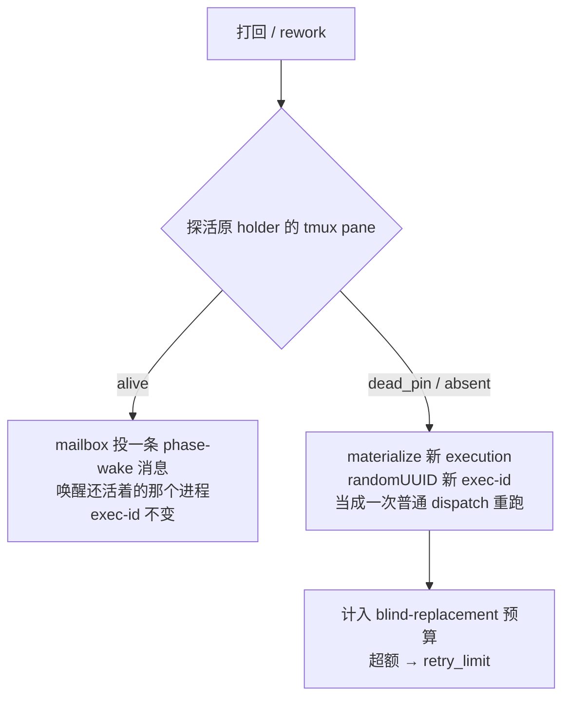

# FLY-2782 节点跑完就退下、被打回再拉起 — 调研

Issue: FLY-2782 (https://linear.app/geoforge3d/issue/FLY-2782/产品研究原型-节点跑完就退下被打回再拉起用-claude-resume-codex-resume-在-mac)
日期: 2026-09-22
基于: exploration.md

> 本文所有数字都是本机实测或生产库只读统计，取数脚本在 `prototype/`，原始回包在 `prototype/raw/`。
> 凡是我没测到的，写「未验证」，不写推断。

---

> 📌 本文是**调研记录与证据**。产品上最终要做成什么样，以 **prd.md** 为准（范围已扩大到全部 DAG 节点）。

## 一句话结论

**可行，而且比想象中便宜 —— 但省下的内存也比想象中少，且 94% 的收益在 Codex 那一段。**

三个纠正 founder 前提的发现：

1. **「三段都常驻」不成立。** 生产库近 30 天：QA 110 个、设计 98 个节点**跑完就立刻终结**，一个都没常驻。
   真正常驻空等的只有 **implement 一段**（254/256）。她想要的「跑完就退下」在设计和 QA 上**已经是现状**。
2. **常驻并没有保住上下文缓存。** prompt cache 是服务端的、约 1 小时 TTL，跟本地进程活不活无关。
   实测：空闲超过 1 小时后被叫醒的轮次，**94.8% 的上下文要重新付费写入** —— 而这些会话的进程一直活着。
   按小时算，**95% 的空等时长落在缓存早就死了的区间**。⇒ 退下再拉起，token 成本几乎不额外增加。
3. **省的是峰值 ~2.9 GB，不是「一半内存」。** 因为常驻的几乎全是 Codex（239/254），
   而一个 Codex 常驻节点约 245MB，一个 Claude 的约 600MB。峰值同时常驻 11 个，平均只有 1.47 个。

---

## 1. 今天到底是什么行为

### 1.1 三段各自跑完之后

| 节点 | 注册表声明 | 生产实测（近 30 天，`session_completed` 锚点） | 结论 |
|---|---|---|---|
| eng_design / design | design 有 `keepalive_park: true` | 98 + 4 个完成，**0 个常驻**，全部当场终结 | 已经是「跑完就退下」 |
| implement | `keepalive_park: true` | 256 个完成，**254 个常驻空等**（平均 4.06h，最长 55.1h） | 唯一真正常驻的一段 |
| qa | **没有** `keepalive_park` | 110 个完成，**0 个常驻** | 已经是「跑完就退下」 |

证据：`packages/config/src/node-type-registry.ts:70-104`（能力声明）、
`packages/teamlead/src/StateStore.ts:57713-57733`（complete 时按 `keepalive_park` 投射成 `ship_parked` 还是 `completed`）；
统计见 `prototype/measure-idle-and-memory.sh` 第 1 节。

> ⚠️ 注意口径：这里的「常驻」= `session_completed` 事件之后、`terminal_at` 之前的那段时间。
> 设计/QA 节点显示 0，是因为它们的 `terminal_at` ≤ 完成时刻，不是因为统计漏了它们。

### 1.2 打回时怎么叫醒

今天是**四态探活 + 两条路**，从不 resume 对话：

- 分类器：`packages/teamlead/src/bridge/phase-actor-reentry.ts:31-70`
- 唤醒：`packages/teamlead/src/bridge/workflow-rework-coordinator.ts:804-816` → `wakeActor` → `deliverDurableTurnWake`
- 替换：`packages/teamlead/src/bridge/workflow-engine-dispatcher.ts:1053-1066`（`newExecutionId: randomUUID()`）

**⇒ 今天「进程退出」= 系统判定「这个节点死了」，走换人重跑，而不是带着上下文回来。**
这正是本单要改的那一点。

### 1.3 Claude 与 Codex 的不对称（这条决定了工程量）

| | Claude runner | Codex runner |
|---|---|---|
| 会话 id | `--session-id <randomUUID>` 起，**adapter 明确不 resume** | `threadId` 已持久化到 `~/.flywheel/state/codex-sessions/<execId>/session.json` |
| 证据 | `TmuxAdapter.ts:1316` `// previousSession intentionally ignored — no resume in interactive tmux mode` | `CodexTmuxAdapter.ts:1582-1597`、`codex-daemon-client.ts:486-490` |
| 有没有现成的同 exec 恢复路径 | 没有（session id 没落库） | **有** —— `resumeExistingExecution()`，Bridge 崩溃后已经在用 |
| 常驻形态 | tmux 里的交互式 `claude` 进程 | `codex app-server` 守护进程（goal=paused）+ 一个 attach 上去的 TUI 窗口 |

**Codex 那边这件事已经做了一半。** 缺的只是「主动退下」和「因为打回而拉起」这两个触发点。

---

## 2. Claude 原型实测

脚本：`prototype/claude-resume-probe.sh`。原始回包：`prototype/raw/*.json`。

| 场景 | 本地重建 | 首 token | 总耗时 | 缓存写入 / 命中 | 上下文完整？ |
|---|---|---|---|---|---|
| 全新起（空目录） | 0.43s | 2.8s | **6.4s** | 36.8k / 0 | — |
| 全新起（真 runner worktree） | 0.50s | 3.5s | **7.0s** | 56.4k / 0 | — |
| 热 resume（同会话，1 分钟内） | 1.4s | 2.8s | **8.3s** | 678 / **36,522** | ✅ 口令正确 |
| **冷 resume**（22 小时前跑完、进程早没了、1.9MB ≈ 79k token） | **51.8s** | 58.0s | **66.3s** | **71,132 / 7,809** | ✅ 准确复述「FLY-2751、round 3 跨家族代码审查、verdict APPROVED、4 个 findings」 |

**读法：**

- **内存归还**：`-p` 模式进程退出即全部归还，这一条不需要专门验证。
- **上下文完整**：冷恢复后它能准确说出 22 小时前那个会话做了什么、结论是什么 —— 这正是打回时需要的东西。
- **慢在哪**：慢的是**本地重建 transcript**（52s），不是 MCP/插件冷启动。
  对照组证明了这点：同一个 worktree 里全新起只要 0.5s 本地时间。
  所以「拉起」比「全新起」多花的就是这 ~50s。
- **token 成本**：冷恢复要重写 90% 的上下文缓存。但 —— 见第 4 节 —— **常驻也躲不掉这笔钱。**

### 两个必须写进设计的失败模式（都实测撞到）

1. **换模型 resume 会失败，而且失败得很晚。** 我把一个跑在大窗口模型上的 6MB 会话用 haiku 拉起，
   本地重建花了 59.5s 之后，API 才回 `Prompt is too long`。
   ⇒ 拉起时必须用**原会话同窗口的模型**，且这个约束要在拉起之前就校验，不能等 API 报错。
2. **`--disallowed-tools` 是变长参数，会把后面的 prompt 一起吞掉**，表现是
   `Error: No deferred tool marker found in the resumed session`（看起来像「会话坏了」，实际是没传 prompt）。
   ⇒ prompt 走 stdin。我第一轮就是被这个骗了一轮，还差点据此得出「中途被杀的会话不能恢复」的错误结论 ——
   跑了干净收尾的对照组才发现是自己的用法问题。

### 一个顺带的观察（未做因果验证）

真实 runner transcript 里约 **35%** 结束在一个悬空的 `tool_result` 上（进程在工具调用返回后、模型回话前被杀）。
我原以为这类会话 resume 不了，**对照实验证伪了这个猜测**（干净收尾的会话报同样的错，根因是上面那个 flag 问题）。
这 35% 的比例本身是真的，但它对 resume 有没有影响 —— **未验证**。

---

## 3. Codex 原型实测

脚本：`prototype/codex-resume-probe.sh`。原始输出：`prototype/raw/codex-*.err`。
版本：`codex-cli 0.153.2`。

| 场景 | 总耗时 | tokens | 上下文完整？ |
|---|---|---|---|
| 全新起 | 9.3s | 23,256 | — |
| resume（同会话） | **8.1s** | 250 | ✅ 口令正确 |
| **冷 resume**（125 小时前、12.9MB 的真 implement 会话） | **11.3s** | 151,278 | ✅ 准确复述「FLY-2680、round 4 评审、写进 /tmp、CHANGES REQUESTED」 |

**Codex 比 Claude 快一个数量级**：12.9MB 的会话 11.3s 拉起，Claude 1.9MB 的要 66.3s。
Codex 的 rollout 格式重建成本几乎不随会话大小涨。

### Codex 的坑

1. 🔴 **`codex exec resume ""`（空 session id）不报错，会静默新建一个全新 session。**
   我第一轮取 id 的 `find -newermt`（BSD find 不支持）返回空，于是拿到一个「我不知道」的**假阴性**，
   差点写成「Codex resume 恢复不了上下文」。取 id 必须解析 rollout 文件名并回读校验。
2. **resume 是就地写回同一个 rollout 文件**，没有 `--fork-session` 这种只读探测选项。
   做只读实验时要靠 `-c sandbox_mode="read-only"` + `-c approval_policy="never"` 兜住副作用。
3. 已知的账号/额度坑（FLY-2472 / FLY-2600 一族）本单**未触发也未复验** —— 本单只跑了 2 次小 exec + 1 次大 resume。

---

## 4. 最关键的一条：常驻并不省 token

这是本单唯一一个推翻方案前提的发现，所以单独成节。

「常驻是为了保住上下文，不然打回时要重新花钱载入」—— 这个直觉是错的。
prompt cache 在**服务端**，有 TTL（回包里 `ephemeral_1h_input_tokens`，即约 1 小时），
**跟本地进程活不活没有关系**。一个活着但空转三小时的进程，下一轮照样全量重付。

拿真实 runner transcript 统计（全部是**进程一直活着**的会话，按两次请求之间的间隔分桶）：

| 空闲时长 | 样本数 | 需要重新付费写入的上下文比例 |
|---|---|---|
| < 15 分钟 | 83 | **3.4%** |
| 15–60 分钟 | 83 | 17.5% |
| 1–3 小时 | 9 | **94.8%** |
| > 3 小时 | 9 | **94.4%** |

再看真实空等时长分布（近 30 天，266 个常驻节点）：

| 空等 | 节点数 | 占比 | 累计空等时长 |
|---|---|---|---|
| < 15 分钟 | 33 | 12% | 4.0 h |
| 15–60 分钟 | 79 | 30% | 45.2 h |
| 1–3 小时 | 73 | 27% | 130.5 h |
| 3–12 小时 | 65 | 24% | 411.6 h |
| > 12 小时 | 16 | 6% | 459.7 h |
| **合计** | **266** | | **1,051 h** |

**两张表叠起来：95% 的空等时长（1,002 / 1,051 h）落在缓存早就失效的区间。**
在那 95% 里，常驻买到的东西是 0 —— 既没省 token，也没省时间，只是占着内存。

⇒ **退下再拉起的 token 成本 ≈ 常驻被叫醒的 token 成本。** 唯一多付的是本地重建时间
（Claude ~50s，Codex ~3s）。

---

## 5. 值不值

### 省多少内存（本机实测）

| | 每个常驻节点占用 | 依据 |
|---|---|---|
| Claude 节点 | **~600 MB** | 7 个真 runner 窗口进程树实测 457–674 MB |
| Codex 节点 | **~245 MB** | pane 进程树 102–131 MB ＋ 另算的 `app-server` 守护进程 89–174 MB（它 reparent 到 init，不在 pane 树里） |

常驻节点的构成：**Codex 239 个（94%）/ Claude 15 个（6%）**。

| 指标 | 数值 |
|---|---|
| 平均同时常驻 | 1.47 个 → **~0.39 GB** |
| **峰值同时常驻** | **11 个 → ~2.9 GB** |
| 月度累计空等 | 1,051 节点·小时 |

峰值那 2.9 GB **约占这台机器 48 GB 的 6%**。

> 🔴 **一处已撤回的错误判断（留作教训）。** 本文初版写过「free 0.9 GB、compressed 9.3 GB、swap 已用 1.65 GB，
> 机器确实在内存压力下」，并据此说这 2.9 GB 是「真金白银」。**那是拿错了尺子。**
> macOS `vm_stat` 的 `Pages free` 天生就很低（可回收的 inactive / compressed 页不计入），
> swap 用量又只涨不降 —— 两个都不是压力信号。
> 权威读数是系统自己的 `memory_pressure`：2026-09-23 03:25Z 实测 **System-wide memory free percentage: 63%**；
> Bridge `/api/capacity` 同刻 `freePct=63%, tight=false`。**这台机器当时并不紧张。**
> 由 Honey Lemon 在 founder 卡预审时指出，我用 `memory_pressure` 独立复核后确认。

**所以这不是一个紧急问题，也不是「省一半内存」。** 真正吃内存的是同时在跑的活节点（10 个窗口，其中 Claude 的每个 600MB），
不是空等的那几个。本单能动的只有空等的部分 —— 值得顺手做掉，但不要拿内存压力当理由。

### 什么情况下反而更慢或更贵

| 情况 | 代价 | 缓解 |
|---|---|---|
| 空等 < 15 分钟就被打回（12% 的节点） | 白白多付 ~50s 重建 + 一次本来能命中的缓存（~95% 的上下文） | **加宽限期**：跑完先别退，空转 15 分钟再退。这一条几乎不花钱：所有节点各留 15 分钟 = 66.5 节点·小时，仍然省掉 **984.5 / 1,051 = 94%** 的空等时长 |
| Claude 段的大会话被打回 | 每次 ~50–60s 本地重建 | 相对一轮 rework 动辄几分钟到几十分钟，可接受；而且 Claude 只占 6% |
| 拉起时模型/窗口不匹配 | 重建完才失败，白烧 ~60s | 拉起前校验模型窗口，见 §2 |
| 拉起失败没有兜底 | 节点丢了上下文 | 保留今天的 replace 路径作为 fallback，但**要跟盲替换预算分开记账**，否则正常的拉起失败会吃掉 `MAX_BLIND_REPLACEMENTS` |

### 推荐

> 🔻 **本节的推荐已被 founder 的决定取代，留作当时的判断记录。**
> 现行范围见 **prd.md**：**全部 DAG 节点**（不止实现段）、Claude 与 Codex 都要、**不加缓冲期**。
> 下面的原文保留，因为支撑它的数据仍然成立；被改的是范围判断，不是数据。

**（原文）做，但只做 implement 一段，且先做 Codex。**

理由：常驻的 94% 是 Codex implement；Codex 侧 `threadId` 已经落库、`thread/resume` 已经在用（Bridge 崩溃恢复走的就是它）；
Codex 拉起只要 11s。Claude 侧要先把 `claudeSessionId` 落库才能谈 resume，收益却只有 6%。

配一个 **15 分钟宽限期**，拿掉 94% 的空等内存，同时把「刚退下就被打回」这个唯一真实的浪费场景堵掉。

> 🔴 **上面这条宽限期建议后来被推翻了，而且推翻它的是我自己推理里的一个错。**
> 我当时以为常驻能保住那 70% 短间隔打回的缓存 —— **错了**：服务端缓存按内容命中，
> **跟是哪个进程发的请求无关**。本文 §2 的热 resume 实测本身就是反证：
> 一个**全新进程**拉起旧会话时直接读到了上一个进程写下的 36,522 个缓存 token。
> ⇒ 缓冲期买不到 token，只买到本地重建的那几十秒。完整论证见 **prd.md §7**。

---

## 6. 未验证 / 边界

诚实列出本单**没有**证到的：

- **没有在真 DAG 上跑通一次「退下 → 打回 → 拉起」**。本单只验了 CLI 层的 resume 能力和生产库的统计，
  没有改任何生产代码，也没有在 529 房里做端到端。这一步归工程实现（见 plan.md）。
- **Codex 额度/账号坑（FLY-2472 / FLY-2600）未复验** —— 本单只跑了 3 次调用。
- **悬空 tool_result 尾巴对 resume 的影响未验证**（见 §2 末）。
- **Claude 大会话（>200k token）的冷恢复未测成功** —— 被模型窗口不匹配挡住，换对模型重测的成本没花。
  所以「Claude 侧大会话拉起要多久」只有 ≥59.5s 这个下界。
- **内存数字是 RSS**，没有扣共享页，会略微高估单个节点独占的量。
- 空等统计以 `session_completed` 事件为锚点，覆盖 266 个节点；没有 `session_completed` 的节点不在统计内。

---

## 7. 外部参考：Google Scion 的闲置处理（来自 FLY-2783 的一手研究）

Honey Lemon 转来的邻单发现，跟「什么时候退下」这一问直接相关。Scion 分三段：

1. 助手可以**主动报「我在等某件事」**；
2. 没报、且 5 分钟没动静 → 标成疑似卡住；
3. 再过 5 分钟没动静 → 拆掉容器回收资源，**但保留对话记忆**；来消息时自动拉起，接着原对话往下说。

**最值钱的是第 1 条「自报在等」** —— 它把「故意在等」和「意外卡死」区分开。
这正是本单 plan.md 要加的那个「自愿退下」标记要解决的同一个问题：
今天系统只能看到「进程在不在」，看不到「它是主动等着还是挂了」（plan.md §1 的第 1、2、5 点全部栽在这里）。

**现成的半个零件**：Flywheel 已经有 `runner_declared_states`（`kind='parked'`，
`packages/flywheel-comm/src/commands/declare-state.ts:84-94`），runner 跑完 `complete` 之后自己就会写一条 ——
**这就是「自报在等」，已经有了。** 缺的只是让判定逻辑去读它，而不是只读 pane 活不活。

**两条边界，不能照搬：**

- Scion 那套**只在有中枢服务器的形态下才有**；我们是本机 tmux + 守护进程，回收和拉起都得自己做。
- 它的 **5 分钟是写死的**，不是调出来的最优值 —— 所以它**不能用来佐证**我们该选几分钟。
  本单推荐的 15 分钟是从 §4 的缓存失效曲线和 §5 的空等分布各自独立算出来的。
