# FLY-353 架构进化 — session-log 解耦(候选设计输入,非定案 PRD)

Issue: FLY-353 (https://linear.app/geoforge3d/issue/FLY-353/架构进化-research-综合-managed-agents-openclaw-raft-精进-flywheel-系统架构)
日期: 2026-07-08
基于: exploration.md(现状审计)、research.md(综合调研)

> ⚠️ **状态(2026-07-08 Lead 调整节奏后):这不是定案 PRD,是「候选设计输入」。** 本轮主交付 =
> 给 Annie 的**研究 HTML**(`architecture-review.html`,把三家架构做法讲清 + 对照我们当前系统 +
> 把 session-log 等列成**候选做法**),之后 **Lead 带 Annie co-evaluate** 再决定做不做、怎么做。
> **session-log 解耦在本轮是「候选方向」,不是已定结论。** 下面这份文档是我把候选做法想细的产物
> (含工程约束 + 一个可能的 build 拆分),已过 Codex design review;但它<b>只作 co-evaluate 的输入</b>,
> **不作 build handoff**,也**不在本轮 create build issue**。定案 + 交接 Tadashi 留到 Annie 拍板之后。
> **FLY-916 并进本条,不重复开**(它是 session-log 的消费者)。
>
> 🎯 **Annie co-eval 收窄(2026-07-08):session-log 不再是"必做候选#1"。** 我们用 Claude Code,session 原生
> 就有;所以问题是"要不要 Flywheel 自己 OWN 这条 log",只在 **3 场景**才值:① Codex/kimi(无原生 session)·
> ② 跨 agent 查询/切片(916)· ③ 多机(单机 tmux 保活 OK)。**按场景定值不值**,不是笼统"做不做 session-log"。
> 下面的落地设计只在"某场景确认要做"时才作对应那块的起点。详见 research.md 收窄 + architecture-review.html。

---

## 1. 背景与问题

FLY-353 是 Annie 从小红书 8 方向精选出的**架构类**方向,consolidate 了原 FLY-334(Managed Agents)/
335(openclaw)/ 370(Raft)。Cass deep-dig 提炼出三者共通 → Flywheel 下一步架构进化,**最高杠杆的一条 =
解耦 session / 记忆**:把 runner 的记忆/事件从 context 里拆出来、做成 context 外的 **append-only 事件
日志**(抄 Managed Agents)→ 无状态 runner 可安全 respawn + 从日志重建。

**调研核实后的诊断(research.md 详):**

- **Flywheel 已经天然是 brain / hands 解耦的形态**(runner 已 agent-agnostic 4 adapter;工具已 execute
  式),**唯独缺 Managed Agents 的第三层 —— session(自己拥有、context 外、可 replay 的日志)。**
- 现有三样都不是它:Claude Code jsonl(vendor 私有、不跨 vendor、Flywheel 查不了)· FLY-795
  progressResume(粗粒度、文档级、只覆盖"死了再派")· Bridge session_events(编排事件、非工作记忆)。
- **这一层的缺失,正是三个当前痛各自被迫用重方案绕的共同底座:**
  - **FLY-939**(respawn 丢状态)→ 被迫 "wake-not-respawn + 全程 keepalive",靠**保活**兜底;
  - **FLY-916**(Lead 带 5-6 session 就吃力)→ 需要 facade 压缩层,但**没有可 slice/摘要的结构化日志**做底料;
  - **重启丢 WIP**(与 FLY-978 同源)→ 运行中状态没在 context 外持久化。

**353 的独门活:补上这层缺失的 session-log 底座,让 respawn 变安全、context 可主动 slice、运行中状态
不随重启丢。** 不替代 939/916/978 的方案,而是让它们各自变轻、变稳。

---

## 2. 北极星 / 目标

**North Star = 『runner 的关键工作状态活在 context 之外,进程可随时重建、关键状态不丢』。**

一句话验收:**任意 runner(claude/agy/kimi/codex)被杀掉后,fresh runner 能从 Flywheel 拥有的
session-log 重建到"接着干"的状态,不依赖 vendor 原生 transcript / session 身份,不丢已锁决策、
阶段 cursor、产物指针、关键消息。**

> **范围诚实(Codex R1 #3):** MVP 是 **turn 级 + 里程碑**日志,保的是**关键工作状态**(决策 /
> cursor / 产物指针 / 关键消息),**不是**任意未提交的文件系统改动、未言明的推理、半截 shell/工具
> 输出、本地进程资源。**文件系统 WIP 只在它已 commit、留在复用的 worktree 里、或被显式记成产物
> 指针/事件时才保住;精确 tool-call 级 replay 不在 MVP(phase 2 若需再加)。**

---

## 3. Non-goals(本 PRD 不做)

- **不重构 brain / hands。** 它们已对齐 Managed Agents(§1),本 PRD 只补 session 层。
- **不重写编排层。** openclaw benchmark 印证 Bridge/HeartbeatService/DAG/failover 已在正道(research §3),
  **不为 B 开 build issue**;heartbeat 主动清单只记为 future 轻借鉴。
- **不做 Raft 防撞车 / 竞品。** 已落 FLY-1002 / FLY-909-1001,**只引用**。
- **不做 phase 2(活 runner context 饱和主动 slice + 重派)。** 本 PRD 点出、占位,**不在本批 build**。
- **不改 FLY-916 的树/看门狗设计。** 916 是 session-log 的**消费者**,并进本条只记关系,不重做其方案。
- **不碰 founder-gated ship / merge 授权语义。** session-log 是运行时机制。
- **不重做 FLY-978 的收尾状态机。** sibling,cross-ref;353 保"运行中状态",978 保"收尾状态"。

---

## 4. 用户与场景

- **Runner(claude/agy/kimi/codex):** 被杀/重启/context 压后,fresh 实例从 session-log 重建,不丢关键
  工作状态(范围见 §2 caveat);记忆恢复不再钉在各 vendor 原生 transcript / session 身份(顺带拆 vendor lock-in)。
- **Lead:** 不再因"必须保活一堆常驻 session 才不丢状态"而被绑住(FLY-939 的保活压力下降);未来(phase 2)
  可消费 session-log 摘要做 facade。
- **Annie(founder):** 少见"重复 runner / 丢进度 / 重启后乱象"这类需要她人肉收拾的场面;ship gate 不变。

---

## 5. 需求 —— Block 1:Flywheel 拥有的 append-only runner 事件日志(MVP 核心)

### 5.1 行为契约

- **每个 runner 有一条 Flywheel 拥有的、context 外的、结构化 append-only 事件日志。**
- **写入经 flywheel-comm**(所有 vendor 都能调的 CLI)—— 一个 `emitEvent` 式入口(命令名 eng 定),
  runner 在关键节点写事件。**天然 agent-agnostic**(claude/agy/kimi/codex 统一)。
- **事件粒度 = turn 级 + 里程碑**(§5.2),不是 tool-call 级(量太大,踩存储雷)。
- **日志可被 Bridge 读取 + 按位置 slice**(对齐 Managed Agents `getEvents()` 语义),供重建 + 未来 facade。

### 5.2 事件内容 + 身份/lineage(schema 由 eng 定,PRD 定必含字段)

每条事件至少含:`event_id`(幂等)· `ts` · `type`(阶段转换 / 决策 / gate / 产物指针 / 关键消息 /
工具里程碑)· `payload`(该类型的结构化内容)· `source`(哪个 runner / vendor)· **`trust_class`**(见 §6.3)。

**身份 / lineage 字段(Codex R1 #4,build-readiness 必需):** 一条逻辑 session-log 会跨多次 respawn
(每次重建 = 新 `exec_id`),所以 `getEvents(slice)` 需要一个**稳定地址**,不能只靠 `exec_id`:

- **`session_log_id` / `lineage_id`** —— 稳定的逻辑日志 id,跨 respawn 不变(同一个任务的多个 runner
  实例写同一条逻辑日志)。
- **`exec_id`(当前)+ `prior_exec_id` / `parent_event_id`** —— respawn 的前驱-后继链,重建时能顺藤续上。
- **单调 `seq` 或持久 byte offset** —— 保证顺序与可定位切片。
- **role / project / issue** —— 与 FLY-795 今天用的同一套归属键(issue + role + branch B / prior session
  行)对齐。**E1 必须定义"fresh runner 如何发现/续写它前驱的逻辑日志",复用 progressResume 的发现权威,
  不另造。**

**必须捕获的里程碑(重建所需的最小充分集):** 阶段转换(onboard→brainstorm→…)· 已锁决策(gate 通过的
理解 / 方案)· 产物指针(exploration/research/plan/PR 的路径或 URL)· progress cursor(阶段/chunk 状态,
继承 progressResume 已有信息)· 关键 Lead↔runner 消息。

### 5.3 存储介质(product/operational 边界,非"引擎会崩"边界)

> **事实纠偏(Codex R1 #1,HIGH):** 早先草稿把"排除 StateStore"论据写成"StateStore 是 sql.js WASM、
> save() 每写全库 export() → 堆碎片化撞穿"。**这已过期:FLY-663 已把 StateStore 迁到 native
> better-sqlite3 + WAL(增量写、无全库 export、save() 现为 no-op),那类 WASM corruption 现在
> 结构性不可能。** sql.js 说法只作**历史根因**(pre-FLY-663),不能当现行硬约束。

- **仍然:runner 工作记忆日志走独立存储,不塞进 Bridge 的 StateStore —— 但理由是 product/operational,
  不是"引擎会崩":**
  - **语义分离:** StateStore `session_events` 是**编排事件**(session_completed / stage_changed,驱动
    FSM);runner 工作记忆是另一类,混进去污染编排语义、耦合两者生命周期。
  - **retention / GC 隔离:** 工作记忆随 runner 生命周期归档/清理(与 FLY-978 收尾 cross-ref);编排事件
    有自己的留存,混表则清理互相牵制。
  - **blast radius 有界:** 一个 runner 的日志坏了/被清,不该影响 Bridge 全局状态 DB。
  - **写入量:** 高频 runner-memory 写不该灌进**共享的** Bridge state DB(哪怕 better-sqlite3 扛得住,
    也没必要让运行时工作流量和编排状态抢同一个 DB 的 WAL / 锁)。
- **默认形态 = per-runner 独立 append-only jsonl 文件**(Flywheel 拥有格式;append 便宜、无全库 rewrite、
  按行/offset 易 slice、易 rotate/gc)。需要查询聚合时,可加 **better-sqlite3 索引层**(与现有 CommDB /
  audit.db 一致;明确**不是** sql.js)。

### 5.3.1 jsonl 的 durability / corruption 语义(Codex R1 #6,E1 build-ready 前必须定)

独立 jsonl **避免了共享 DB 耦合,但引入自己的失败模式** —— 撕裂尾行、并发写、world-readable 泄漏。
E1 必须定义:

- **权限:** per-log 目录 0700、文件 0600(工作记忆可能含敏感上下文,绝不 world-readable)。
- **原子 append:** `O_APPEND` 或单写者 + 锁;并发写者不得交错撕裂。
- **幂等 + 顺序:** `event_id` 幂等 + 单调 `seq` / byte offset。
- **崩溃恢复:** 撕裂的最后一行要能"忽略 torn tail line"或靠 checksum/length 检出,不让半行毒死重建。
- **fsync 政策:** 有界 fsync(别每事件都 fsync 拖垮,也别全不 fsync 丢数据)。
- **rotation + retention:** max-size 轮转;有界 retention(eng 定值),防无界增长;收尾时归档/清理
  (与 FLY-978 cross-ref)。
- **payload 指针化:** payload 尽量存**指针**(文件路径 / URL / id),**不 dump 含 secret 的 transcript**。

### 5.4 与 vendor 原生 transcript / session 身份的关系(MVP = 桥接,不取代)

> **措辞纠偏(Codex R1 #2):** 各 vendor 的 resume seam **不统一**,别一概说成 `--resume`:headless
> Claude 用 `--resume <sessionId>`(`ClaudeCodeAdapter`),但**交互式 Claude tmux 用 `--session-id`
> 且忽略 previousSession**(`TmuxAdapter.ts`);Codex 用 `threadId` / `codex exec resume`
> (`CodexTmuxAdapter`);agy/kimi 既无 Claude `--session-id` 也无 Agent Team transport。所以本 PRD
> 一律用中性说法"**vendor 原生 transcript / session 身份(有则用)**",别把实现者引到某个 adapter seam。

- **MVP 不取代 vendor 原生 transcript / session 身份。** runner 通过 flywheel-comm 把里程碑事件
  **镜像/桥接**到 Flywheel 日志;vendor 原生 transcript 仍作 vendor 自己的即时 resume 底料(有则用)。
- **好处:** 增量、字节兼容、低风险;后续可逐步把"重建"从依赖 vendor 原生 transcript / session 身份迁到
  依赖 Flywheel 日志,最终削弱 vendor transcript 的角色(不在 MVP 强求)。**production runner 契约是
  agent-neutral:Flywheel 重建走 session-log 切片,无论 vendor 有 `--resume` / `--session-id` /
  `threadId` / 还是 transport=none。**

---

## 6. 需求 —— Block 2:细粒度死后重建(升级 progressResume)

### 6.1 行为契约

- **fresh runner 重建 = 读 session-log 切片,而不是只读一个 progress.md cursor。**
- session-log MVP **收编** progressResume 现有信息(阶段/chunk cursor + committed docs 指针),再补上
  已锁决策 + 关键事件流 → 重建粒度从"阶段/chunk"升级到"事件"。
- **重建入口不再依赖 vendor 原生 transcript / session 身份:** Blueprint 注入"读你的 session-log 切片"
  指令(类似现在注入 progressResume),对 claude/agy/kimi/codex 统一 → **拆 vendor lock-in**。

### 6.2 必须继承的安全护栏(不可破)

- **继承 resume-mode.ts 的 fail-closed 语义**(exploration §2.1b):只有 StateStore 权威 `effectiveStage`
  与日志记录的 phase **一致**(且已到 implement/qa)时,才发"跳过 onboard/brainstorm/design gate"的授权层;
  **stale / 篡改的 session-log 绝不能越过强制 brainstorm / design-review gate。**
- **founder ship-gate 永远保留**(重建绝不自动 ship)。

### 6.3 gate-skip 的 provenance —— 靠"构造"fail-closed,不靠 prompt 文字(Codex R1 #5)

**问题:** 若 runner 能往 session-log 写任意 `phase=implement` / `gate_passed` payload,一条 stale/篡改
的日志即便代码本意 fail-closed,也可能在"社交上"显得可信。→ **不能让 freeform payload 文字决定跳不跳 gate。**

- **trust class 分层(每条事件带 `trust_class`,§5.2):**
  - **authority-bearing 事件** —— 只有**已经强制授权的 flywheel-comm 命令**(`stage` / `progress` /
    `gate` / `respond` / review / ship 校验)才能发。它们进的是权威路径。
  - **runner-authored 事件** —— runner 自己写的决策摘要 / 推理 / 关键消息,**只作 replay 上下文,永远
    不能用来 suppress gate**。
- **重建时的 `effectiveStage` 由 server 端(StateStore + 校验过的 progress / session-log phase)算出,
  绝不取自 freeform payload 文字。** 这是把 §6.2 的 fail-closed 从"prompt 里写了一句"升级成"结构上
  runner 根本没有能力伪造授权"。E1/E2 必须按此分类事件来源。

### 6.4 respawn 安全 → 对 FLY-939 keepalive 的影响(写清,别误读;附 fencing 前提)

- session-log 让**从日志重建可靠** → **respawn 本身变安全**(对齐 Managed Agents `wake(sessionId)`)。
- **推论:FLY-939 的"全程 keepalive"从"正确性依赖"降级成"性能优化"** —— **但仅在"旧 runner 确认死/
  被 fence 掉"之后成立(Codex R1 #7)。** session-log 让重建少依赖进程存活,但**不**自动阻止"两个活
  runner 同时碰同一个共享 worktree":若旧 runner 只是**不可达而非真死**,fresh replay runner + 旧 runner
  仍可能在 code / progress.md / gate 回复 / PR handoff 上争用 —— 这正是 FLY-939/887 要防的那类。
- **所以 E2 硬要求:fresh runner 取得"权威写"之前,必须有 Bridge 拥有的 lease / turn transfer,或
  "旧 runner 已证死/已 close"的检查。** keepalive 只对**确认死/已 fence**的 runner 才降级为优化。
- **本 PRD 不推翻 FLY-939**(它已 Done、上线);只是在 session-log + fencing 到位后,keepalive 的失败
  不再是正确性事故。这条要在 build issue 里对 Tadashi 讲清,避免误以为要回退 939 或去掉 fencing。

---

## 7. 需求 —— Block 3:灰度与字节兼容(硬约束)

- **默认 off + reverse-compat sentinel。** `FLYWHEEL_SESSION_LOG=0`(或等价)= 逐字现状(仍走
  progressResume + 各 vendor 原生 session 行为,有则用;无 session-log 写/读/重建),不配置 = 关。
- **灰度可开:** 先在 Flywheel 自托管 / QA slot 开,验证重建正确性 + 无性能/存储回归,再逐项目放开。
- **这么底层的改动必须能回退。** 任何 build issue 都要带 reverse-compat 测试(不设 env = 现状字节对照)。

---

## 8. 状态机(runner 记忆 / 重建生命周期)

```mermaid
stateDiagram-v2
    [*] --> running: runner spawn(首次)
    running --> running: emitEvent(阶段转换/决策/产物/cursor/关键消息)写入 session-log

    running --> dead: 被杀/重启/crash(context 压或显式 terminate)
    dead --> rebuilding: fresh runner spawn + Blueprint 注入"读 session-log 切片"
    rebuilding --> running: 从日志重建到"接着干";gate 护栏按 effectiveStage 决定跳不跳

    running --> completed: 任务完成(PR / ship,走 founder gate)
    completed --> [*]: 收尾(FLY-978)可归档/清理 session-log

    note right of rebuilding
      重建 = 读日志切片(继承 progressResume + 已锁决策 + 事件流)
      fail-closed:effectiveStage 与日志 phase 不一致 ⇒ 不跳 gate
      vendor 无关:不依赖 vendor 原生 transcript/session 身份;founder ship-gate 永远保留
    end note
    note right of running
      日志 = 独立 append-only jsonl(独立于 Bridge StateStore)
      写入经 flywheel-comm(agent-agnostic);turn 级 + 里程碑
    end note
```



---

## 9. 时序图(写入 + 死后重建)

```mermaid
sequenceDiagram
    participant R1 as Runner(brain v1)
    participant L as session-log(context 外, Flywheel 拥有)
    participant B as Bridge/Blueprint
    participant R2 as Runner(brain v2, fresh)

    Note over R1,L: 正常运行 —— 持续写日志
    R1->>L: emitEvent(阶段转换 onboard→brainstorm)
    R1->>L: emitEvent(决策:gate 通过的理解/方案)
    R1->>L: emitEvent(产物指针:exploration.md / plan.md)
    R1->>L: emitEvent(progress cursor:phase/chunk)

    Note over R1: 被杀 / 重启 / context 压 → brain v1 死
    B->>L: 读该 lineage / session_log_id 的 session-log 切片 + StateStore effectiveStage
    B->>R2: spawn fresh runner + 注入"读 session-log 切片"重建指令
    R2->>L: getEvents(slice) 读回事件流
    R2->>R2: 重建到"接着干";effectiveStage 一致才跳 onboard/brainstorm gate
    R2->>L: 继续 emitEvent(接着写同一 lineage / session_log_id,不 fork 新日志)
    Note over R2: founder ship-gate 永远保留;绝不自动 ship
```

---

## 10. 验收标准(可衡量)

1. **重建正确性:** 杀掉一个跑到 implement 阶段的 runner,fresh runner 从 session-log 重建后,**不重跑
   已完成的 explore/research/plan**、保留已锁决策、从正确 cursor 接着干(对照 progressResume 现状:粒度更细、
   不依赖 vendor 原生 transcript / session 身份)。**范围内的"状态"= 关键工作状态**(决策 / cursor / 产物
   指针 / 关键消息);文件系统 WIP 只在已 commit / 在复用 worktree / 记成产物指针时才保住(§2 范围诚实)。
2. **agent-agnostic:** 上述在 claude 与至少一个非-claude vendor(agy 或 kimi 或 codex)上都成立(重建走
   session-log 切片,不走 vendor 原生 transcript / session 身份)。
3. **状态不丢:** Bridge 重启中途杀 runner,session-log 不丢已写事件;重建能续(含 torn-tail 恢复 §5.3.1)。
4. **fail-closed 护栏保住(构造级):** 构造 effectiveStage 与日志 phase 不一致(或用 runner-authored 事件
   伪造 phase=implement / gate_passed)→ 重建**不跳** 强制 brainstorm/design gate;`effectiveStage` 由
   server 端算、不取 freeform payload 文字(§6.3);founder ship-gate 永远在。
5. **存储隔离:** 日志走独立 append-only 存储、**不写进 Bridge 的 StateStore**(理由 = 语义分离 / retention
   隔离 / blast radius,§5.3;**不是** sql.js corruption —— 那已被 FLY-663 治了);jsonl durability 语义
   (0600 权限 / 原子 append / torn-tail 恢复 / retention)按 §5.3.1 落实、有测试。
6. **lineage 可续:** fresh runner(新 exec_id)能靠 `session_log_id` / `prior_exec_id` 发现并续写前驱逻辑
   日志,不 fork、不丢连续性(§5.2)。
7. **老 runner fencing:** fresh runner 取得权威写之前,有 Bridge lease / turn transfer 或"旧 runner 证死/
   已 close"检查;不会出现两个活 runner 争同一 worktree(§6.4)。
8. **字节兼容:** 不设 `FLYWHEEL_SESSION_LOG` = 逐字现状(reverse-compat 测试对照);可灰度、可回退。
9. **FLY-939 不回退:** keepalive 仍在,但其失败(对确认死/已 fence 的 runner)不再造成"重复 runner"正确性
   事故(session-log + fencing 兜底)。

---

## 11. 交接 —— Build-issue 拆分方案(给 Tadashi;先出方案,暂不 create)

> PRD 待 codex design review + Lead↔Annie 共创轮 review 后定稿。下列拆成 eng issue(Flywheel 标签)交
> Tadashi —— Honey Lemon 合入并跟 Annie 过完后再 create-issue。

> **依赖顺序(Codex R1 #8):** 这是底层记忆底座,**E3 灰度开关 + reverse-compat 测试必须和 E1 第一版
> 一起落**(否则半截 E1 会开始产日志却没有干净的关闭路径 / 字节对照);**E4 的有界 retention 是 E1 的
> done 标准之一**(归档与 FLY-978 的对接可后续细化)。E3/E4 不是 E1/E2 之后的"收尾",是 E1/E2 的前提。

- **E1(Block 1 核心)—— session-log 写入层:** flywheel-comm `emitEvent` 式入口 + 事件 schema(§5.2 必含
  字段,**含身份/lineage `session_log_id`/`prior_exec_id`/`seq` + `trust_class`**)+ 独立 append-only
  jsonl 存储(§5.3,**独立于 Bridge StateStore**,理由 = 语义/retention/blast-radius,非 sql.js corruption)+
  **jsonl durability 语义(§5.3.1:0600 / 原子 append / torn-tail / rotation)** + Bridge 侧 getEvents/slice
  读取。turn 级 + 里程碑粒度。agent-agnostic(所有 vendor 经 flywheel-comm 写)。**E1 done 标准含 E3 开关 +
  E4 有界 retention。**
- **E2(Block 2)—— 死后重建(升级 progressResume):** 重建读 session-log 切片(靠 `session_log_id`/
  `prior_exec_id` **发现前驱逻辑日志**,复用 FLY-795 发现权威;收编 progressResume 信息 + 已锁决策 + 事件流);
  Blueprint 注入重建指令,**agent-neutral(不依赖 vendor 原生 transcript/session 身份)**;**继承
  resume-mode.ts fail-closed gate 护栏 + founder ship-gate,且 `effectiveStage` server 端算、trust_class
  分层(§6.3)**;**老 runner fencing(Bridge lease / 证死才降级 keepalive,§6.4)**。写清"respawn 变安全 →
  939 keepalive 对确认死/已 fence 的 runner 降级为优化,不回退 939、不去 fencing"。
- **E3(Block 3)—— 灰度与字节兼容(与 E1 同批落):** `FLYWHEEL_SESSION_LOG` 默认 off + reverse-compat
  sentinel;不设 env = 现状字节对照;灰度先自托管/QA slot(§7)。
- **E4(存储与生命周期,E1 done 标准的一部分)—— retention / gc:** 有界 retention,防无界增长(§5.3);
  日志随 runner 生命周期,收尾时归档/清理(与 FLY-978 收尾 cross-ref,归档细节可后续与 978 对齐)。
- **E5(phase 2 占位,不在本批建)—— 活 runner context 饱和主动 slice + 重派 fresh runner + facade 摘要喂
  FLY-916 树。** 记为 future,本 PRD 不 build。

**PM 验收 = Lead↔Annie 共创轮定稿后跟踪。** 本 issue 不做实现、不 create build issue、不 ship。

---

## 12. Open Questions(待 review 收敛)

1. **桥接 vs 取代的迁移节奏(§5.4):** MVP 桥接后,何时/是否把重建完全迁离 vendor 原生 transcript /
   session 身份 —— 留给 phase 2 / eng 评估。
2. **事件粒度边界(§5.2):** turn 级 + 里程碑的"里程碑最小充分集"是否够重建所有场景(三段式 design/impl/QA
   的跨 phase 重建),eng 用真机验证后微调。
3. **存储层是否需要 sqlite 索引(§5.3):** 纯 jsonl 是否够用,还是 facade/查询需求要 better-sqlite3 索引层 ——
   等 phase 2 facade 需求明确再定。
4. **与 FLY-978 收尾的接口(§11 E4):** session-log 归档/清理的触发点与 978 durable finalization 的 5 步
   cleanup 如何对齐(session-log 是否算 978 的 authoritative inventory 一项)。

> 已定案、不再是 open question:主交付 = 抄 A 的 session-log(三 verdict 全过)· phased(MVP=日志+死后重建,
> phase 2=活 slice)· 存储**独立于 Bridge StateStore**(理由 = 语义/retention/blast-radius,非 sql.js
> corruption —— 那已被 FLY-663 治了)· fail-closed gate 护栏继承 + trust_class 分层 + server 端 effectiveStage ·
> 老 runner fencing 前提 · 默认 off 灰度 · FLY-916 并进不重开 · B 不 build / C 引用。

---

## 13. 关联 issue

- **要治的痛(session-log 是共同底座):** FLY-916(Lead scale,头号消费者,并进本条)· FLY-939(respawn,
  已 Done 保活,session-log 让 respawn 变安全、keepalive 降级为优化)· FLY-978(收尾,sibling,durable
  finalization 互补)· 重启丢 WIP(与 978 同源)。
- **已在做只引用:** FLY-1002(Raft 防撞车)· FLY-909/1001(Raft 竞品)· FLY-887(phase keepalive)。
- **consolidated 进本 issue:** FLY-334(Managed Agents)· FLY-335(openclaw)· FLY-370(Raft)。
- **实现交接:** Tadashi(Flywheel 标签)。
