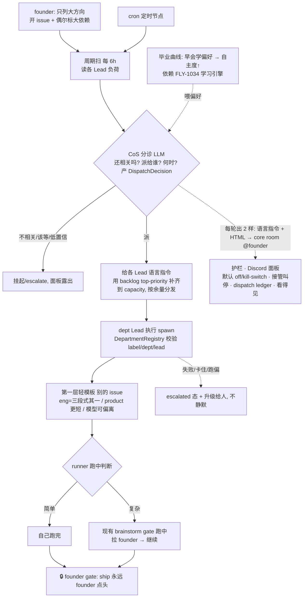

# FLY-353 主动 DAG 编排 + 监管护栏 — PRD(产品需求文档)

Issue: FLY-353 (https://linear.app/geoforge3d/issue/FLY-353/架构进化-research-综合-managed-agents-openclaw-raft-精进-flywheel-系统架构)
日期: 2026-07-08
基于: research.md(3 家架构综合)、dag-orchestration-design.html(设计 co-eval v7,**Annie 已确认**)、exploration.md(现状审计)

> 状态:**draft(设计 v7 Annie 已确认「353 看起来 OK,去落实成 PRD」;待 codex design review 复审 + Honey Lemon QA)。**
> 本 PRD 只定**产品行为 + 机制 + 工程约束**;具体 eng 设计与实现 = **Tadashi**。文档位置:与本 issue 其它文档
> 同放 `product/doc/FLY-353-architecture-evolution/`(一 issue 一文件夹)。

---

## 1. 背景与问题

FLY-353 起于「综合 Managed Agents / openclaw / Raft → 精进 Flywheel 架构」的 research。经与 Annie 多轮
co-eval **收敛**:research 三家里,session-log 解耦只在 3 场景(Codex/kimi · 跨 agent slice · 多机)才值、
且单机 Claude Code 不痛 → **收窄为 backlog(§14)**。真正**戳当下痛**的是 **DAG 主动编排**:

- Annie 的痛(原话):现在烦「一堆 Linear issue 怎么开、怎么派」——**手动开 issue、再一个个跟 Lead 说你做 1、
  你做 2**;issue 一多,派活本身就累。
- → 353 的答案 = **主动 DAG 编排(第二层治理引擎)**:人只列大方向,系统按分诊 + 依赖自动挑/派/推进,人不再
  一个个 assign;但**判断不丢、可监管、ship 仍 founder-gated**。

---

## 2. 北极星 / 目标

**North Star = 『founder 只列大方向,系统自动把该做的挑出来、派下去、推进到底 —— 人不再一个个 assign,判断没丢、不失控』。**

一句话验收:**Annie 开一批 issue(偶尔标个大依赖)后,不用逐个 assign;CoS 自动分诊 + 按依赖/负荷自动派,
复杂的活 runner 跑中拉她一起定,ship 仍她点头;整个过程她在 Discord 看得见、随时能叫停。**

---

## 3. Non-goals（本 PRD / 353 不做，避免与别的 issue 重叠）

- **不做 session-log MVP** —— backlog(§14),等 Codex 实测真痛再做。
- **不碰 lead-tree / fleet-scaling** —— 「一个 Lead 带很多 runner 的树状扩展 / 分 sub-lead」= **FLY-1022**,不在 353。
  互补:353 = offload session/自动派发让单 Lead 拿更多;1022 = 分 sub-lead 每个拿更少。
- **不建「学习引擎」** —— CoS 学派发 + Lead 学替 founder 决策(拿什么 data、怎么转成自主决定)= **FLY-1034**
  (autonomy learning,已建,单独 co-eval)。353 的毕业曲线**依赖** FLY-1034,但**不 build** 它。
- **不建第一层「轻模板」** —— 每类任务的 DAG 模板 = 另开 issue(§5),353 只**调用**它。
- **不另做 dashboard** —— **Discord 就是面板**(§9)。
- **不改 ship / merge 授权** —— ship 永远 founder-gated(§10 护栏①)。
- **不在本 issue 实现 / 建 build issue / ship** —— 只出 PRD + 拆分方案(§16),QA + Annie 终审后再 create。

---

## 4. 核心 framing:轻模板 + 强治理（回应「会不会过度复杂化 / 限制强模型」）

Annie 担心「把简单的事复杂化 / 固定模板限制越来越强的模型」。答:**我们不束缚模型「怎么想」,提供的是治理 + 编排。**

- **模板 = 轻的、可覆盖的默认起手式,不是死模板/紧身衣。** 给「这类活一般这么起手」的默认,但**模型可以偏离**
  (简单的一步跑完、复杂的多绕几步)。**模型越强,越能在模板之上自由发挥。**
- **DAG 真正不可替代的价值 = 治理,不是限制思考。** 分诊 · founder gate · 随时接管 · 成本控制(贵模型只用在
  难步骤)—— 这些是**控制/信任/成本**需求,**模型再强都还要**;管的是「派什么、谁批、花多少」,不是「怎么推理」。

---

## 5. 两层 DAG 模型（乐高；353 只做第二层）

- **第一层 · 轻模板层(≈乐高,= 另开 issue)** —— 做<u>一个</u> issue 怎么跑。每类任务一套**轻/可覆盖**的默认模板:
  eng = 三段式(设计→实现→QA,**只是其一、不是唯一**;不同粒度 Runner 可用不同 DAG)· product = 更短(1-2 节点)。
  节点级能力:**profile(节点绑模型,已是现实** —— grounded:`three-stage-phases.ts` 是每 phase 一个模型的单一
  真相,QA=Opus,三段式本就是一张「节点绑模型」的 DAG)。**inject / fork 挪到后续**(§16 E6,v1 不做)。
  **353 只调用第一层,不建它。**
- **第二层 · 353 治理引擎(本 issue)** —— 决定做<u>哪些</u> issue + 派给谁 + 何时 + proactive + 护栏 = CoS 分诊 +
  自动派发 + 监管。**353 全部重点在这层。**

---

## 6. CoS = LLM 分诊节点 —— 但「产决策 ≠ 有 spawn 权」（Codex R1 HIGH-1）

- **分流由 LLM 判断,不是机械 DAG**(机械挑任务会把早已不重要的 issue 照派)。这个分诊节点 = 各 dept 现有的
  **CoS**(Annie 原话:CoS 本就是为此设计的)。
- ⚠️ **CoS 今天没有 spawn 权、也不该直接拿到**(grounded:`flywheel-cos-lead` = `Flywheel-Triage`、
  `canSpawnRunners:false`;config.yaml「CoS triage/route + Tadashi spawn」;`DepartmentRegistry.isLeadInScope()`
  拒 `lead_cannot_spawn`;`AgentDispatcher` 是 deterministic label router、非 LLM)。直接给 CoS 装 spawn 会 fail-closed
  或破坏 Lead→department spawn 边界。
- **正确设计(v1):CoS 只<u>产决策</u>** —— 输出 typed `DispatchDecision`
  `{issue, targetLead, targetDept, template, confidence, rationale, dependencies}`;**由它底下的 dept Lead 去执行
  spawn(= CoS 给 Lead 的<u>语言指令</u>,§9),仍经 `DepartmentRegistry` 校验 label/dept/lead/template eligibility;
  CoS 保持 `canSpawnRunners:false`**。`AgentDispatcher` 明确是 runner-role/label router、不是 LLM 分诊。**decision ≠ authority。**

---

## 7. 依赖层：轻、可选、emergent + 精确语义（Codex R1 MED-5）

- **不建重度人工依赖图。** 大多数 issue 不标依赖;founder **偶尔**给大方向(A→B);其余**主要靠 Lead/PM 临时判断**;
  依赖层**一开始可以基本没有**(Annie:很难 rely on 人把依赖说清)。
- **CoS 推进:** 有标的依赖尊重;没标 → 并行 / 按到达序 + 负荷(§8)。依赖 emergent、**非前置门槛**。
- **精确语义(fail-closed + visible,eng 必须定,不留给实现者猜):** canonical source(Linear relation `blocks` →
  反推 blockedBy,过滤 completed/canceled,同旧 `LinearGraphBuilder`;或 founder 自然语言 note)· relation 方向 ·
  **unknown / cross-project blocker → 不越过、升级** · **cycle → escalate 不死跑** · terminal state 释放下游 ·
  **Linear fetch 失败 → 不派发** · 无依赖 = eligible,**≠ 无并发上限**(仍受 §8 capacity 限)。

---

## 8. 频次 + 调度：周期扫为主，每 6h，读负荷→top-priority 补齐到 capacity（Annie 定）

- **周期扫为主,不是事件驱动**(Annie 纠正):新建 issue ≠ 马上执行,任务有 priority,靠**分诊成批**判谁先谁后。
- **初期 cadence = 每 6 小时扫一次**,每轮逻辑:
  1. **读每个 Lead 当前负荷**(每 Lead 上限如 N=5:看各手里还有几件)。
  2. **谁不满 → 用 backlog 的 top-priority 补齐到上限**(Lead1 有 0→+5、Lead2 有 2→+3)。
  3. = **读负荷 → 抓 top-priority → 按各 Lead 余量分发。**
- **capacity 上限关联 FLY-1022。**
- **动态负载触发 = 后续北极星:** 把「读负荷」升级成按**系统水位**(内存 / token 额度)自动决定何时扫(降到某线
  就补活、满载不过载)。**诚实:现在还没能力监控内存/token,先做每 6h 固定 + capacity 补齐,水位触发作后续。**

---

## 9. CoS 输出两样 + Discord 面板 + cron（publish-report = FLY-203,Codex R1 LOW-6）

- **CoS 每轮分诊完输出<u>两样</u>:**
  1. **语言指令(真正派活)** —— 跟 Lead A 说「你去做 1/2/3」、Lead B 说「你去做 4/5/6」(= §6 的 spawn 由 dept Lead 执行)。
  2. **一个 HTML(给 founder 瞟)** —— 主要给她看、不一定马上看、有空瞟一眼。
- **面板 = Discord**(不另做 dashboard),复用 **FLY-203 `publish-report` / reports-route**(注:是 FLY-203,非 FLY-930;
  publish-report 是 report delivery、不是 live dashboard)。**约束(防刷屏):** 每轮 sweep 发一条 summary HTML → core
  room → @founder;事件性只在 dispatched / escalated / blocked / pause 等**关键状态**发短消息或合并进下一轮 report;
  定义 report 字段 + dedupe/noise budget + @founder 规则。
- **cron(每天/定时跑的活)= 引擎里一个定时节点**,到点触发,结果同一 Discord 面板露出。cron 不是另一套系统。

---

## 10. 主轴 + 4 监管护栏（判断在 run 里；护栏落成硬验收，Codex R1 HIGH-2）

**脊梁:判断不在「派发」环节,在「runner 跑的时候」。** 默认全自动派发;简单 issue runner 自己跑完;复杂的
runner **用现有 brainstorm gate 跑到一半拉 founder/Lead** 一起定,再继续(不是新东西,runner 本就跑中 brainstorm)。

**4 护栏(且必须是 engine 硬验收,不是口号 —— 错误派活的 blast radius 不只在 ship:启动高成本 runner、占 session
slot、开分支、耗模型、和三段式/FLY-1002 防撞车并发冲突):**

1. **ship 仍 founder-gated**(复用 `verifyApproval`)—— 合入 main 永远 founder 点头。
2. **随时接管 / 叫停** —— 暂停自动流、抽某条转人工、改依赖重排。
3. **失败 → `escalated` 态 + 升级给人,不静默** —— 启动失败 / gate 超时 / runner 卡住 / wrong-label reject / 跑偏 →
   进 escalated 态、上面板、告诉人(**弃用**旧 resolver「shelve 掉继续」的原因,§12)。
4. **看得见** —— Discord 面板(§9)。

**引擎必须内建的硬护栏(启动前置 / 验收项):** 全局 kill switch + **默认 off**(`FLYWHEEL_AUTO_DISPATCH=0` 一键停)·
per-project/per-label allowlist · **首批 rollout = dry-run/report-only**(先只出决策 + 上面板不真 spawn)·
per-issue opt-out/hold label · **per-project/per-dept 最大并发上限** · **CoS 低置信/模糊 → escalate 不 dispatch** ·
**启动前写 durable dispatch ledger**(谁/哪条/什么决策/何时,审计 + 崩溃恢复 + 面板)。

---

## 11. 渐进自治：早会学偏好 → 全自动 DAG（毕业曲线；依赖 FLY-1034）

全自动不是一步到位,是**一条毕业曲线**:

- **近期:founder 早会(重)** —— founder 和 CoS 开早会,CoS 在早会里学 founder 偏好(节奏 / 依赖 / 优先级)。
- **中期:学够了** —— 自主 triage 升高、早会变短、founder 少管。
- **终点(北极星):全自动 DAG** —— CoS 自主 triage + 派发,founder 只瞟 HTML + 随时介入。
- **回路 = 早会学偏好:** CoS 每轮决定 → 早会上 founder 确认/纠正 → CoS 学到偏好 → 下轮更准 → 早会需要人的地方变少。

**依赖(353 不 build):** ⭐ **FLY-1034 autonomy learning**(单独 co-eval,已建)—— 「怎么学」(拿什么 signal/data、
怎么 convert 成自主决策)+ **两处学习**(① 早会:CoS 学派发;② Lead:学替 founder 决策)= FLY-1034 的活。**353 只用
「早会 + 渐进自治」这个运行模型/轨迹,学习引擎在 1034 展开。** voice 化早会(语音跟 CoS 开早会)= **FLY-906** context,
非 353 硬依赖。

---

## 12. 引擎：删没用的旧 dag-resolver + 重搭（Codex R1 LOW-7 迁移note）

- **诚实评估(grounded):** 现有 `dag-resolver` = v0.1.0 基础货(Kahn + getReady/markDone/shelve +
  LinearGraphBuilder from blockedBy + DagDispatcher),**没接生产**(`new DagDispatcher` 生产路径 0 处)、无 LLM 分诊、
  无护栏、出错 shelve-继续。**不复活,删掉,按新模型(§4-§11)重搭。**
- **删除迁移 note(E1 scope):** `DagDispatcher` 不在生产路径,但 `edge-worker` 仍 import `DagNode` type、package 依赖仍在、
  scripts/tests 还实例化 `DagDispatcher`。→ **先 move/minimize shared types(`DagNode` 若 Blueprint tests 还要)、
  移除 `flywheel-dag-resolver` 依赖、更新 smoke scripts/tests,或标 deprecated 一个 release 再删** —— 别机械删导致 breakage。

---

## 13. 端到端流程

---

## 14. session-log（backlog，不展开）

「自己 own 一条 agent-agnostic 事件日志」—— backlog:Claude Code 单机不痛;只在 3 场景才值(Codex/kimi · 跨 agent
slice · 多机)。等 Codex 实测真痛再做。详见 research.md 收窄。

---

## 15. 验收标准（可衡量）

1. **省心:** Annie 开一批 issue 后不用逐个 assign;CoS 自动分诊 + 按负荷/依赖自动派(每 6h + 补齐到 capacity + 按余量分发)。
2. **判断没丢:** 复杂 issue runner 跑中经 brainstorm gate 拉人;旧/不相关 issue 被 CoS 分诊挡下,不机械照派。
3. **授权边界:** CoS 只产 `DispatchDecision`、`canSpawnRunners:false`;spawn 由 dept Lead 经 DepartmentRegistry 校验执行。
4. **不失控(硬护栏):** 默认 off + kill switch;首批 dry-run;per-issue opt-out;max concurrency;低置信 escalate;
   dispatch ledger;失败进 escalated 上面板;ship 仍 founder-gated;可随时接管/叫停。
5. **依赖 fail-closed:** unknown/cross-project blocker 不越过、cycle escalate、Linear fetch 失败不派;无依赖 ≠ 无并发上限。
6. **面板:** CoS 每轮出 语言指令 + summary HTML(FLY-203 publish-report)→ core room @founder;有 dedupe/noise budget。
7. **毕业曲线:** 早会学偏好 → 自主度↑;学习引擎依赖 FLY-1034(353 不 build)。
8. **旧引擎:** 没用的 dag-resolver 按迁移 note 删除;新引擎按本 PRD 重搭。
9. **两层:** 第一层每类任务一套轻模板(eng≠都三段式,另开 issue)+ profile 复用现有;第二层 CoS 分诊 + 自动派发。
10. **不越界:** 353 不覆盖 lead-tree(FLY-1022)/ 学习引擎(FLY-1034)。

---

## 16. 交接 —— Build-issue 拆分（给 Tadashi;先出方案,暂不 create;顺序依 Codex R1 MED-3）

> 待 codex 复审 + Honey Lemon QA + Annie 终审后 create-issue(Flywheel 标签,挂 Tadashi)。**顺序刻意让 schema /
> 授权 / 可观测 / default-off 先行**(调度系统,不是普通 feature)。

- **E1 · 决策 schema + durable ledger + default-off + dry-run 面板** —— `DispatchDecision` schema;每次派发前写 durable
  dispatch ledger;全局 kill switch + `FLYWHEEL_AUTO_DISPATCH` 默认 off + allowlist;首批 dry-run/report-only。
  含 §12 删 `dag-resolver` 的迁移 scope。
- **E2 · CoS 分诊(只产决策,不 spawn)** —— CoS LLM triage 产 typed `DispatchDecision`(相关/派谁/模板/何时/置信);
  低置信 escalate;`canSpawnRunners:false` 不变。
- **E3 · 引擎校验 + 派发** —— 引擎校验 decision,经现有 `RunDispatcher` / `/api/runs/start` + `DepartmentRegistry`
  边界派发(dept Lead 执行 spawn);每 6h 周期扫 + 读负荷 + 补齐到 capacity + 按余量分发(§8);轻量依赖 §7。
- **E4 · 护栏 + 面板硬化** —— pause/takeover · 失败 escalated · max concurrency · Discord 面板(FLY-203 publish-report:
  语言指令 + summary HTML,dedupe/noise);cron 定时节点。
- **E5 · 动态负载触发(北极星,后续)** —— 系统水位(内存/token)决定何时扫;capacity 对接 FLY-1022。
- **E6 · 第一层模板泛化(后续)** —— inject/fork 等通用 template-runtime 能力(v1 不做;v1 只支持现有成熟形态:
  single-session / 现有三段式 eng / product single-session-gate)。**第一层模板本身 = 另开 issue。**
- **依赖(353 不 build,cross-ref):** FLY-1034(学习引擎)· FLY-906(voice 早会)· FLY-1022(capacity/lead-tree)。

**PM 验收 = 后续跟踪(本 issue 不做实现)。**

---

## 17. Open Questions

1. **模板选择:** 每类任务 default 模板由谁定义、CoS 怎么给 issue 选模板(eng 有多套时)—— 大部分归第一层模板 issue。
2. **周期扫重排规则:** 每 6h 默认下,什么条件重排/挂起一个 backlog issue、priority 怎么算。
3. **面板信息密度:** CoS 每轮 summary HTML 展示哪些(在跑/排队/block/升级)、与现有 status 显示的关系。
4. **依赖标注入口:** founder「偶尔标大依赖」用什么(Linear blockedBy / 一句话)。
5. **与 FLY-1034 的接口:** 毕业曲线「早会学偏好」喂给 CoS 的确切形态,待 1034 co-eval 对齐。

> 已定案:DAG 主动编排=优先(session-log backlog)· 轻模板+强治理 · 两层(353=第二层引擎,第一层模板另开)·
> CoS=分诊、产决策≠spawn · 判断在 run 里 · 依赖轻量 emergent+fail-closed · 周期扫每 6h+capacity 补齐 · Discord=面板 ·
> 4 硬护栏 · 毕业曲线(依赖 FLY-1034)· 删旧引擎重搭 · Non-goal(lead-tree=1022 / 学习=1034 / voice=906)。

---

## 18. 附录 · homerail 澄清（答 Annie §1）

homerail 的 DAG 是**「一个 agent 一次 run 内部的工作流图」**(run 里 node 按 port/条件边/loop 流转;1004 firsthand 读码)
—— 相当于我们的**第一层(模板层)**,**不是** 353 的**第二层(issue 级跨 fleet 自动派发)**。「homerail 有 DAG」≠「它做我们这件事」。

---

## 19. 关联 issue

- **痛/上游:** FLY-353(本 issue)· FLY-916(Lead scale,proactive 受益方)· FLY-1002(Raft 防撞车,与并发安全 cross-ref)。
- **互补/边界(353 不覆盖):** FLY-1022(lead-tree/fleet-scaling/capacity)· FLY-1034(autonomy learning 引擎)· FLY-906(voice 早会)。
- **consolidated:** FLY-334(Managed Agents)· FLY-335(openclaw)· FLY-370(Raft)。
- **backlog:** session-log(§14)。
- **实现交接:** Tadashi(Flywheel 标签)。

> 注:`research.md` 早期把 session-log 写成 MVP —— 已被 dag-orchestration-design v7 / Annie co-eval **superseded**;
> session-log 现为 backlog(§14),以本 PRD 为准(Codex R1 LOW-8)。
