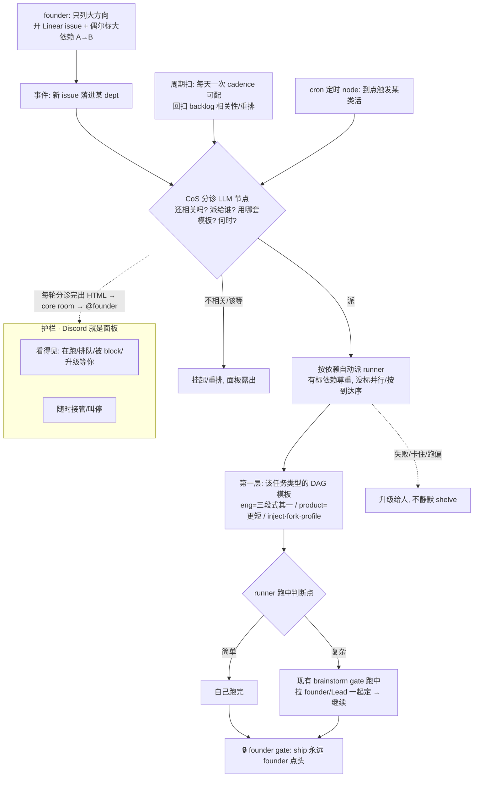

# FLY-353 主动 DAG 编排 + 监管护栏 — PRD(产品需求文档)

Issue: FLY-353 (https://linear.app/geoforge3d/issue/FLY-353/架构进化-research-综合-managed-agents-openclaw-raft-精进-flywheel-系统架构)
日期: 2026-07-08
基于: research.md(3 家架构综合)、dag-orchestration-design.html(设计 co-eval v3 收敛,Annie 逐轮)、exploration.md(现状审计)

> ⚠️ **状态:HELD(2026-07-08)—— Annie 要先看更新的设计 HTML(v5)确认 OK,才写 PRD。** 本 draft 暂停,
> 待设计 v5 定稿后再续写。**续写时必须 fold:** ①Codex R1 design review 的 8 条(已 fold §5 CoS 授权边界 +
> §9 护栏硬化;**待 fold:** E1-E6 重排为 schema/ledger/default-off 先行、模板层 v1 收窄(inject/fork 挪后)、
> 依赖 semantics 精确化、publish-report 改 FLY-203、dag-resolver 删除的迁移note、research 过时标注);
> ②新 framing『轻模板 + 强治理』(第一层模板=轻/可覆盖默认非死模板,否则限强模型;第二层治理=DAG 不可替代
> 价值,不束缚模型推理);③两层拆两 PRD(**353 聚焦第二层治理引擎**;第一层轻模板另开 issue,但两层内容/model
> 灌进 353 别丢)。
>
> 353 从「架构进化 research」一路 co-eval 收敛出的答案 = **主动 DAG 编排(第二层治理引擎)**(session-log 收窄为
> backlog)。本 PRD 只定**产品行为 + 机制 + 工程约束**;具体 eng 设计与实现 = **Tadashi**。文档位置:与本 issue
> 其它文档同放 `product/doc/FLY-353-architecture-evolution/`(一 issue 一文件夹;若需移 engineering/doc 供 eng 树可 git mv)。

---

## 1. 背景与问题

FLY-353 起点是「综合 Managed Agents / openclaw / Raft → 精进 Flywheel 架构」的 research。经与 Annie 多轮
co-eval,方向**收敛**:

- research 三家的启发里,**session-log 解耦**对我们**只在 3 场景(Codex/kimi · 跨 agent slice · 多机)才值**,
  且 Claude Code 单机下现在不痛 → **收窄为 backlog**(§12)。
- 真正**戳 Annie 当下痛**的是 **DAG 主动编排**:她的原话 —— 现在烦的是「一堆 Linear issue 怎么开、怎么派」,
  **手动开 issue 1-10、再一个个跟 Lead 说你做 1、你做 2**;issue 一多,派活本身就累。
- → **353「架构进化」的答案 = 主动 DAG 编排**:人只列大方向,系统按依赖 + 判断自动挑/派/推进,人不再一个个
  assign;但**判断不丢、可监管、ship 仍 founder-gated**。

**这份 PRD = 把这个方向落成可交给 Tadashi 实现的产品需求。**

---

## 2. 北极星 / 目标

**North Star = 『founder 只列大方向,系统自动把该做的挑出来、派下去、推进到底 —— 人不再一个个 assign,但判断没丢、不失控』。**

一句话验收:**Annie 开一批 Linear issue(偶尔标个大依赖)后,不用再逐个跟 Lead 说「你做这个」;CoS 自动分诊 +
按依赖自动派 runner,复杂的活 runner 跑中拉她一起定,ship 仍她点头;整个过程她在 Discord 看得见、随时能叫停。**

---

## 3. Non-goals(本 PRD 不做)

- **不做 session-log MVP** —— 收窄为 backlog(§12),等 Codex 实测真痛再拿出来。
- **不建重度人工依赖图** —— 依赖层轻量、可选、emergent(§6),不是要 Annie 把整张任务图预先画好。
- **不另做 dashboard** —— **Discord 就是面板**(§8),复用现有,不建新 UI。
- **不改 ship / merge 授权** —— ship 永远 founder-gated(§9 护栏①)。
- **不在本 issue 实现 / 建 build issue / ship** —— 只出 PRD + 拆分方案(§13),Honey Lemon QA + Annie 终审后再 create。

---

## 4. 两层 DAG 模型(Annie 的乐高 framing)

DAG 在我们这里是**两层**,叠在一起 —— 这是 Annie 在 1004 里 articulate 的、最清楚的 framing:

- **第一层 · 模板层(乐高):做<u>一个</u> issue 怎么编排。** 每类任务一套 DAG 模板。同一套底层「积木」(节点),
  不同任务类型拼成不同编排:
  - **eng issue** → 三段式(设计 → 实现 → QA)—— 但**注意:三段式只是 eng 的<u>一个</u>模板,不是唯一**;不同
    粒度的 Runner 可用不同 DAG(小改可能 1-2 节点,不必都三段式)。
  - **product/designer issue** → 完全不同、更短(如 1-2 节点:调研/收敛)。
  - **未来别的任务类型** → 各自一套;可提供几种模板让不同事件挑。
  - **节点级运行时能力**:**inject**(跑中插节点)· **fork**(岔并行试)· **profile**(每节点绑模型)。
    profile **已经是现实** —— grounded:`three-stage-phases.ts` 是「每 phase 一个模型」的单一真相(QA=Opus);
    **三段式本就是一张「节点绑模型」的 DAG**,profile 是这条能力的**泛化,不是新建**。
  - ≈ homerail 的「一个 agent 一次 run 内部的工作流图」就在这一层(§附录 homerail 澄清)。
- **第二层 · 353 引擎层:决定做<u>哪些</u> issue + 怎么自动推进。** 在模板之上,**CoS 分诊**(§5)判「还相关吗 /
  派给谁 / 何时 / 怎么更 proactive」+ 按依赖自动派发。**这层就是 353 要建的。**

**分层关系:** 第一层「一个 issue <u>怎么</u>跑」(模板/乐高) · 第二层「做<u>哪些</u> issue、<u>怎么</u>自动推进」
(353 引擎 = CoS 分诊 + 自动派发) · **护栏**(§9)包在外面管安全。

---

## 5. CoS = LLM 分诊节点 —— 但「产决策 ≠ 有 spawn 权」(安全边界,Codex R1 HIGH-1)

- **分流必须由 LLM 判断,不是机械 DAG。** 纯机械挑任务容易错(如早已不重要的 issue 还照派)—— Annie 明确点了这个。
- **这个 LLM 分诊节点 = 各 dept/project 现有的 CoS**(Chief of Staff,如 Aunt Cass)。Annie 原话:「我一开始设计
  CoS 就是想做这个」。**grounded**:CoS 本就是 triage/路由 persona。
- ⚠️ **关键边界纠正(grounded 核代码):CoS 今天<u>没有</u> spawn 权,也<u>不该</u>直接拿到。** 现状:
  `flywheel-cos-lead` 是 `Flywheel-Triage`、`canSpawnRunners:false`;config.yaml 写明「CoS Aunt Cass triage/route
  + Eng Lead Tadashi spawn Runners」;`DepartmentRegistry.isLeadInScope()` 会先拒 `lead_cannot_spawn`;
  `AgentDispatcher` 是 **deterministic label router,不是 LLM**。→ 若实现者按「给 CoS 装自动派发」直接让
  `flywheel-cos-lead` 调 `/api/runs/start`,Bridge 会 fail-closed;若为过而把 CoS 改成 `canSpawnRunners:true`,
  会**破坏现有 Lead→department spawn 边界**、扩大 triage lead 的生产权限。**两者都不对。**
- **正确设计(v1):CoS 只<u>产决策</u>,不 spawn。**
  - CoS(LLM triage)输出一个 typed **`DispatchDecision`**:`{issue, targetLead, targetDept, template, confidence,
    rationale, dependencies}`。
  - **引擎/Bridge 以受控服务身份(或经目标 Lead 的委托)执行 spawn**,仍由 `DepartmentRegistry` 校验 issue label /
    target lead / department / template eligibility;**CoS 本身保持 `canSpawnRunners:false`**。
  - `AgentDispatcher` 明确定位为 **runner role / agent-label router**(选哪种 agent),**不是** LLM 分诊 —— 两者是不同东西。
- **一句话:CoS 判「该做什么」(decision);spawn 权仍在受控执行层 + department 校验里(authority)。decision ≠ authority。**

---

## 6. 依赖层:轻量、可选、emergent(不是前置门槛)

- **不建重度人工依赖图。** 大多数 issue **不标依赖**;founder **偶尔**给个大方向依赖(A→B);其余由 Lead/PM
  **临时判断**。
- **CoS 的推进规则:** 有标的依赖 → 尊重(A 没完不派 B);**没标的** → **并行 / 按到达序**推进。
- **依赖是 emergent 的,不是前置门槛** —— 不要求 Annie 预先把整张图画好才能开跑(这正是「静态 DAG 要你预先
  知道全部」的反面,呼应她「开放式活没法预先规划成静态图」)。

---

## 7. 频次:事件驱动 + 周期扫

主动循环由两个触发合成:

- **事件驱动(主):** 新 issue 落进某 dept → **CoS 立刻分诊**(判相关/派谁/何时)→ 该派就派。
- **周期扫(补):** **每天一次**(cadence 可配)回扫 backlog —— 「这些还相关吗?要不要重排/重派?」防止 emergent
  的东西被漏掉、或旧 issue 该清该重排。

---

## 8. cron + 面板:Discord 就是面板

- **面板 = Discord**(不另做 dashboard,复用现有)。
- **CoS 每轮分诊完 → 出一个 HTML(分诊结果:派了什么/排队/被 block/升级等你)→ 发 core room → @ founder。**
  (复用 FLY-930 publish-report 能力。)
- **真 cron(定时活)= 引擎里的周期触发器(定时 node)** —— 到点自动触发某类活;结果在**同一个 Discord 面板 HTML**
  露出。cron 不是另一套系统,是引擎里的一种节点。

---

## 9. 主轴 + 4 监管护栏(判断在 run 里,不在派发口)

**脊梁(Annie 纠正过的):判断不在「派发」环节,在「runner 跑的时候」。** 默认**全自动派发**;简单的 issue runner
自己跑完;复杂的 runner **用现有的 brainstorm gate 跑到一半把 founder/Lead 拉进来**一起定,再继续。这不是新东西 ——
runner 本来就跑中 brainstorm-gate,我们只让「派发」自动化、把「判断」留在它本来就在的地方(run 里)。

**4 道监管护栏(Annie 最在意:别失控)—— 且必须落成 engine 的<u>硬验收</u>,不是口号(Codex R1 HIGH-2):**

> 为什么要硬:即使 ship 是 founder-gated,**错误派活的 blast radius 不只在 ship** —— 会启动高成本 runner、
> 占 active session slot、开分支、消耗模型、制造 PR 噪声、和三段式 / FLY-1002 防撞车产生并发冲突。所以护栏要
> 内建成引擎的启动前置条件,不能只靠「run 里 brainstorm gate」。

1. **ship 仍 founder-gated(不变)** —— 自动的是「派活 + 跑」,**合入 main 永远 founder 点头**(复用 verify-approval)。
2. **随时接管 / 叫停** —— founder/Lead 能暂停整个自动流、把某条 issue 抽出来转人工、改依赖重排。
3. **失败 → `escalated` 状态 + 升级给人,不静默** —— 启动失败 / gate 超时 / runner 卡住 / wrong-label reject /
   跑偏 → **进 `escalated` 态、上面板、告诉人**,绝不「静默 shelve 了继续」(正是要弃用旧 resolver「shelve 掉继续」的原因,§10)。
4. **看得见** —— Discord 面板(§8)显示 在跑 / 排队 / 被 block / 升级等你。

**引擎必须内建的硬护栏(启动前置 / 验收项):**
- **全局 kill switch + 默认 off**:整套默认关;`FLYWHEEL_AUTO_DISPATCH=0`(或等价)一键停;可 per-project / per-label allowlist。
- **首批 rollout = dry-run / report-only 模式**:先只「出决策 + 上面板」不真 spawn,验证准确性再开真派发。
- **per-issue opt-out / hold label**:某条 issue 打标即不进自动流。
- **per-project / per-dept 最大并发上限**:防自动流一次拉爆 session slot。
- **CoS 低置信 / 模糊 / 不确定 → escalate,不 dispatch**:拿不准就升级给人,不硬派。
- **启动前写 durable dispatch ledger**:每次派发前先落一条持久记录(谁、哪条 issue、什么决策、何时),供审计 +
  崩溃恢复 + 面板;绝不「派了但没留痕」。

---

## 10. 引擎:删没用的旧 code,按新模型重搭

- **诚实评估(grounded 核代码):** 现有 `dag-resolver` 是 **v0.1.0 最早期**的东西 —— 只有基础 Kahn 拓扑排序 +
  getReady/markDone/shelve + 从 Linear blockedBy 建图 + 并行/错误隔离;**没有** LLM 分诊(机械挑任务 = Annie 担心的
  「会判断错」)、**没有**监管护栏(出错 shelve 掉继续、不升级)、**没接进生产**(dormant),也没跟现在演进过的
  Lead/三段式/founder-gate/brainstorm-gate 栈整合。
- **结论(Annie 拍:她怀疑它做得不行):不复活、直接删没在用的 dag-resolver code,按新模型重搭。** 新模型 = 两层 DAG
  (§4)+ CoS 分诊(§5)+ 轻量依赖(§6)+ 4 护栏(§9)。图逻辑(拓扑排序 + 从 Linear blockedBy 建图)这块**概念**
  可借鉴,但不照搬旧引擎。

---

## 11. 端到端流程(状态 + 时序)

---

## 12. session-log(backlog,不展开)

research 阶段的「Flywheel 自己 own 一条 agent-agnostic 事件日志」—— Annie 定了 **backlog**:Claude Code 单机下
现在记忆不痛;**只在 3 场景才值(① Codex/kimi 无原生 session · ② 跨 agent 查询/切片 916 · ③ 多机)**。等她用
Codex 实跑一段、真发现记忆有问题,再拿出来做。本 PRD 不展开,只记一笔、不丢(详见 research.md 收窄)。

---

## 13. 验收标准(可衡量)

1. **省心:** Annie 开一批 issue 后,**不用逐个 assign**;CoS 自动分诊 + 按依赖自动派,该跑的跑起来。
2. **判断没丢:** 复杂 issue 的 runner 跑中经 brainstorm gate 拉人;不该自动跑的(旧/不相关)被 CoS 分诊挡下,不机械照派。
3. **不失控:** ship 仍 founder-gated;可随时接管/叫停;失败升级给人(不静默 shelve);Discord 面板看得见。
4. **两层清晰:** 第一层每类任务一套模板(eng≠都三段式);第二层 CoS 分诊 + 自动派发;profile(节点绑模型)复用现有。
5. **依赖轻量:** 不需要预先画整张图;不标 = 并行/按到达序;emergent 非前置门槛。
6. **频次:** 事件驱动(新 issue 即分诊)+ 每天一次周期扫(可配)。
7. **面板:** CoS 每轮分诊出 HTML 发 core room @founder;cron 定时 node 结果同面板露出。
8. **旧引擎:** 没用的 dag-resolver code 删除;新引擎按本 PRD 模型重搭。

---

## 14. 交接 —— Build-issue 拆分方案(给 Tadashi;先出方案,暂不 create)

> 待 Honey Lemon QA + codex design review + Annie 终审后再 create-issue(Flywheel 标签,挂 Tadashi)。

- **E1 · 引擎重搭(核心)** —— 删没用的 `dag-resolver` code;按新模型建第二层「353 引擎」:CoS 分诊入口 + 按依赖
  自动派 runner(轻量依赖 §6)+ 事件驱动 + 周期扫(§7)。含以 bug/assessment 角度记录旧引擎为何不复用(§10)。
- **E2 · CoS 分诊节点** —— 把现有 CoS 角色扩成「自动派发的 LLM 分诊」:判相关/派谁/用哪套模板/何时/proactive
  (§5);默认全自动派发,判断留 run 里(§9 脊梁)。
- **E3 · 第一层模板** —— 「每类任务一套 DAG 模板」机制:eng=三段式(其一,不同粒度可不同 DAG)、product=更短;
  inject/fork/profile 节点级能力(profile 复用 `three-stage-phases.ts`,§4)。
- **E4 · 4 监管护栏** —— ship founder-gated(复用 verify-approval)· 随时接管/叫停 · 失败升级给人(改掉旧
  shelve-继续)· Discord 面板(§8,复用 publish-report:CoS 每轮出 HTML 发 core @founder)。
- **E5 · cron 定时 node** —— 引擎里的周期触发器,结果同 Discord 面板露出(§8)。
- **E6(backlog,不在本批)· session-log** —— 等 Codex 实测真痛再做(§12)。

**PM 验收 = 后续跟踪(本 issue 不做实现)。**

---

## 15. Open Questions(待 review 收敛)

1. **模板怎么选/怎么定义**:每类任务的 default DAG 模板由谁定义、CoS 怎么给一个 issue 选模板(eng 有多套时)。
2. **inject/fork 的触发**:跑中 inject/fork 是 runner 自主、Lead 触发、还是 founder?(护栏关系)
3. **周期扫的 cadence 与重排规则**:每天一次的默认、什么条件重排/挂起一个 backlog issue。
4. **面板 HTML 的信息密度**:CoS 每轮出的分诊 HTML 具体展示哪些(在跑/排队/block/升级),与现有 status 显示的关系。
5. **依赖标注的入口**:founder「偶尔标大依赖」用什么方式(Linear blockedBy?一句话?)。

> 已定案、不再 open:DAG 主动编排=优先(session-log backlog)· 两层模型(乐高模板层 + 353 引擎层)· CoS=分诊节点
> (不新造角色)· 判断在 run 里(不在派发口)· 依赖轻量 emergent · 频次=事件+周期 · Discord=面板 · 4 护栏
> (ship founder-gated 等)· 旧引擎删+重搭。

---

## 16. 附录 · homerail 澄清(答 Annie「homerail 的 DAG 是做这事吗」)

**不是,是另一个层级。** homerail 的 DAG 是**「一个 agent 一次 run 内部的工作流图」**(run 里 node 按 port / 条件边 /
loop 流转;1004 runner firsthand 读码结论)—— 相当于我们的**第一层(模板层)**。**不是**我们 353 要做的**第二层
(issue 级、跨 fleet 的自动派发)**。所以「homerail 有 DAG」≠「它做我们这件事」。(homerail 无公开架构文档,结论来自读码。)

---

## 17. 关联 issue

- **痛/上游:** FLY-353 本 issue(架构进化 research → DAG 主动编排收敛);FLY-916(Lead scale,proactive 引擎的
  受益方);FLY-1002(Raft 防撞车,Tadashi 在建,与自动派发的并发安全相关,cross-ref)。
- **consolidated:** FLY-334(Managed Agents)· FLY-335(openclaw)· FLY-370(Raft)。
- **backlog:** session-log(§12,等 Codex 实测真痛)。
- **实现交接:** Tadashi(Flywheel 标签)。
