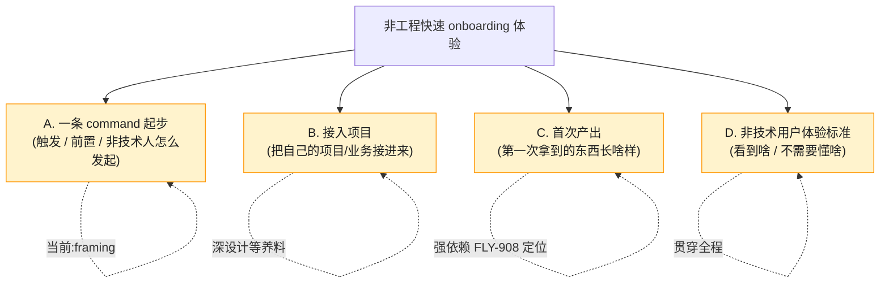

# FLY-910 非工程快速 onboarding 体验设计 — 探索/Framing(parking 文档)

Issue: FLY-910 (https://linear.app/geoforge3d/issue/FLY-910/非工程快速-onboarding-体验设计一条-command-上手后体验)
日期: 2026-07-06
基于: 无(父 EPIC FLY-908 产品定位)

---

> ## ✅ 更新(2026-07-08):park 已解除,设计已收敛,部署轴已定
>
> 三样养料到位(**FLY-908 定位 EPIC Done · FLY-911 定位文档落地 · FLY-912 Hooves&Paws 采访**),深设计已完成并与 Annie 逐块共创收敛。锚已锁:**客户=甲(半技术)· 部署=B 纯自托管 · 入口=终端一条 command · 用词=Captain/Crew/Team**。
> 部署轴 Annie 复盘定了 **MVP=自托管 B / Managed=V2** —— 见 `deployment-decision-and-mvp-scope.md`。权威逐屏 eng-buildable 规格见 `onboarding-flow-detailed.md`。**剩余=战术块逐块等 Annie 拍**(见决定文档 §4)。
> **下方原 parking 内容留作历史底料**(现状痛点审计仍有效、当参考)。

---

> ## ⏸️ (历史)状态:等养料、暂缓深钻
>
> 本文是一份**轻量 framing / parking 文档**,不是完整 PRD、不是深设计。
> 它把这个 issue 的**结构、现状痛点、待补养料、开放问题**先钉清楚,让它从「空挂着」变成「养料一到就能顺着接着钻」。
>
> **深设计触发条件**:父 EPIC **FLY-908 产品定位**收敛(正与 Annie 共创,关联 FLY-911)**+ 竞品分析 + Anna 对第一个客户 Hooves & Paws 的采访**三样养料到位。定位没清之前深钻 = 投机浪费(不知道终点,设计通往终点的路径必然白做)。
>
> **更新(2026-07-06,方向调整)**:Annie 指出「没先问 clarification 就产文档不值当」。本文**降格为 brainstorm 底料**(现状痛点审计仍有效、当参考);当前重心 = 先跟 Annie 走一轮真 brainstorm、把澄清问透 → 见同文件夹 `brainstorm-prep.md`。**不再当 parking 交付、不憋 PRD。**

---

## 1. 这个 issue 要解决什么(what)

让**非工程小企业**能**快速** onboard 进 Flywheel:从「一条 command 起步」→「把自己的项目接进来」→「拿到首次产出」。治现在的痛点 —— **onboarding 要手动搞一天、还强耦合工程**。

非技术用户视角要有明确的**体验标准**:他们看到啥、不需要懂啥。

## 2. 现状痛点审计(为什么「手动搞一天 + 强耦合工程」)

我审计了现在的 onboarding 机制。结论:**现在根本没有面向非工程用户的 onboarding —— 现有的「一条 command」是给工程师的,而真正花一天的活全压在 founder 手动完成的工程/运维步骤上。**

### 2.1 现在的「一条 command」其实只覆盖前半段,且是工程视角

现在的 `scripts/setup-new-project.sh`(FLY-284)是**唯一**一条 zero-to-one command,但它:

- **只做纯文件系统脚手架**:repo 骨架 + `.flywheel` 骨架 + `.lead` 身份骨架 + doc-flow。
- **前提就假设你是工程师**:要在终端跑 bash、传 `<project-name> <department>` 参数、懂 repo / label / department 这些概念。
- 明确**不碰**任何 live / 不可逆的东西 —— 后半段全部只是「打印一张清单」留给 founder 手动跑。

### 2.2 真正「搞一天」的是后半段:10 步 founder 手动 cutover 清单

`setup-new-project.sh` 结尾打印的 gated cutover 清单(§8),每一步都要 founder 亲手做、且都是工程/运维动作:

| # | 步骤 | 为什么非工程人做不了 |
|---|------|----------------------|
| 1 | 走正常 PR flow commit + push 脚手架 | 要懂 git / PR |
| 2 | `gh repo create` 建 GitHub 私有仓 + push | 要有 gh CLI + GitHub 账号 + 命令行 |
| 3 | Linear 建 team/labels 做 routing | 要懂 Linear team/label/routing 模型 |
| 4 | 建 Discord bot + 频道,token 塞 `~/.flywheel/.env`,把 bot id/channel id 填进 identity.md 的 TODO | Discord Developer Portal + 2FA + 邀请 + 编辑 env 文件 |
| 5 | 手改 live `~/.flywheel/projects.json`(含 memoryAllowedUsers,fail-closed) | 手编 JSON,错一个字符就崩 |
| 6 | 每个 Lead 跑一次 `claude-lead.sh` 生成 + 校验 manifest,再停掉 | 命令行 + 懂 manifest |
| 7 | 每个 Lead 装/reload launchd plist(CoS 必须设 `FLYWHEEL_LEAD_ROLE=cos`) | macOS launchd / plutil / launchctl |
| 8 | 重启 Bridge | 懂进程/服务生命周期 |
| 9 | 验证 bot 上线 + 频道回话 + 真 founder 聊一次 | 要知道「怎样算成功」 |
| 10 | 接 deploy digest hook(`report-deployment.sh` 进 CI/deploy 点) | 懂 CI / hook |

**这就是痛点的根:非工程用户面对的不是「一条 command」,而是一张 10 步工程清单。** 「一天」花在 2-10 步;「强耦合工程」= 每一步都要工程知识 + 命令行 + founder 在场。

### 2.3 一个重要区分(影响优先级)

这 10 步里,**绝大多数与「非工程公司拿 Flywheel 干嘛」这个定位无关** —— 它们是纯粹的「把一个项目接进 Flywheel 基础设施」的机制。也就是说:**把这后半段解耦、包装成非技术人也能无痛跑完的体验,这件事相对不依赖 FLY-908 定位、可以先推。**(见 §5 MVP 候选。)

真正**依赖定位**的是:「接进来之后要产出什么、首次产出长啥样、非技术用户到底用它干嘛」 —— 这决定 onboarding 的**终点**,不知道终点就没法设计通往它的旅程。

## 3. Topic 树(大主题 → 子块,标当前位置)

| 子块 | 一句话 | 深设计依赖 | 当前位置 |
|------|--------|-----------|----------|
| **A. 一条 command 起步** | 非技术人如何发起 onboarding、这条 command 具体触发什么 | 部分依赖定位;**机制解耦部分可先推**(= MVP 候选) | framing 已列,深设计待养料 |
| **B. 接入项目** | 把用户自己的项目/业务接进来的流程 | 依赖「接进来要干嘛」= 定位 | framing 已列 |
| **C. 首次产出** | 用户第一次拿到的产物长啥样 | **强依赖** FLY-908 定位(终点) | framing 已列 |
| **D. 非技术用户体验标准** | 全程 UX 红线:看到啥、不懂啥也能走完 | 贯穿 A/B/C,养料到后逐块细化 | framing 已列 |

## 4. 每块的「养料 gate」(深设计前需要什么输入)

深设计每一块之前,必须先拿到对应养料。养料来源:**FLY-908/911 定位** · **竞品分析** · **Anna 对 Hooves & Paws 的采访**。

| 子块 | 深设计前需要的养料 |
|------|-------------------|
| A. 一条 command 起步 | 定位:目标用户是谁、他们从哪来(网站?Discord 邀请?)、有没有「项目」这个概念还是纯业务描述。竞品:别人的第一步入口长啥样。 |
| B. 接入项目 | 定位:「项目」对非工程公司意味着什么(一个业务?一个客户?一批订单?)。Anna 采访:Hooves & Paws 实际有什么「项目」形态。 |
| C. 首次产出 | **定位(最关键)**:非工程公司拿 Flywheel 到底产出什么(报告?自动化?内容?运营动作?)。这是 onboarding 的终点,没有它 C 无法设计。 |
| D. 非技术用户体验标准 | 竞品 + Anna 采访:非技术用户的真实认知边界(他们懂 Discord 吗?懂「Lead / Runner」吗?需要用别的词吗?)。 |

## 5. 非工程 MVP 最高优先候选(Honey Lemon 指定,相对不依赖定位、能先推)

> **候选:把 §2.2 的「后半段 founder 手动 10 步 cutover」→ 做成非技术人「一条 command 无痛跑完」的体验。**

- **为什么它是最高优先**:它是当前痛点(手动搞一天 + 强耦合工程)最直接的来源;且它是**纯机制/UX 解耦**,与「非工程公司拿 Flywheel 干嘛」这个定位关系不大 —— 定位还没清时它就能先推进。
- **它要回答的核心问题(留给深设计,养料到就钻)**:哪些步骤能自动化、哪些必须保留 founder 闸(如 Discord token / merge / ship 永远 founder-gated,FLY-175)、非技术人看到的到底是什么界面、失败了怎么自愈或求助。
- **边界**:这是「接入机制」的 MVP,不等于整个 onboarding 体验;C(首次产出)仍强依赖定位。

## 6. 待与 Annie 共创的开放问题(养料到后逐块钻)

1. 非工程用户的**入口**在哪?(现在是终端 bash;未来是网页?Discord 邀请链接?Anna 引导?)
2. 「一条 command」是字面一条命令,还是一个**引导式对话/表单**?非技术人可能连终端都不开。
3. 「项目」这个概念对非工程公司成立吗?还是他们只有「我想让你帮我做 X」这种业务描述?
4. 10 步 cutover 里,哪些能安全自动化、哪些必须留 founder 手动闸(安全红线:token / merge / ship / Runner-lifecycle 永远 founder-gated)?
5. 首次产出的「Aha moment」是什么?(定位决定 —— 等 FLY-908。)
6. 非技术用户全程需要懂哪些词、绝对不能出现哪些工程黑话(Lead/Runner/manifest/launchd/Bridge...)?

## 7. ⚠️ 深设计标准备忘(Annie 强调,以后所有 design 通用)

养料到、真开始设计 onboarding / MVP 体验时,**必须做到极细,不是 high-level 记录**:

- 非技术用户在 Discord(或入口)里**一步步看到啥**;
- **UI 长啥样**(具体界面/文案/按钮);
- **交互流程图**(每一步的分支、失败路径);
- **一条 command 具体触发什么**(端到端机制);
- **拿到的首次产出长啥样**(具体样例)。

**标准 = 细到 eng 照着就能建出我们想要的东西、Annie 不用再跟工程掰扯细节。** 需要就用 `deep-research` skill 研究「非技术用户 onboarding 体验」别人怎么做。

> 本轮只是 framing,**不**执行上述极细设计 —— 但把这个标准钉在这里,深钻时照做。

## 8. Non-goals / 边界(本轮明确不做)

- **不**做完整 onboarding PRD / 深设计(等养料)。
- **不**写任何生产代码 / 脚本改动。
- **不**碰 live config / 不建 bot / 不重启 Bridge。
- **不**在这里做 PM 验收(那是未来 FLY-830,现在不做)。
- **不**越过 FLY-908 定位去假设终点。

## 9. Next(接下来)

- 本文档随 PR 落地,把 FLY-910 从「空挂着」变成「结构清晰、等养料」。
- **触发深钻的信号**:FLY-908 定位收敛(+ 竞品 + Anna 采访)→ Honey Lemon 拉我接着钻,**从 §5 MVP 候选 + §3 topic 树逐块**推进,照 §7 极细标准。
- 深钻产出 → 收敛 PRD → `create-issue` 拆 build issue 交 eng(每个 issue 链回对应设计段)。
