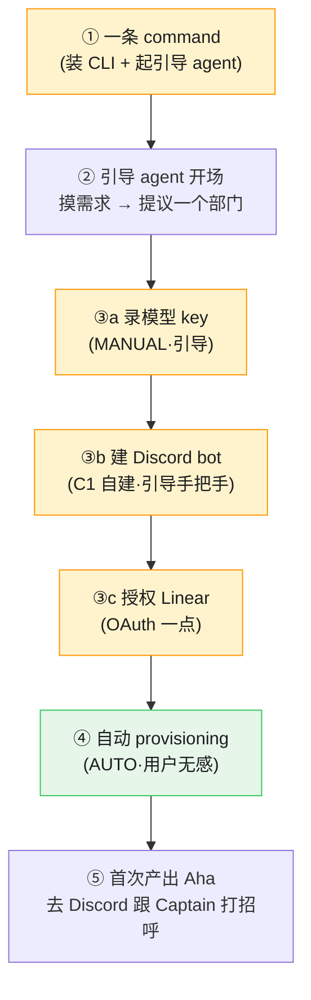

# FLY-910 非工程自托管 onboarding — 端到端流程 draft(逐屏)

Issue: FLY-910 (https://linear.app/geoforge3d/issue/FLY-910/非工程快速-onboarding-体验设计一条-command-上手后体验)
日期: 2026-07-06
基于: provisioning-automation-boundary.md · self-hosted-onboarding.md · research-options.md · FLY-912 Hooves&Paws

> **锚(Annie 锁)**:客户 = 甲(时间紧、有技术直觉的经营者)· 部署 = B 纯自托管 · 入口 = 终端一条 command 可接受。
> **本文 = 深化 draft**(Honey Lemon「放手深化」)。用推荐默认写全流程;**用词已锁(Annie block-1)= Captain / Crew / Team**(不再是变量);其余**战术待定处**(bot 默认 C1、砍 GitHub 等)已标 ⟨待 Annie⟩,定了改文案即可、流程结构不变。
> 颗粒度目标:细到 Tadashi 照着能建、Annie 不用再掰细节。每屏标:客户看到啥 / 底层触发啥 / 校验 / 失败路径。

---

## 全流程一张图

---

## ① 入口:一条 command

**客户看到**:复制一条命令粘进终端(甲 能接受),例如
`curl -fsSL https://get.flywheel.ai | sh`（形态 ⟨待定：curl 一行 vs npx flywheel onboard⟩）
→ 终端开始「检查环境… 安装… 启动向导」,几十秒后进入一个**对话式向导**(不是表单、不是一屏配置)。

**底层触发**:下载 CLI → 检测依赖(Node/git,缺则自动装或引导)→ 全局安装 → 起 onboarding agent(引导式,终端内对话)。对齐 OpenClaw 一行装 → wizard。

**校验 / 失败**:
- 无 Node → 自动装 or「我帮你装 Node,y/n」。
- 不支持的 OS → 明确提示(FLY-648:macOS/Linux/WSL2 支持,其它先挡)。
- 网络失败 → 具体报错 + 重试,不静默挂。

---

## ② 引导 agent 开场 + 摸需求(generic:帮你搭你自己的 AI 团队)

**客户看到(对话,逐条)**:
> 向导:嗨,我是帮你把**你自己的 AI 团队**搭起来的向导。几分钟搞定。先问一句 —— 你最想让这个团队帮你做的**第一件事**是什么?用大白话说就行。
> 客户:我要一个盯我 dropship 订单、出问题直接告诉我为什么的。
> 向导:懂了。我建议给你先建一个**「订单盯梢」Team**:一个 **Captain** 帮你把关,一个 **Crew** 去各系统查「这单为什么卡」。名字你可以改。这样对吗?
> 客户:对 /（改名）

**底层触发**:agent 把客户的自然语言 → 一份**项目 config**(FLY-648 核心/项目分离:department 名、要哪个 manager + 几个 specialist、这个部门的活范围)。**不预定义客户公司**——完全从他的描述长出来(generic)。

**设计要点**:
- 一次只问一件事,对话式,**不甩表单**。
- **不出现工程黑话**(不说 Lead/Runner/repo/manifest);说「你的 Team / Captain / Crew / 帮你干活」。
- 甲 水平:允许他改 Team 结构、加 Crew;但给**好默认**,别让他从零配。

**校验 / 失败**:描述太空(「帮我搞钱」)→ agent 追问一句具体场景,不硬编。

---

## ③ 三件必须亲手的事(引导过,能自动的都在后台悄悄做)

> 顺序:先模型(团队的脑子)→ Discord(团队干活的地方)→ Linear(后台清单)。每件**一次只推一步**、录密钥**走 CLI 安全输入绝不粘对话**、**当场校验**、失败给**具体**原因。

### ③a 录模型 key(Claude)
**客户看到**:
> 向导:你的团队用 Claude 当大脑。你有 Claude 的订阅或 API key 吗?有的话我引导你贴进来(走安全输入,不会显示在对话里)。没有的话 → 这个链接注册。
> [客户在 CLI 隐藏输入里粘 key]
> 向导:✓ 验证通过,大脑接好了。

**底层触发**:CLI 隐藏 prompt 收 key → 存本地 config(不进聊天/不进 git)→ 发一个最小测试调用校验。
**失败**:key 无效 → 「这个 key 连不上,检查有没有复制全 / 额度」;不重复问、可重贴。

### ③b 建 Discord bot ⟨默认 C1 自建;C2 省事捷径可选⟩
**客户看到(手把手,配短视频/截图,一步一确认)**:
> 向导:你的团队在 **Discord** 里跟你干活。我们给你建一个专属机器人。跟着做(30 秒):
> 1. 打开 discord.com/developers/applications → 右上「New Application」→ 起个名(比如你公司名)→ 建。
> 2. 左边「Bot」→「Reset Token」→ 复制那串 token。
> 3. 回来把 token 贴进我这里的安全输入。
> [客户贴 token（CLI 隐藏输入）]
> 向导:✓ 收到。还差一步:在同一页往下,打开「Message Content Intent」和「Server Members Intent」两个开关(截图在此)。开好告诉我。
> 客户:开好了。
> 向导:✓ 我连上了,你的机器人在线了。最后点这个链接把它请进你的 Discord 服务器 → [邀请链接]。
> 向导:✓ 它进群了。

**底层触发**:token 经 CLI 隐藏输入 → 本地 config(不进聊天)→ 连 Discord 校验 → 用 app client id 生成 invite-url → 检测 bot 已加入目标 server → 自动建所需频道。
**失败(具体化)**:
- intents 没开 → 「Message Content 还没开,去打开那个开关」(精确到哪个)。
- token 错 → 重贴。
- 没把 bot 邀进服务器 → 「还没看到它进群,点一下这个邀请链接」。
- **worst-case**:客户卡在 Portal → 「要不要我喊 Anna 跟你连屏一起弄?」(诚实兜底,不假装全自助)。
**⟨C2 捷径,可选⟩**:「想跳过上面?我可以给你一个现成机器人直接邀请进来 —— 但它的身份是 Flywheel 托管的(不是你完全自有)。要走这条吗?」默认不推,甲 通常走 C1。

### ③c 授权 Linear(OAuth,一点)
**客户看到**:
> 向导:你的团队用一个**后台清单**记「要做什么、做到哪了」——**你平时不用打开它**,给你留个底。点一下授权就行。
> [浏览器弹 Linear 授权 → 客户点同意]
> 向导:✓ 后台清单接好了。

**底层触发**:OAuth device flow(不粘 API key)→ 拿授权 → 系统用 API 自动建 team + routing labels(客户无感)。Linear 全程隐藏在 agent 后。
**失败**:拒绝授权 → 「没授权的话团队没法记账,重来一次?」

---

## ④ 自动 provisioning(AUTO,用户无感)

**客户看到**:一个干净进度(不是 JSON):
> 向导:都授权好了,我在把你的团队安置好 ——
> ✓ 建工作区　✓ 配好 Captain 和 Crew　✓ 让团队常驻　✓ 上线自检
> 向导:搞定 🎉

**底层触发(映射边界表 [AUTO])**:脚手架本地 repo(⟨待 Annie:砍 GitHub → 仓留本地⟩)→ 写 projects.json → claude-lead 生成+校验 manifest → 装 OS-portable 常驻服务(launchd/systemd/WSL2,FLY-648)→ 起 Bridge → 健康检查。
**可续传**:中断重跑从断点继续,不重复已完成步(幂等)。
**失败**:某步失败 → 具体报错 + 自动重试一次 + 「卡住了,我把详情发 Anna 看看」兜底。

---

## ⑤ 首次产出 Aha(去 Discord 跟 Captain 打招呼)

**客户看到**:
> 向导:去你的 Discord,你会看到你的**订单盯梢 Team**。跟 Captain 说句话试试,比如「看看我今天有没有卡住的单」。
> [客户在 Discord 里 @ 或直接说]
> Captain:收到,让 Crew 去查。
> Crew(几十秒后,在 Discord):我扫了你今天的 dropship 单。**#1234 卡住不是丢单** —— 供应商已发货,但确认邮件没被读到,所以显示 pending。另外 3 单正常。要我盯着这单的确认吗?

**为什么是 Aha(甲/Hooves&Paws 依据)**:它**真替客户干了一件平时要跨 Veeqo/Ordoro/KV log 几个系统才能还原的事**,给了个「为什么」的**可信答案**(还主动点出「不是丢单」这种静默失败盲区),不是一个静态 dashboard。价值 = 结果(看清风险),不是功能。
**首次产出样例形态**:Discord 里一条**可信的结论 + 下一步选项**。⟨具体做哪件首事,随客户②里描述而定;Hooves&Paws 只当样例,不承诺定制。⟩

---

## 贯穿:非技术 UX 红线(甲 口径)
- **绝不露出**:Lead/Runner/manifest/launchd/Bridge/projects.json/repo。**说**:向导 / 你的 Team / Captain / Crew / 后台清单 / 安置。
- **token 永不进对话**(走 CLI 隐藏输入)。
- 每步:一次一件事 · 当场校验才前进 · 失败给**具体**原因不是「出错了」· 可续传 · worst-case 一键喊真人。
- 甲 允许有技术底:终端命令、Developer Portal 引导都可接受,但仍**手把手 + 好默认**,不让他从零配。

## 交给 Tadashi 的对应(建底座时)
- ①=一行装+起 agent;②=自然语言→项目 config(核心/项目分离);③=3 件亲手事的**引导+校验+安全录密钥**;④=[AUTO] provisioning + OS-portable service + 可续传;⑤=首次任务落 Discord。
- bot 走可插拔 seam(默认 C1);见 provisioning-automation-boundary.md 的分类表。

## ⟨待 Annie 拍的战术点(不 gate 流程结构,定了改文案)⟩
1. 用词**已锁(Annie block-1)= Captain / Crew / Team**(不再是变量;见 research-options.md Block 2 决策记录;保留「你审批」暗示防过度信任)。
2. bot 默认 C1(自建)对甲对不对、C2 要不要露出。
3. 砍 GitHub(仓留本地)。
4. Linear 全隐藏(客户从不打开)可接受。
5. 「机器常开」要不要在①开场就诚实告知门槛。
