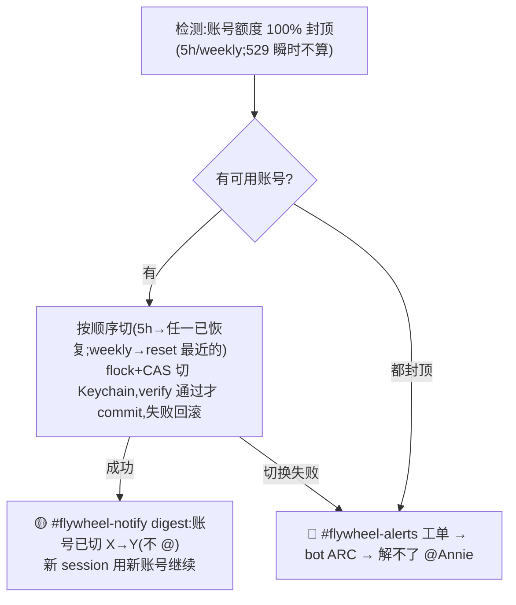

# FLY-915 Flywheel infra alerts & notification pipeline — PRD(v1 细节稿 / eng 照着能建)

Issue: FLY-915 (https://linear.app/geoforge3d/issue/FLY-915/flywheel-infra-alerts-and-notification-pipeline-痛点梳理-产品定义prd)
日期: 2026-07-06
基于: exploration.md(ground truth)、Annie 2026-07-06 逐节 review 决定

> **状态**:方向已由 Annie 全部拍板并 **lgtm(2026-07-06)** —— A/B/C/D/E + @-target 路由 + 3 个小确认(A2/B3/D2)+ T1/T2 全部收口(仅 T3 命名占位)。本稿是**给 eng 照着能建的细节 PRD**。已按 lgtm **拆成 3 个 eng issue:FLY-927 / FLY-928 / FLY-929**(交 Tadashi);W3a quick-fix = **FLY-925** 单独先行。**ship/merge/上线仍 founder-gated**(Tadashi 建、Annie 拍板)。
> **核心架构原则(贯穿全文)**:**告警频道 = bot 的「工单队列」,不是 Annie 的 inbox。** 有专属 thread 的错误进那条 thread(她在上下文看到);没有专属 thread 的问题才进告警频道 → **@ 唯一 owner bot**(默认 Claude bot,账号/授权按「谁都不救自己」交叉;**无双 bot 竞争**)ACK + 直接修,修得掉安静处理,**修不掉才 @Annie**。

---

## 1. Problem / Users / Goals

- **Problem**:Flywheel 内部 alert/通知/infra bot/profile 切换是一摊乱账 —— 告警频道被噪音刷屏(Annie 已不看)、每日 token report 静默失败、Simba 越权发全局通知、频道职责不清、第二个 infra bot 没建、Claude 额度切换建好却没启用(Annie 手动切)。
- **Users**:Annie(founder,只在「必须人介入」时被打断)+ 两个 infra bot(告警频道的常驻处理者)+ 各 Lead/Runner(被监看对象)。
- **Goal**:让告警频道变成 **bot 自动处理的工单队列**;Annie 只在 bot 修不掉时被精准打断;所有 infra 通知归位到通知频道 + 对应 thread;Claude 额度切换真自动。
- **Non-goals**:PM 验收闭环(=FLY-830);客户/第三方内容;FLY-914 的交互评论 feature(本 issue 只贡献了 CSP 可行性约束给它)。

## 2. 核心架构:告警频道 = bot 工单队列

Annie 的关键转向:**告警频道主要给「能解决问题的 bot/人」看,不是给她看。**

```mermaid
flowchart TD
    ERR["infra 侧发生一个问题<br/>(session 卡死 / 额度封顶 / auth 过期 / runner 停 …)"] --> Q{这个问题有没有<br/>专属 [FLY-XX] thread?}
    Q -->|有(项目/issue 出错)| TH["进那条 issue thread<br/>(Annie 在上下文看到,不埋全局告警频道)"]
    Q -->|没有(如某 Lead session 卡死)| AL["#flywheel-alerts 告警频道<br/>= bot 工单队列"]
    AL --> BOT["常驻 infra bot 认领工单"]
    BOT --> ACK["① ACK(标记我在处理)"]
    ACK --> FIX["② ARC 自动修(nudge / 重试 / 切账号 / respawn …)"]
    FIX -->|修掉了| SILENT["③a 安静 resolve(不 @Annie,留处理记录)"]
    FIX -->|修不掉/超时| ESC["③b 才 @Annie 升级(带上下文,人来救)"]
```

**三类落点**:
| 落点 | 放什么 | 谁发 | 会不会 @Annie |
|---|---|---|---|
| **[FLY-XX] issue thread** | 有专属 thread 的错误(项目/issue 出错)+ founder 通知(milestone/ship-ready/stuck page) | 对应 Lead / founder-thread-notifier | 就地 @(她在上下文) |
| **#flywheel-alerts 告警频道** | **没有**专属 thread 的 infra 问题(Lead session 卡死、额度封顶切不动、auth 救援失败、runner 卡死/超时/529 真停…) | **只有** infra bot(+auto-repair bot) | **默认不** —— bot 先 ACK+修;**修不掉才 @** |
| **#flywheel-notify 通知频道** | 非紧急 digest:token report / 系统重启 / 账号轮转成功 / 例行状态 | **Claude Infra Bot** | 不 @(digest) |

---

## 3. A. 频道架构(细节)

### 3.1 路由规则(eng 照着实现)
每条 infra 事件按下面决策路由(在 `LeadAlertNotifier` / 告警发射侧实现):
1. **该事件是否绑定某个 [FLY-XX](有专属 issue thread)?**
   - 是 → 走 `founder-thread-notifier` 进那条 thread(复用现有 FLY-523/818 机制)。**不进告警频道。**
   - 否 → 进 #flywheel-alerts(作为 bot 工单)。
2. **该事件是否「非紧急通知」(token report / 重启 / 轮转成功 / 例行)?**
   - 是 → 进 #flywheel-notify,由 Claude Infra Bot 发,不 @。
3. 其余(无 thread 的真问题)→ #flywheel-alerts 工单队列。

### 3.2 三个频道 & 归属
- **#flywheel-notify(通知频道)**:**A2 已定(Annie 2026-07-06)= 复用现有 token-usage 频道**(`1521630422918758472`,token report 已在打它),重命名/定位为 #flywheel-notify;发送方统一 = Claude Infra Bot。
- **#flywheel-alerts(告警频道)**:保留现有统一告警频道(`…661254`,FLY-368),但**语义转为 bot 工单队列**(见 §4)。
- **[FLY-XX] thread**:现有 per-issue chat thread,不变。

### 3.3 消息 schema(治「不知道哪来的」)
每条进告警频道的工单**必须带**结构化头:`project` + `lead/runner id` + `kind` + `first-seen ts` + `工单状态(ACK/修复中/已修/已升级)`。修现状缺 `projectName` 的问题(`formatContent()`)。

### 3.4 发送方门禁(治刷屏根因之一)
- **只有 infra bot(+ auto-repair bot)能往 #flywheel-alerts 写。** 别的进程一律拒(现状是谁都能发)。实现:告警发射统一收口到 infra-bot 身份;shell 兜底路径(`lead-alert.sh`)也要认统一频道 + 门禁(现状它不认 —— FLY-368 §9 遗留)。
- **频道级速率兜底**:#flywheel-alerts 每分钟工单上限,超了攒批,防任何新刷屏路径。

---

## 4. B. 什么进告警频道(工单白名单)+ bot 工单行为 + 治刷屏

### 4.1 工单白名单(进 #flywheel-alerts 让 bot 处理)
| 工单 kind | 触发 | bot ARC 尝试 | 修不掉时 |
|---|---|---|---|
| Lead session 真冻结 | 真卡死(**非** idle 1h) | 单 Enter / nudge / respawn+resume | @Annie(要人马上救) |
| 账号额度封顶切不动 | 全部账号封顶 / 切换失败 | 切下一个可用账号 | @Annie |
| login/auth 过期 | Lead/Runner auth 失效 | rescue(re-login 协调) | @Annie |
| runner 卡死 / 超时 | 超阈值无进展 | continue nudge / respawn | @Annie |
| **529 瞬时(runner 真停)** | runner 因 529 真停 | 等待/重试/切账号(ARC) | 解不了才 @Annie |
| three_stage_stuck / founder 通知投递失败 | 现有检测 | 现有处理 | @Annie |
| **内存压力越危险阈(OOM 预警)**(FLY-1082,FLY-1142 改真实压力信号,FLY-1193 加 debounce) | free% < 8 或 swapout-delta 持续 >0(vm_stat 实测,连续 2 tick 确认;弃用只涨不缩的 swap 水位) | trigger 时**静默**置可逆 pressure-hold(暂停派新 runner);压力**持续 ≥ N 秒**(env `FLYWHEEL_MEM_PAGE_DEBOUNCE_SEC` 默认 120)才告警 + 通知各 Lead 降载 —— 几秒自愈的瞬时 spike 不 page/不广播;真实压力被证明健康(free% ≥15 且 swapout 增量 ≤ MIN)自动解除+安静 resolve | 30 分钟不恢复 @Annie |
| **tmux server 整个消失**(FLY-1082) | server 死/重启且 StateStore 仍有 running runner | 成组标记终态(一个 episode,不是 13 条单独告警)+ 按 Lead 分组通知(各自阵亡清单+resume 指针);respawn 由 Lead 驱动 | 通知投递失败 @Annie |
| **Bridge 非正常退出**(FLY-1082) | dirty-exit marker(上一代没走 clean shutdown) | wrapper 直发 page(Bridge-independent 快路径)+ 复活后 boot 工单对账 → 安静 resolve;launchd respawn 即修复 | crash-loop(10 分钟 ≥3 次)@Annie;「一直没起来」由进程外心跳探针直接 @Annie |
| **infra bot 掉线**(FLY-1082) | launchd job 死 / pane 消失 | launchd job 原地重启(幂等可逆) | 2 次失败 @Annie |
| **跨 Lead 僵尸 session 积压**(FLY-1082) | CommDB↔StateStore 对账三形态,积压 ≥3 | (b) 型:设计上不自动收割(收割 = FLY-1066)→ 带样本清单直接升级 | 直接 @Annie(带清单+一个决定) |

### 4.2 治假冻结误判(Annie 明确要修)
- **idle 1h ≠ 冻结**:健康 idle(等活儿)绝不能报成冻结。现有 `isIdleHealthyPane()` idle suppressor(FLY-193,default-ON)已做这件事 —— PRD 要求**确认它覆盖到位**,并把「真冻结(要人救)vs 健康 idle(别报)」的判定标准写死进 eng issue(真冻结 = 有活跃任务但 live-region 长时间无变化且无 idle 锚点)。已知盲点(frozen-mid-thinking 无 esc 提示)列为 follow-up 抓真样本。
- **529**:不再一律压掉 —— **runner 真停要报**(进工单让 bot ARC);仅「529 瞬时但 runner 仍在烧」的健康情形压掉(现有 `isTransientThrottlePane` 区分)。

### 4.3 bot 工单生命周期(eng 状态机)
`检测 → 入队(告警频道工单)→ bot ACK → ARC 尝试(有限次/超时)→ [成功] 安静 resolve + 留处理记录 / [失败] @Annie 升级(带完整上下文)`。**幂等**:同一问题不重复开工单(复用现有 claims.db/episode-latch);**跨 bot 不抢**(provider 归属见 C)。

**进程外兜底(FLY-1082,2026-07-09 事故补)**:检测面大多活在 Bridge 进程内 —— Bridge 自己死了,整个检测→入队→修复平面一起死。所以「Bridge 死了且没活过来」由 **Codex Infra Bot 侧的独立心跳探针**兜住(确定性脚本,非 LLM loop,随 bot 的 launchd 域部署):每分钟 curl Bridge /health,**连续 down ≥5 分钟(可配)→ 直接 @Annie**,恢复后单发一条解除;每个 down episode 只 page 一次。快路径(死了但复活了)由 Bridge wrapper 的 dirty-exit marker 直发承担。**Bridge 自身死亡的检测腿(wrapper 直发 + 外部心跳)不得塞回 Bridge 进程内 —— 否则事故时同死**。

## 5. C. 两 infra bot 分工(Annie:分工 OK)

| 职责 | Codex Infra Bot(pool-03,已建待部署) | Claude Infra Bot(新建 pool-04/05/06) |
|---|---|---|
| 监看 + 切/救 | Claude 侧额度 + auth | Codex 侧额度 + auth |
| 救自己那侧 | ❌ 禁止(server 端 actorBackend!==provider 强制) | ❌ 禁止 |
| **provider 无关问题**(runner 卡死/超时/**529**) | — | **✅ 由 Claude Infra Bot 处理**(Annie 定) |
| 全局非紧急通知(token report/重启/轮转) | — | **✅ 由 Claude Infra Bot 发**(见 E) |

→ **Claude Infra Bot = 常驻主力**:管 Codex 侧救援 + 所有 provider 无关问题 + 所有全局通知。Codex Infra Bot 专注救 Claude 侧。

## 6. D. profile 自动切换(真 enable + 行为)

### 6.1 决定
- **真 enable**:开 `FLYWHEEL_ACCOUNT_SELF_HEAL` + 补 `FLYWHEEL_CLAUDE_PROFILE_BIN` + 走 FLY-696 §8 真机 QA(含「绝不弄坏 claude 登录」红线)+ Annie GO。这套切换机器已建好、已 merged,只差这一窗。
- **成功 = 静默自动切**:检测封顶 → 自动切下一个可用账号 → 成功后**只在通知频道留一条 digest message(不 @Annie)**。
- **失败/切不动 = 才打断**:切换失败 / 全部账号封顶 → 进**告警频道**,bot 先尝试 ARC,**解不了才 @Annie**。

### 6.2 流程(eng)

- **通知落点(回答 Annie 的 D 具体问)**:成功→通知频道 digest,不 @;失败/切不动→告警频道,bot 先试,@Annie 兜底。
- **已知边界(carry-forward,v1 接受)**:当前卡住的 session 不自动搬到新账号,只有新 session 用新账号(D2 Annie 未要求 v1 强搬 → v1 保留此边界,列 follow-up)。

## 7. E. token report / 重启 / 轮转 → Claude Infra Bot + 通知频道

### 7.1 决定
- **token report + 系统重启 + 账号轮转 → 全部由 Claude Infra Bot 发,进 #flywheel-notify。** Simba **退出所有 Flywheel 全局发送**。
- token report **先照现有格式迁走稳住**:每日 00:30 / 14 天窗口 / week-over-week 周对比,不改内容。
- **要改的 3 处发送方**:① Bridge `/api/reports` 的 `discordBotToken`(现取 `DISCORD_BOT_TOKEN`=Simba)② `restart-services.sh` 的 `NOTIFY_BOT_TOKEN`(现硬编码 `SIMBA_BOT_TOKEN`)③ standup sender(**保留约束**:现用非-CoS lead token 好让 Simba 触发 triage —— 迁移别破坏)。

### 7.2 稳定性
- **🔧 W3a QUICK-FIX(已单独立 = FLY-925,可先行、不等本 PRD)**:补 `FLYWHEEL_BRIDGE_URL`(token report 每晚真发出去,治「静默失败」)+ 补 `STANDUP_PROJECT_NAME`(修 standup 404)。纯配置、零产品风险。
- **产品级(W3b)**:Claude Infra Bot 带**自我健康检查** —— 「该发的 digest 没发成功」本身算一条通知/升级,不再静默失败几周没人知道(痛点 2 的真根)。

## 8. Success metrics(北极星)

- **N1(主)**:Annie 被告警频道打断的次数 / 周 —— 目标趋近于「只在 bot 真修不掉时」。衡量:@Annie 的告警条数 vs bot 安静 resolve 的工单数,比值持续下降。
- N2:告警频道噪音率(非工单/假告警条数)→ 0(发送方门禁 + 白名单 + 修假冻结后)。
- N3:token report 到达率(该发 30 天发成功 30 天)→ 100%(quick-fix + 自我健康检查后)。
- N4:Claude 额度封顶后「自动切成功、无需 Annie 手动」占比 → 目标 ≥ 目标阈值(enable 后)。

## 9. 收口决定(Annie 2026-07-06 已接受,不再 open)
- **A2 = 复用** ✅:通知频道复用现有 token-usage 频道(`1521630422918758472`),重命名/定位为 #flywheel-notify(token report 本就打它,省得新开)。
- **B3 = 每日 1 次** ✅:通知频道 digest 每日 1 次汇总;真紧急项不走 digest、按告警频道工单即时处理。
- **D2 = v1 不搬** ✅:当前卡住的 session v1 不自动搬账号(等 reset / 手动重启,只有新 session 用新账号);「卡住 session 也自动搬」列 follow-up。

## 10.0 组件产品行为规格(eng 照着建、不回来问 —— Annie 要求的细节标准)

> 对**每个 bot + 每个频道 + profile 切换**写死:①住/作用在哪个 channel ②监看/触发条件 ③触发后 action + 结果落哪频道 ④被 add/部署时初始化 ⑤铁律/边界。T1/T2 已锁(20/分;2次/5分);唯一仍未定项 = T3(Claude Infra Bot 命名),Annie 待起名,先占位、不 block(见 CMP-2)。

### 频道 CH-1 · #flywheel-alerts(告警频道 = bot 工单队列)
- ① **@-target 路由(Annie 2026-07-06 已锁,核心)**:每条工单 **只 @ 一个该处理的 owner bot**,**不让两 bot 都常驻抢着修 / 一起扑**。被 @ 的那一个 owner 独家认领;没被 @ 的 bot 不动手。**默认 owner = Claude Infra Bot(主力)**;账号/auth 救援按「谁都不救自己」交叉指定 owner(见白名单表「@ 谁」列)。沿用现有统一告警频道(`…661254`)。
- ② 进什么(准入):只有**没有专属 thread** 的 infra 真问题(工单白名单见下表)。有专属 thread 的错误 → 路由到那条 thread,**不进这里**。
- ③ 谁能发 + 格式:**只有 infra bot(+ auto-repair)能发**(发送方门禁,别的进程拒);**频道级速率上限 = 20 条/分钟(T1 已锁),超了攒批**。每条工单头:`project + lead/runner id + kind + first-seen ts + owner(@谁)+ 状态(NEW/ACK/修复中/已修/已升级)`。
- ④ 行为(工单生命周期):工单进 → **@ 唯一 owner bot** → 该 owner **ACK** → **ARC 尝试**(**修不掉判定 = 重试 2 次 或 5 分钟超时,T2 已锁**)→ 修掉=**安静 resolve**(更新状态,不 @Annie)/ 修不掉=**@Annie 升级**(带上下文)。幂等:同问题不重复开工单(复用 claims.db/episode-latch);**单 owner** 天然避免两 bot 竞争同一工单。
- ⑤ 铁律:默认**不 @Annie**,只有修不掉才 @;**一条工单只有一个 owner**;谁都不救自己(账号/auth 救援交叉)。

**工单白名单(进 CH-1 → @ 唯一 owner 处理):**
| kind | 触发 | **@ 谁(唯一 owner)** | ARC 尝试 | 修不掉 |
|---|---|---|---|---|
| Lead session 真冻结 | 真卡死(非 idle 1h) | **Claude bot(默认主力)** | 单 Enter / nudge / respawn+resume | @Annie |
| **Claude 账号**问题(封顶切不动) | 全封顶/切换失败 | **Codex bot**(交叉:Claude 问题 @ Codex) | 切下一个可用账号 | @Annie |
| **Codex 账号**问题(额度满等) | Codex 侧额度/切换 | **Claude bot**(交叉:Codex 问题 @ Claude) | 按 provider 处理 | @Annie |
| login/auth 过期 | auth 失效 | **对侧 bot**(交叉:Claude auth @ Codex、Codex auth @ Claude) | rescue re-login | @Annie |
| runner 卡死/超时 | 超阈无进展 | **Claude bot**(provider 无关,默认) | continue nudge / respawn | @Annie |
| 529 runner 真停 | runner 因 529 真停 | **Claude bot**(provider 无关,默认) | 等/重试/切 | @Annie |
| three_stage_stuck / founder 通知投递失败 | 现有检测 | **Claude bot(默认)** | 现有处理 | @Annie |
| 内存压力越危险阈(OOM 预警) | free%/swapout-delta 滞回+2 tick 确认(FLY-1142);page 需持续 ≥ N 秒(FLY-1193 debounce) | **Claude bot(fleet 级默认)** | trigger 静默置 pressure-hold + 持续 ≥ N 秒才 Lead 降载通知;真实压力健康自动解除 | 30 分钟不恢复 @Annie |
| tmux server 整个消失 | server 死且仍有 running runner | **Claude bot(fleet 级默认)** | 成组终态迁移 + 按 Lead 分组通知(respawn 归 Lead) | 通知投递失败 @Annie |
| Bridge 非正常退出 | dirty-exit marker | **Claude bot(fleet 级默认)** | launchd respawn + boot 对账自检 → 安静 resolve | crash-loop / 没活过来(外部心跳)@Annie |
| infra bot 掉线 | launchd job 死/pane 消失 | **对侧 bot**(交叉:死 Claude bot @ Codex、死 Codex bot @ Claude) | launchd job 原地重启 | 2 次失败 @Annie |
| 跨 Lead 僵尸 session 积压 | 对账三形态,积压 ≥3 | **Claude bot** | (b) 型:不自动收割(FLY-1066)→ 直接升级 | 直接 @Annie(带清单) |

> **@-routing 规则(Annie 2026-07-06 已锁)**:一条工单只 @ 一个 owner、无双 bot 竞争。**默认 @ Claude bot(主力)**;provider 无关问题(runner 卡死/超时/529)→ @ Claude bot;账号/auth 救援按「谁都不救自己」**交叉**:**Claude 账号/auth 问题 @ Codex bot、Codex 账号/auth 问题 @ Claude bot**。

### 频道 CH-2 · #flywheel-notify(通知频道)
- ① 谁在/在哪:复用现有 token-usage 频道 `1521630422918758472` 定位成 #flywheel-notify(A2 已定复用);唯一发送方 = **Claude Infra Bot**。
- ② 进什么:非紧急 digest —— token report、系统重启、账号轮转成功、profile 切换成功、例行状态。
- ③ 节奏:每日 1 次 digest 汇总(B3 已定)。
- ④ 初始化:迁移 3 处 sender 到 Claude Infra Bot(见 CMP-4)。
- ⑤ 铁律:**绝不 @Annie**;绝不放需要人立即处理的东西(那些进 CH-1 或 thread)。

### 频道 CH-3 · 每条 [FLY-XX] issue thread
- ① 每条 issue 自己的 chat thread(现有)。
- ② 进什么:**有专属 thread 的错误**(项目/issue 出错)+ founder 通知(milestone / ship-ready / stuck page)。
- ③ 谁发:对应 Lead / `founder-thread-notifier`。
- ④ 行为:就地 @(Annie 在上下文看到)。
- ⑤ 铁律:有 thread 的错误**绝不埋进全局告警频道**。

### 组件 CMP-1 · Codex Infra Bot(pool-03,已建待部署)
- ① 在哪 + 何时动手:在 **#flywheel-alerts** 里,但**只处理 @ 到自己的工单**(**不常驻抢修、不跟 Claude bot 竞争**)。owner 范围 = **Claude 侧账号/auth 问题**(交叉:Claude 问题 @ 它)。身份 = pool-03(`CODEX_INFRA_BOT_TOKEN`)。
- ② owner 范围:**Claude 侧** Lead/Runner —— 额度(usage_limit 封顶)+ auth(login_expired)(被 @ 时才处理)。
- ③ 触发 → action → 落哪:
  - Claude 账号封顶 → 触发已建 self-heal 切 Claude 账号 → **成功**=#flywheel-notify digest「账号已切 X→Y」不 @;**失败**=#flywheel-alerts 工单升级 @Annie。
  - Claude 侧 login/auth 过期 → rescue(re-login 协调 / kickstart / respawn+resume)→ 成功=安静 resolve;失败=@Annie。
- ④ 被 add/部署时初始化:装 launchd(`run-codex-infra-bot-tui.sh` + plist)→ `verify-windowed-lead` → 开 `FLYWHEEL_ACCOUNT_SELF_HEAL` → 重启 Bridge → 注入演练 → Annie GO。启动后注册进 #flywheel-alerts 监听、认领 Claude-侧工单。
- ⑤ 铁律/边界:**谁都不救自己** —— 绝不处理 Codex 侧(server 端 `actorBackend!==provider` 强制);卡住 session v1 不自动搬。

### 组件 CMP-2 · Claude Infra Bot(pool-04/05/06,待新建)—— 默认主力 owner
- ① 在哪 + 何时动手:在 **#flywheel-alerts** 里,处理 **@ 到自己的工单**(**不跟 Codex bot 抢**)+ **唯一发 #flywheel-notify** 的 bot。owner 范围 = 默认主力 + Codex 侧账号/auth + provider 无关问题。身份 = pool-04/05/06 claim 一个。
- ② owner 范围:**默认 owner(主力)**;**Codex 侧** Runner 额度+auth(交叉:Codex 问题 @ 它);**provider 无关问题**(runner 卡死/超时/529 真停,Annie 定归它);全局通知源(token report/重启/轮转)。
- ③ 触发 → action → 落哪:
  - Codex 侧 auth 过期 → rescue Codex → 成功安静 / 失败 @。
  - runner 卡死/超时 → continue nudge / respawn → 成功安静 / 失败 @。
  - 529 runner 真停 → ARC(等/重试/切）→ 解不了 @。
  - token report/重启/轮转 → 发 #flywheel-notify digest,不 @。
- ④ 被 add/部署时初始化:pool claim → rename → invite-url → Annie 邀请进 server → 装 launchd(仿 CMP-1 launcher)→ verify → 接线(监听 #flywheel-alerts + 发 #flywheel-notify + 接管 token report/重启/轮转 sender)→ 演练 → Annie GO。
- ⑤ 铁律/边界:谁都不救自己(不碰 Claude 侧账号切换 = CMP-1 的活);#flywheel-notify 绝不 @Annie。

### 组件 CMP-3 · profile 自动切换(Claude 额度 self-heal)
- ① 作用在:机器级(Keychain 账号);触发/通知落 #flywheel-alerts(失败)/ #flywheel-notify(成功)。
- ② 触发条件:某 Claude 账号额度 **100% 封顶**(5h 或 weekly;**529 瞬时不算**)。检测源 = LeadWatchdog usage_limit + usage-gauge。
- ③ action → 落哪:有可用账号 → 按顺序切(5h→任一已恢复;weekly→reset 最近的)→ flock+CAS 切 Keychain,**verify 通过才 commit,失败回滚** → **成功**=#flywheel-notify digest 不 @ + 新 session 用新账号;**切换失败/全封顶**=#flywheel-alerts 工单 → Codex Infra Bot ARC → 解不了 @Annie。
- ④ 被 enable 时初始化:开 `FLYWHEEL_ACCOUNT_SELF_HEAL` + 补 `FLYWHEEL_CLAUDE_PROFILE_BIN` → FLY-696 §8 真机 QA(含「绝不弄坏 claude 登录」红线)→ Annie GO。
- ⑤ 铁律/边界:只有真 100% 封顶才切;verify 失败绝不 commit(不弄坏登录);卡住 session v1 不自动搬。

### 组件 CMP-4 · token report / 重启 / 轮转 digest(发送方迁移)
- ① 发进 #flywheel-notify,由 Claude Infra Bot 发。
- ② 触发:token report = 每日 00:30 launchd;重启 = update-flywheel.sh/restart-services.sh;轮转 = 账号切换成功。
- ③ action:照现有格式(14 天窗口/周对比)→ digest 不 @;**自我健康检查**:该发没发成功 → 升级一条通知。
- ④ 初始化(迁移):3 处 sender 换 Claude Infra Bot token —— ① Bridge `/api/reports` `discordBotToken` ② `restart-services.sh` `NOTIFY_BOT_TOKEN` ③ standup sender(**保留非-CoS 约束**);补 `FLYWHEEL_BRIDGE_URL`(=W3a quick-fix);Simba 退出全局发送。
- ⑤ 铁律:**Simba 绝不再发 Flywheel 全局通知**。

---

## 10. Build issues(方向定稿后拆给 Tadashi;每条链回本 PRD 节)

| # | Workstream | 对应节 | 备注 / 依赖 |
|---|---|---|---|
| **W3a** | 🔧 QUICK-FIX:补 `FLYWHEEL_BRIDGE_URL` + `STANDUP_PROJECT_NAME` | §7.2 | **已单独立 issue = FLY-925**(可先行、不等本 PRD) |
| W1 | 告警频道转 bot 工单队列 + 路由(有 thread→thread)+ 发送方门禁 + 速率兜底 + 消息 schema | §2/3/4/10.0 CH-1 | 核心架构 |
| W2 | 「告警≠通知」写进 spec + 每条工单带 project/lead/kind | §3.3 | |
| W3b | 建/定位 #flywheel-notify + token report/重启/轮转迁 Claude Infra Bot + Simba 退出 + 自我健康检查 | §7/10.0 CH-2,CMP-4 | **⚠️ 依赖 W5**:迁移的目标发送方 = Claude Infra Bot,得 W5 先把它建出来 |
| W4 | 部署 + 启用 Codex Infra Bot(FLY-871 C6 上线窗) | §5/10.0 CMP-1 | |
| W5 | 新建 Claude Infra Bot(pool-04/05/06;救 Codex 侧 + provider 无关问题 + 全局通知) | §5/10.0 CMP-2 | **W3b 的前置** |
| W6 | 启用 Claude 额度自动切换(开 flag + 真机 QA + 成功静默/失败 @ 的通知体验) | §6/10.0 CMP-3 | |
| W-B | 治假冻结误判确认(idle 1h≠冻结)+ 529 真停要报 | §4.2 | 可并入 W1 |

### 3 个 eng issue(Annie 2026-07-06 lgtm,已建;label = Flywheel eng,team FLY / project Flywheel)
- **[FLY-927] ① 频道架构 + 路由 + @-target 门禁** = W1 + W2(+ W-B 并入)—— §2/3/4/10.0 CH-1/2/3。含:告警频道转工单队列、有 thread→thread 路由、@-target 唯一 owner、发送方门禁、**速率 20/分(T1)**、消息 schema、告警≠通知写进 spec + 带 project/lead/kind。
- **[FLY-928] ② 两个 infra bot** = W4(部署 Codex Infra Bot)+ W5(新建 Claude Infra Bot)—— §5/10.0 CMP-1/2。**W5 先于 ③ 的通知迁移**。
- **[FLY-929] ③ profile 自动切换 + 通知迁移** = W6 + W3b —— §6/7/10.0 CMP-3/4。含:启用 Claude 额度自动切换(成功静默/失败 @,**修不掉判定 2次/5分 T2**)+ token report/重启/轮转迁到 Claude Infra Bot + 通知频道 + 自我健康检查 + Simba 退出。
- **跨 issue 依赖**:FLY-929 的通知迁移(W3b)**依赖 FLY-928 的 W5**(Claude Infra Bot 要先存在才能当发送方)→ 排期 FLY-928 先于 FLY-929 的迁移部分。
- **T3(Claude Infra Bot 命名)**:Annie 待定 → issue 里先用占位名「Claude Infra Bot」,名字定了补,**不 block 开工**。
- **已拎出先行**:W3a quick-fix = **FLY-925**(不占这 3 个 issue)。
- **ship/merge/上线仍 founder-gated**(Tadashi 建、Annie 拍板)。

> PM 验收 = 未来 FLY-830,现在不做。

---

## 附:决定汇总(Annie 2026-07-06 已 lgtm,全部收口)
- A2 = **复用**现有 token-usage 频道当 #flywheel-notify ✅
- B3 = **每日 1 次** digest ✅
- D2 = v1 **不强搬**卡住 session(列 follow-up)✅
- @-target 路由(一 owner、无双 bot 竞争、账号/授权交叉)✅;T1=20/分、T2=2次/5分 ✅
- **整体产品方向 Annie 已 lgtm** → 已拆 **FLY-927 / FLY-928 / FLY-929** 交 Tadashi(W3a quick-fix = FLY-925 单独先行)。
- **唯一仍未定** = T3 Claude Infra Bot 命名(占位、不 block 开工)。ship/merge/上线仍 founder-gated。
