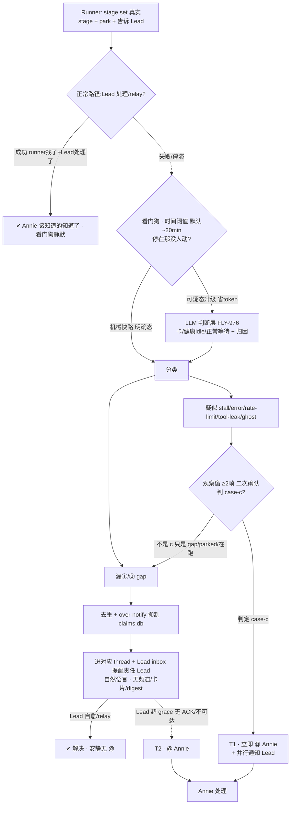

# FLY-942 Watchdog + Lead 主动汇报机制 — PRD(DRAFT · 骨架,逐块跟 Annie converge 中)

Issue: FLY-942 (https://linear.app/geoforge3d/issue/FLY-942/watchdog-lead-主动汇报机制-产品设计-prd让-annie-不再当人肉-qa)
日期: 2026-07-07
基于: exploration.md(本文件夹)、FLY-878/915/927/941/964/975/976 关联 issue、Annie 2026-07-07 深度 review
母 Epic: FLY-989 Watchdog + 主动汇报 稳定化 EPIC (https://linear.app/geoforge3d/issue/FLY-989) — 本 PRD(FLY-942)= 该 Epic 的「主动汇报 + 检测」产品定义 PRD;Epic consolidate 878/975/976/927/915/970/973/941/964,以后发现一个提一个、定期 iterate。FLY-989 归 FLY-774 稳定化 EPIC 底下。

> **状态**:**G1 + G2 全 converged(Annie 逐块拍定,2026-07-07~08)**。G1 检测层:兜两漏 + 时间阈值 + FLY-976 LLM 判断层读 per-pane 富态判三态(C 绝不漏)。G2 汇报层(Annie 2026-07-08 大幅砍简单):**全进对应 [FLY-XX] thread、自然语言;无 founder 频道 / 无决策卡 / 无 digest;唯一主动 @ Annie = 真卡死 / Lead 接不住**。→ 下一步 **codex design-review** → 拆 build issue 给 Tadashi。**不 ship / 不 merge / 不 create-issue**(ship 仍 founder-gated)。
> **北极星:准确性 = 三态判对**((a) 在跑长turn / (b) 正常parked 不误报、(c) 真卡死 不漏报;读 per-pane 富态 token-flow+FSM 态,非粗信号)**+ Annie 四病症**(①误报=混淆a/b ②分发→consolidate ③漏报=漏c ④噪音)。主动汇报只有在检测足够准时才成立 —— "状态显示骗你一次你就再也懒得看"。两半同等重要:**① 检测层(准)+ ② 主动汇报层(兜漏、全进对应 thread 自然语言、极少 @)**。

---

## 0. 一句话

runner 干完一轮 parked、或真卡住时,正常路径(runner 告诉 Lead → Lead 处理/relay)自己 work;**看门狗只在正常路径漏了(runner 没找 Lead / Lead 漏应答)、或真 stall,且超时间阈值没人动时,把状态用自然语言进对应 [FLY-XX] thread、先提醒责任 Lead;唯一主动 @ Annie = 真卡死 / Lead 接不住**,让 Annie 不用每 30–60min 人肉巡查。把"扫描/检测"变成看门狗的系统级职责(可扩展,新 Lead 不必会巡查),把 Lead 从"巡查工"变成"第一响应人";用**时间阈值 + 去重/抑制 + 全进对应 thread(自然语言)+ 真卡死绝不漏** 同时满足"绝不静默停着没人发现" ⨯ "Annie 离开数小时也不刷屏"(**无 digest / 无频道 / 无卡片**,Annie 2026-07-08 简化)。

## 1. Problem / Users / Goals

- **Problem**:runner 经常干完一轮 parked(等 founder 拍板)或真卡住,没人主动汇报 → Annie 被迫人肉巡查每个 runner(人肉 QA);要她拍的决策埋在长消息、不进对应 thread、不够醒目。且现有看门狗**不准**(漏报真 stall / 误报健康 runner / alive-flag 不可信 / 归因错措辞),不准 → Annie 更得自己盯。
- **Users**:**Annie(founder)** 只在"真需要她拍 / 真卡了"时被精准醒目叫到,其余不打扰,离开数小时回来一眼看清"哪些在等我";**Lead** 从"要会巡查"解放为"看门狗一响我第一个排查",自愈或 relay;**Runner / Watchdog / Bridge** = 状态的产生 / 检测 / 投递。
- **Goals**:① **准**(北极星):检测漏报近零、误报可容忍低、归因/措辞按真实 stage 不猜。② **绝不静默**:任何需人介入的停止,系统一定让"该负责的人"知道。③ **不刷屏**:无新状态变化=无新通知。④ **决策进对应 thread**:一事一帖(自然语言,非固定卡片)。⑤ **可扩展**:检测是系统级看门狗的活,不靠每 Lead 手动扫。
- **Non-goals(划走给别 issue,本 PRD 只定产品行为,不重做)**:
  - 检测**实现**(park 元组 / 真实 stage 归因 / @-target / 时间阈值)= **FLY-927 Watchdog v2**(In Progress;注:927 现用 1h,本 PRD 收敛为 878 的 ~20min 可配,Qe/eng 对齐)。
  - 看门狗 **LLM 判断层实现** = **FLY-976** eng(Tadashi);本 PRD 定"要什么判断行为"。
  - 告警频道架构 / bot 工单队列 / 发送方门禁 / profile 切换 = **FLY-915**(Annie 已 lgtm)。本 PRD 复用其 thread 落点。
  - tool-call-leak 检测 = **FLY-941**(检测清单里的一类)。
  - 状态**持久显示**(置顶/标题/4 态/返工)= **FLY-964**。本 PRD push 与其同源。
  - eng 实现细节 = Tadashi。

## 2. 核心架构:正常路径自洽,看门狗时间阈值兜"漏"(Annie 2026-07-07 revise)

> **⚠️ 早稿"球换手就 push / park 立即 push"被 Annie 否掉。** 正常路径(runner 报 stage/park + 告诉 Lead → Lead 处理/relay)自己就 work;看门狗**只兜它的两类失败(漏),且超时间阈值才响**(不即时)。



**两半各自的价值**:检测层保证"准"(北极星,否则汇报不可信);汇报层保证"进 thread、自然语言、极少 @"。**准确性 = 三态判对(C 绝不漏)+ Annie 四病症**。**汇报 = 全进对应 thread、自然语言;唯一主动 @ = 真卡死/Lead 接不住**(Annie 2026-07-08 简化)。**同源**——都从 `flywheel-comm stage set` 真实 stage + park 元组派生 → 与 FLY-964 显示永不打架,归因永不靠猜。

---

## 3. ① 检测层(准确性 = 北极星)

### 3.0 核心病:分不清三种"看起来 idle"(Cass 亲历 + Tadashi code/运营)
现 watchdog = 多组件(`RunnerIdleWatchdog`/`LeadWatchdog`/`HeartbeatService`/`GatePoller`/`stuck-detector`)**各扫各的**,靠**粗信号**(idle 时长 / 无 `stage_changed` / message 模式匹配 / alive-flag,stale+机械)。**分不清三态**:

| 态 | 真相 | 现状误判 | 例 |
|---|---|---|---|
| **(a) 在跑长 turn** | pane token 在流 | **误报** | FLY-545 48min implement 狂吐 token 却报 stuck |
| **(b) 正常 parked 等 gate** | awaiting_review + 明确 park | **误报** | parked 等 founder 被当卡 |
| **(c) 真卡死** | error + 空 prompt + 不恢复 | **漏报** | FLY-975/546 error-then-idle 被当 HEALTHY |

粗信号混三态 → 误报(a)(b)+漏报(c);codex-hold 罐头"等很久"不分正常 hold vs 真卡(FLY-863 半修 / 912)。**核心跃迁 = 从"粗信号机械匹配"→"读 per-pane 富态"(token-flow + 会话 FSM 态)区分 a/b/c** = 自动化 Tadashi 手动 fleet-scan。

### 3.1 北极星验收 = 三态判对(带优先级)+ Annie 四病症 ✅ G1 定案
**准 = 三态判对,且带优先级(Annie 拍)**:
- **(c) 真卡死 = 头号北极星,绝不放过(100% 不漏)** —— 报错+空prompt+不恢复 / rate-limit冻 / `/compact` 死等。检测第一优先 = 可靠认出 C。**漏 C = 直接逼 Annie 人肉巡查。**
- **(a) 在跑长 turn 被误报 = 可容忍、低优先** —— 用户一看知道是假的、不处理;修但非 top。
- **(b) 正常 parked 等她 = 不是误报、是 feature,要 surface** —— parked 等她 + 没人告诉她 → watcher surface 正是最该做的(接汇报层 gap② Lead-漏应答)。看门狗不把 (b) 当"卡"告警,但汇报层要兜"parked-等-founder 却没人转"。
- **北极星 = C 绝不漏 >> A/B。**

映射 Annie 四病症:
- **① 误报** = 混淆 a/b(把在跑/合法 parked 当卡);机械匹配旧 msg、遇新 error 认不出 → **坐实 FLY-976 LLM 判断层**。
- **② 分发不合理**:有的报给 Lead[好]、有的进 alert room[被忽略] → **consolidate 接收点**。
- **③ 漏报** = 漏 c(真 stuck 没反应,FLY-975/546)。
- **④ 噪音过多**:对错的问题狂发(FLY-871 / ghost FLY-970)。
- 底层:**alive-flag 不可信**(alive=true 却登出/卡菜单/冻结 FLY-909)→ 必须 capture pane;**归因不靠猜**(FLY-912)。
- 一句话:**watchdog 说卡就是真卡、说健康就是真健康;报了就是该报的、报到的就是看得到的。**

### 3.2 准确性机制 ✅ **Annie 拍:走 FLY-976 LLM 判断层**(读 per-pane 富态判 a/b/c)
- **机械快路**(零 token,便宜初筛):真实 stage / park 元组明判明确态。
- **LLM 判断层**(可疑才升级,省 token,FLY-976):读 pane 富态(token-flow + FSM 态)+ 真实 stage + park 元组 → 判 **a working / b parked / c stuck** + 归因(球在谁)+ 建议动作(nudge/respawn/切账号/@人)。正是 546 那种"报错后静默 idle"机械分不清、LLM 能。
- **观察窗 + 二次确认(Tadashi 补,机制关键)**:三态判定最难是**边界** —— 长 turn 里瞬时空 prompt(看着 idle、下秒又吐)、error-but-looks-parked(报错后停在类 park 静默态)。→ 检测用**观察窗 + 二次确认**,**不是单帧快照**。**分类器最小契约(Codex R1 MED-5,只定契约不写实现)**:
  - **≥2 帧,间隔有界**(不是单帧);
  - **输入 = live-region diff + token-flow(在不在吐)+ 会话 FSM 态 + 最近 CommDB 事件(ask/park/stage)+ 已过时长**(单看 idle 有无不够 —— 现 `isIdleHealthyPane` 就是单帧、且现 `stuck-candidate` 明说漏掉"输出仍在变的卡"如 retry loop/spinner);
  - **不确定时 → `fail-suspicious` 附 pane 原文上报,绝不静默压掉**(降级变糙、不吞)。
  - 目的:别把恢复中的长 turn 当卡死(护 a)、也别把真卡死当短暂空(护 C)。直接服务"C 绝不漏"。
- **配套 lead 协议(FLY-937)**:Lead 收 stuck 报警**先 capture pane 验当下**(不信 stale alive-flag/commit);**报警默认可信、值得查,不默认误报**。自动看门狗读 capture-pane 判 frozen/rate-limit = **FLY-778**。
- **降级永不静默**(FLY-878 标签分层):认不出→AI 兜底;仍不确定→`fail-suspicious` 附 pane 原文上报(标签变糙、绝不吞)。
- 边界:判断层**实现** = FLY-976 eng + 937 lead 协议 + 778;本 PRD 定"要这种理解 + 输出契约"。

### 3.3 看门狗抓什么(catalog,超时间阈值才响;喂 FLY-927/976)
| 检测类 | 判定(准确性要点) | 先报谁 | 归属 |
|---|---|---|---|
| **漏① runner 没找 Lead** | parked/需要人,但无对 Lead 的通信 | 责任 Lead | **878 s1** |
| **漏② Lead 漏应答** | runner 找了 Lead,Lead 超应答时效未理 | 提醒该 Lead | **878 s3 / HL** |
| 真 stall / error | capture pane:冻住 + 无进展(非健康 idle);`Server error mid-response` 不得被 `isIdleHealthyPane` 压掉 | owner Lead | 878/**975 必修** |
| rate-limit / 冻结 / 登出 | capture pane 认菜单/登出(**非 alive-flag**);理想自动切账号 | owner Lead/infra | alive-flag 家族 |
| tool-call-leak | 输出含未执行的 invoke 文字块 | owner Lead | **FLY-941** |
| dead-but-registered ghost | status=running 但 alive=false 僵尸 | 系统(检测+清+抑制) | **FLY-970/973** |

> 注:"干完 parked 等 founder"/"需 founder 决策"是**正常路径**surface 的状态(runner→Lead→relay 或系统直投 thread),**看门狗只在它超阈值停滞时**才按 漏①/漏② 兜。

### 3.4 over-notify 抑制(治 ghost 刷屏)+ 治源头〔Q9〕
- **抑制**:已知 / 正在清 / 已升级的问题**绝不 re-alert**(FLY-970 死着还一直 fire session_stuck)。复用去重设施 + 对"清理中"ghost 加抑制态。
- **治源头(auto-QA-spawn gate)= follow-up ref,不在 942 build**(§9 已移出):FLY-970 ghost 根因 = product/no-three-stage issue 被错误 auto-spawn QA → 此类 issue 不该自动 spawn QA(归 **FLY-579/707**)。942 只把它列为相邻需求。
- 清理机制 / 子 session scope 归属 = eng(FLY-973:归 parent lead 非一律 eng);归约束 = FLY-962/978。**均 follow-up,非 942 build。**

### 3.5 mid-turn hard-stop(相邻能力)= follow-up 独立 issue,不在 942 build
现状 queued STOP 只在 turn 边界生效 → runner 烧完 token 做完不想要的才停(FLY-915 v2 就多做了个 PRD+PR)。需求:能 kill 当前 turn。实现 = harness/eng,**独立 issue**(§9 已移出 942 build);待 Annie 定是否纳入 942 scope(默认不纳入)。

---

## 4. ② 主动汇报层(Annie 2026-07-08 定稿:全进 thread、自然语言、极少 @)

> **⚠️ Annie 大幅砍简单**:所有汇报进相关 [FLY-XX] thread、用**自然语言**(Lead 现已做得好的那样)。**不搞独立 founder 频道、不搞决策卡固定模板、不搞每日 digest。** 早稿的 founder 频道 / 决策卡 / digest 设计全**作废**。

### 4.1 两界面,同源
| | 是什么 | 谁看 | 触发 |
|---|---|---|---|
| 持久显示(FLY-964,pull) | 置顶/标题恒在、静默刷新 | 想看时扫 | 每生命周期事件重算 |
| 看门狗兜漏(本 PRD,时间阈值) | 正常路径失败(两漏+stall)超阈值 → 进对应 thread、自然语言 | Lead 先接;真卡/接不住才 @ Annie | 停在那没人动 + 超阈值 |

### 4.2 全进对应 [FLY-XX] thread、自然语言(不搞频道/卡片/digest)
- **要 Annie 拍的决定** → 直接进**该 issue 的 thread**、自然语言(她:需要她决定的本就跟某 issue 相关,发对应 thread 就行)。**不搞独立 founder 频道 / 开放队列。**
- **Lead 替她拍的可回退小决定** → 该 thread 一条**安静帖、不 @ 她**(她选安静帖,不是 digest)。
- **日常 问 / 答 / FYI** → thread、安静、**无 @**。
- 形态 = **自然语言**,**不要固定卡片格式、不要 digest**。

### 4.3 主动 @ Annie 的两个(且仅两个)触发 —— 解决 escalation 语义(Codex R1 HIGH-1)
系统**唯一**主动 @/打断 Annie 的情况,精确定义为下面两条(消除"case-c 立即 @ vs Lead-first"的歧义):

| 触发 | 时序 | Lead 参与 |
|---|---|---|
| **T1 · 真卡死 case-c** | **看门狗判定 case-c 那刻立即 @ Annie**(不等 Lead grace) | **同时**通知责任 Lead(Lead 仍按 FLY-937 capture pane 去修;但 case-c 严重 + 北极星#1,Annie 不排在 Lead grace 之后) |
| **T2 · gap-Lead-接不住** | 两漏(①runner 没找 Lead / ②Lead 漏应答)先 nudge Lead;**Lead 超 grace 无 ACK / 不可达 → 才 @ Annie** | Lead-first,升级兜底 |

> **为什么 case-c 立即 @ 而 gap 走 Lead-first**:真卡死 = 罕见、严重、常需 founder 动作(切账号/重启),且是北极星"绝不漏"的核心,不该压在 Lead grace 之后;两漏是"没人转/没人接"的责任问题,Lead 是第一责任人、给窗口自处理。**此条按 Annie 原话"真卡死 → 当场立刻 @ 她"定;待她终确认(若她要 case-c 也走 Lead-grace,改 T1 时序即可)。**

日常 问/答/FYI/Lead 替拍安静帖 全走 thread、安静、**无 @**。

### 4.4 反刷屏 ⨯ 绝不静默(靠检测,不靠 digest)
- **不刷屏**:日常无 @;去重 + over-notify 抑制;正常路径 work 时静默;T1/T2 都稀有高信号。
- **绝不静默**:靠**两漏检测(T2)+ case-c 绝不漏(T1)**(**不靠 digest** —— Annie 明确不要)。digest 被砍后,"绝不静默"由检测层(两漏 + case-c 100% 不漏)保证,非 digest 网底。

### 4.5 Lead 响应契约 + Lead-提醒 transport(Codex R1 HIGH-2)
看门狗检测到两漏 + stall(§3.3),**责任 Lead 第一响应人**:① 排查 ② 自愈 ③ 真需 Annie 拍 → 在对应 thread 用**自然语言**surface(不是固定卡片)④ **绝不静默**(留痕)。
- **Lead-提醒的投递契约(不是 founder-thread-notifier —— 那是 founder-only,只 @ ownerUserId)**:
  - **目标 Lead** = 按 parent issue 的 dept label 解析出的 owner Lead(非一律 eng)。
  - **投递** = 进对应 [FLY-XX] thread 一条帖 **+ 经现有 Lead inbox/mailbox 机制通知该 Lead**(复用 FLY-161 `runner_question`→Lead inbox / FLY-168 mailbox wake;**不复用 founder-only 的 `founder-thread-notifier`**)。
  - **ACK/凭据** = Lead 的 disposition/回应(自愈记录 / relay / 明确 dismiss)。
  - **升级** = 超 grace 无 ACK / Lead 不可达 → **@ Annie(= T2)**。
- 漏① runner 没找 Lead → 提醒 Lead(thread + Lead inbox)。
- 漏② Lead 漏应答 → 提醒 Lead;**Lead 接不住 → @ Annie(T2)**。
- 真卡死 case-c → **看门狗立刻 @ Annie(T1)+ 并行通知 Lead**。

### 4.6 检测 cadence / 时延契约(Codex R1 HIGH-3:阈值必须绑到真实轮询)
**现状**:Runner idle/stuck 轮询默认 **~1h**(`DEFAULT_IDLE_POLL_MS = 3_600_000`;stuck 首检也放宽到 ~1h);现有 10min stagnant 阈值受该轮询驱动。→ **光在纸上写 20min 阈值、但仍每小时看一眼 runner,达不到"不再每 30–60min 巡查"。** 阈值必须绑 cadence:
- **廉价 gap/state 扫描**(读 CommDB `runner_declared_states` / ask 记录 / stage,**不抓 pane**)每 N 分钟(便宜、可高频)→ 判两漏(①②)。
- **pane 观察帧**(capture pane,较贵)在 M 分钟内取 ≥2 帧(用于 case-c 富态判定,§3.2)。
- **首个 actionable Lead 提醒 ≤ 配置阈值(~20min,global+per-project)**;case-c 判定 → 立即 @ Annie(T1)。
- 若昂贵 pane capture 现实上仍 ~1h,则 20min 只保证廉价 gap 检测,case-c pane 诊断时延更粗 —— **eng 需定 scheduler**(见 W-cadence)。**验收写明 max 检测时延**,不留 cadence 隐式。

> 早稿 `mockup.html` 的决策卡/digest 形态已被 Annie 简化为**自然语言进 thread**;mockup 仅存历史,PRD 以本节为准。

---

## 5. 组件职责 + 数据流

| 组件 | 职责 | 状态 |
|---|---|---|
| Runner | `stage set` 报真实 stage(`stage.ts`→`stage_changed`→`sessions.session_stage`);干完 `park`(CommDB `runner_declared_states`) | 已建;⚠️ park 后现状静默 |
| Watchdog | 检测/分类(球在谁)/去重;park 元组+@-target+阈值=FLY-927;LLM 判断=FLY-976 | 部分已建;927/976 计划中 |
| Bridge | **两漏/T2** → 进对应 thread + **Lead inbox/mailbox(FLY-161/168)提醒 Lead(不用 founder-only 的 `founder-thread-notifier`)**;**T1 case-c / Lead 接不住** → `founder-thread-notifier` **仅走 founder @ 那条路**;去重 claims.db | Lead inbox/去重已建;三态判定 + case-c 即时 @ + 观察窗 + Lead-ACK 契约要补(**无卡片/无 digest**) |
| Lead | 第一响应人(§4.7) | 契约要形式化 |
| FLY-964 显示 | 同源持久显示 | 不重做 |

数据流:`runner 状态变 → stage set(真实stage)+park+告诉 Lead → [正常路径:Lead 处理/relay 成功→看门狗静默] / [失败→Watchdog 时间阈值 + 读 pane 富态判三态/分类(两漏+stall)/去重 → 进对应 thread 自然语言、提醒 Lead → 真卡死/Lead 接不住 → 当场 @ Annie]`

## 6. 状态机(时间阈值 + 兜两漏 + stall)

```mermaid
stateDiagram-v2
  [*] --> running
  running --> running: 常规进展(看门狗静默)
  running --> normal: 停/需要人 → runner 告诉 Lead
  normal --> handled: Lead 处理/relay(正常路径 work)
  handled --> [*]

  running --> gap1: 漏① 没告诉 Lead
  normal --> gap2: 漏② Lead 漏应答
  running --> suspect: 疑似 stall/error/rate-limit/tool-leak/ghost

  suspect --> classify: 观察窗 ≥2帧 二次确认
  classify --> gap1: 不是 c(gap/parked/在跑)
  classify --> case_c: 判定真卡死 case-c
  case_c --> t1: T1 · 立即 @ Annie + 并行通知 Lead

  gap1 --> watch: 时间阈值计时(~20min)
  gap2 --> watch
  watch --> silent: 阈值内被处理 → 静默不报
  watch --> report_lead: 超阈值 → 进 thread + Lead inbox 提醒 Lead
  report_lead --> resolved: Lead 自愈/relay(安静无 @)
  report_lead --> t2: Lead 超 grace 无 ACK/不可达 → T2 · @ Annie
  resolved --> [*]
  t1 --> [*]
  t2 --> [*]

  note right of case_c: T1 = 唯一立即 @;稀有高信号
  note right of watch: 去重+抑制;ghost 不 re-alert;无 digest/频道/卡片
```

## 7. Success metrics(北极星)= 三态判对(带优先级)+ 用例集 ✅ G1 定案
**主指标 + 优先级(Annie 拍)**:**(c) 真卡死绝不漏(100%)>> (a) 在跑可容忍误报 >> (b) parked 要 surface(进 thread)**。
> **命名(Codex R1 MED-4)**:用例前缀 **FP(误报组)/ FN(漏报组)/ R(汇报)/ L(Lead 协议)**,**与三态 a/b/c 无关**(避免旧 A/B 标签与状态 a/b 混淆)。

**检测用例(3 FP + 4 FN = 7;Cass 亲历 + Tadashi 印证 + 本 PRD dogfood)**:
| # | case | 真态 | 现状 | 验收 |
|---|---|:--:|---|---|
| **FP0 🐕** | 本 942 runner 长 draft turn(无 stage_changed)被误报 `session_stuck`;HL capture 见在动、可容忍未转 Annie | a | 误报 | 不判 stuck(dogfood:写 PRD 的 runner 被它要治的 watchdog 误报) |
| **FP1** | 零-commit 只读/QA run 被判 stuck(FLY-798「没commit=stuck」) | a/b | 误报 | 不判 stuck(可容忍偶发) |
| **FP2** | 长操作 idle-timeout 误杀(等 codex/build/test,慢但在动) | a | 误报误杀 | 不判 stuck(观察窗护) |
| **FN0 🐕** | 910 runner alive=true 但 auth 挂(`Not logged in`)→ 机械当 healthy | c | **漏报** | **100% 判 stuck**(liveness≠healthy,须读 pane) |
| **FN1** | error-then-idle → HEALTHY(FLY-546/975) | c | **漏报** | **100% 判 stuck** |
| **FN2** | `/compact` 静默 stall(FLY-837,进程 alive 活死) | c | **漏报** | **100% 判 stuck** |
| **FN3** | Lead draft-not-sent(FLY-574,status 绿但发不出) | c | **漏报** | **100% 判 stuck** |

**汇报用例(gap/parked → 通知目标;Codex R1 MED-4 补,直接测汇报层)**:
| # | 场景 | 期望 |
|---|---|---|
| **R1** | parked 等 founder + 已 surface 到 thread + Lead 处理了 | 看门狗**静默**(不报,正常路径) |
| **R2** | parked/需要人 + runner 没告诉 Lead(漏①) | 提醒 Lead(thread + Lead inbox) |
| **R3** | runner 告诉了 Lead 但 Lead 漏应答(漏②)超 grace | **@ Annie(T2)** |
| **R4** | 真卡死 case-c | **立即 @ Annie(T1)+ 通知 Lead** |

**Lead 协议用例(937)**:**L1** = Lead 见「刚 commit」机械 dismiss 真 stuck(07-06 rate-limit;watchdog 对/Lead 错)→ **937:capture pane 验当下、报警默认可信、不默认误报**。

**共同根子** = 判断靠机械信号/alive-flag/idle 有无、**不读 pane 当下** → 读 per-pane 富态 + 观察窗二次确认后全判对。**FN 组(FN0-FN3,真态 c)必须 100% 不漏 + `fail-suspicious` 兜底;FP 组(FP0-FP2)可容忍偶发误报;汇报按 R1-R4 判对。语料随事故增补。**

四病症验收(并轨):
- **② 分发命中**:所有汇报进**对应 [FLY-XX] thread**(自然语言)→ 100%;进被忽略的 alert room = 0;主动 @ Annie 仅限 T1/T2。
- **④ 噪音**:同一/错误问题的重复告警 → 去重+抑制后趋零;日常无 @、正常路径 work 时零打扰。
- 附:归因准确(措辞/球在谁 与真实 stage 一致 → 100%);可扩展(新 Lead 零配置被覆盖)。

## 8. 边界 / 分工
- **942**(本 PRD)= 检测(要检测什么 + 准确性)+ 主动汇报(founder 体验:何时/怎么 surface)。
- **⚠️ 边界澄清(Codex R1 LOW-7)**:FLY-942 的"无频道/无卡片/无 digest"**只砍它自己给 runner 主动汇报造的 founder 收件面**;**FLY-915 的 `#flywheel-alerts` infra bot 工单队列 + `#flywheel-notify` infra digest 是另一条独立管线,不受本 PRD 影响、也不被本 PRD 复用回来**。别把 942 读成废掉 915 的 infra alert 管线。
- **927** = 检测实现(park 元组/归因/@-target/阈值)。**976** = LLM 判断层实现(读 per-pane 富态判 a/b/c)。**937** = lead 收 stuck 报警 capture-pane 验当下协议。**778** = 自动看门狗读 capture-pane 判 frozen/rate-limit。**915** = 通知管线(频道/工单/门禁/profile 切换)。**941** = tool-leak 检测。**964** = 持久显示。**973** = 子 session scope 归属(归 parent lead)。**962/978** = 归档约束 / 死态清理根治。**579/707** = auto-QA-spawn gate(治 ghost 源头)。

## 9. Build workstreams(**只提议,不 create-issue**;定稿后交 Tadashi 拆)
| # | workstream | 对应节 | 依赖 |
|---|---|---|---|
| W1 | 时间阈值兜两漏(漏①没找 Lead / 漏② Lead 漏应答)→ 进对应 thread + **Lead inbox 提醒**;Lead 接不住 → @ Annie(T2) | §4.2/4.5 | **Lead inbox/mailbox(FLY-161/168),不用 founder-only 的 founder-thread-notifier** |
| W2 | 真卡死 case-c → 看门狗当场立刻 @ Annie(T1)+ 并行通知 Lead | §4.3 | 检测层 + `founder-thread-notifier`(founder @) |
| W-cadence | scheduler/时延契约:廉价 gap 扫描每 N 分钟 + pane 帧 M 分钟内 ≥2 帧 + 首个 Lead 提醒 ≤ ~20min(现 `DEFAULT_IDLE_POLL_MS` ~1h 需改) | §4.6 | scheduler / poll |
| W3 | 检测准确性:读 per-pane 富态判 a/b/c(LLM 判断层)+ 观察窗二次确认(≥2 帧 + live-region/token-flow/FSM/近事件)+ isIdleHealthyPane 修 + lead 协议 | §3.0–3.3 | **FLY-976 / 975 / 937 / 778 / 927** |
| W4 | **仅** over-notify 抑制(ghost 已知/正清理不 re-alert)+ owner 归属链 | §3.4 | 970/973 |

> **移出 942 build(Codex R1 MED-6,除非 Annie 再确认纳入)**:auto-QA-spawn gate = **FLY-579/707**;ghost 清理/scope = **970/973/962/978**;mid-turn hard-stop = **独立 issue**(§3.5,harness 能力,待 Annie 定 scope)。942 只列它们为**需求/依赖**,不在本 PRD build。
> **砍掉的(Annie 2026-07-08 简化)**:决策卡固定格式、🟡 类型、consolidate 独立 founder 频道/开放队列、每日 digest —— 全部作废,汇报回归"进对应 thread、自然语言"。

## 10. 决策进度 ✅ **全 converged(G1 + G2 已拍定)**
**G1 · 框架 + 检测准确性 ✅ Annie 拍(2026-07-07 深度 review)**:
- 框架:① 不是 push-every-ball-change → 兜两漏;② 不是立即 push → 时间阈值型。
- 准确性 = **FLY-976 LLM 判断层**(读 per-pane 富态判 a/b/c)+ 观察窗二次确认;北极星 = **三态判对(C 绝不漏 100%)+ 四病症**;用例集 = 检测 7(FP0-2/FN0-3)+ 汇报 R1-4 + Lead 协议 L1(§7)。

**G2 · 汇报层 ✅ Annie 定稿(2026-07-08,大幅砍简单)**:
- **全进对应 [FLY-XX] thread、自然语言**;**无 founder 频道 / 无决策卡模板 / 无 digest**。
- Qa 接收点 = 进该 issue thread(砍 founder 频道/开放队列);Qb 决策卡 = **砍**(自然语言);Qc Lead 替拍可回退 = **安静帖不 @**;Qd digest = **砍**。
- **唯一主动 @ Annie = 真卡死 case-c / Lead 接不住。**

**边界/scope**(同 §8/§9):942 build = 检测准确性 + 两漏兜 thread/Lead inbox + case-c @Annie(T1)+ over-notify 抑制(仅 §3.4 那条)。**移出 942 build → follow-up**:auto-QA-spawn gate(579/707)、ghost 清理/scope(970/973/962/978)、mid-turn hard-stop(独立 issue,待 Annie 定 scope)。942↔915(通知管线)独立。

→ **全 converged。下一步:codex design-review → 拆 build issue 给 Tadashi(不 create-issue,draft,ship 仍 founder-gated)。**
