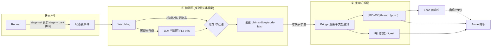

# FLY-942 Watchdog + Lead 主动汇报机制 — PRD(DRAFT · 骨架,逐块跟 Annie converge 中)

Issue: FLY-942 (https://linear.app/geoforge3d/issue/FLY-942/watchdog-lead-主动汇报机制-产品设计-prd让-annie-不再当人肉-qa)
日期: 2026-07-07
基于: exploration.md(本文件夹)、FLY-878/915/927/941/964/975/976 关联 issue、HL round-1 框架确认

> **状态**:DRAFT 骨架。round-1 框架已 HL 确认(两界面/两时刻/反刷屏阶梯/边界干净 + 第 5 球态"Lead 压着没 relay")。**Q1–Q10 待 Annie 逐块 converge**(见 §10),converge 一块落一块。**不 ship / 不 merge / 不 create-issue**。
> **北极星:准确性。** 主动汇报只有在检测足够准时才成立 —— "状态显示骗你一次你就再也懒得看"。所以本 PRD 两半同等重要:**① 检测层(准确)+ ② 主动汇报层(醒目、进 thread、不刷屏)**。

---

## 0. 一句话

runner 干完一轮 parked、或真卡住时,**系统主动、准确、及时地把带类型的状态推进对应 issue thread**,让 Annie 不用每 30–60min 人肉巡查。把"扫描/检测"变成看门狗的系统级职责(可扩展,新 Lead 不必会巡查),把 Lead 从"巡查工"变成"第一响应人";用**去重 + 升级阶梯 + 每日兜底 digest** 同时满足"绝不静默停着没人发现" ⨯ "Annie 离开数小时也不刷屏"。

## 1. Problem / Users / Goals

- **Problem**:runner 经常干完一轮 parked(等 founder 拍板)或真卡住,没人主动汇报 → Annie 被迫人肉巡查每个 runner(人肉 QA);要她拍的决策埋在长消息、不进对应 thread、不够醒目。且现有看门狗**不准**(漏报真 stall / 误报健康 runner / alive-flag 不可信 / 归因错措辞),不准 → Annie 更得自己盯。
- **Users**:**Annie(founder)** 只在"真需要她拍 / 真卡了"时被精准醒目叫到,其余不打扰,离开数小时回来一眼看清"哪些在等我";**Lead** 从"要会巡查"解放为"看门狗一响我第一个排查",自愈或 relay;**Runner / Watchdog / Bridge** = 状态的产生 / 检测 / 投递。
- **Goals**:① **准**(北极星):检测漏报近零、误报可容忍低、归因/措辞按真实 stage 不猜。② **绝不静默**:任何需人介入的停止,系统一定让"该负责的人"知道。③ **不刷屏**:无新状态变化=无新通知。④ **决策醒目进 thread**:一事一卡。⑤ **可扩展**:检测是系统级看门狗的活,不靠每 Lead 手动扫。
- **Non-goals(划走给别 issue,本 PRD 只定产品行为,不重做)**:
  - 检测**实现**(park 元组 / 真实 stage 归因 / @-target / 1h 阈值)= **FLY-927 Watchdog v2**(In Progress)。
  - 看门狗 **LLM 判断层实现** = **FLY-976** eng(Tadashi);本 PRD 定"要什么判断行为"。
  - 告警频道架构 / bot 工单队列 / 发送方门禁 / profile 切换 = **FLY-915**(Annie 已 lgtm)。本 PRD 复用其 thread 落点。
  - tool-call-leak 检测 = **FLY-941**(检测清单里的一类)。
  - 状态**持久显示**(置顶/标题/4 态/返工)= **FLY-964**。本 PRD push 与其同源。
  - eng 实现细节 = Tadashi。

## 2. 核心架构:两半,同源



**两半各自的价值**:检测层保证"准"(否则汇报不可信);汇报层保证"主动、醒目、不刷屏"。**同源**——都从 `flywheel-comm stage set` 的真实 stage + park 元组派生 → 与 FLY-964 的持久显示永不打架,归因永不靠猜。

---

## 3. ① 检测层(准确性 = 北极星)

### 3.1 为什么准确性是北极星(现状为什么不准)
现有机械规则(pane-hash 冻结 + 固定错误模式 + `isIdleHealthyPane` 抑制器)两头错:
- **漏报**(最致命,直接逼 Annie 人肉巡查):FLY-975/546 —— `Server error mid-response` 后停空 `❯` 静默 22min 被当"健康 idle"压掉;**FLY-927 不修这条**。
- **误报**(→ 刷屏 → 她不看了):长活 runner 被当卡死(FLY-871);ghost 死着还一直 fire session_stuck(FLY-970)。
- **alive-flag 不可信**:alive=true 却登出/卡 rate-limit 菜单/冻结(FLY-909)→ 必须 **capture pane** 才准。
- **归因错**:FLY-912"Code Review 卡 3h"靠画面猜(真相=approve gate 等 founder)。

### 3.2 准确性机制 〔Q1 · 待 Annie 拍 —— rec:走 FLY-976 hybrid〕
- **机械快路**(零 token,便宜初筛):真实 stage / park 元组明判(parked-at-gate=合法等 founder;running+pane 活跃=健康;已知错误模式秒认)。
- **LLM 判断层**(可疑才升级,省 token,FLY-976):读 pane 尾 + 真实 stage + park 元组 + 最近事件 → 输出「卡住 / 健康 idle / 正常等待」+ 归因(球在谁)+ 建议动作(nudge / respawn / 切账号 / @人)。正是 546 那种"报错后静默 idle"要的。
- **降级永不静默**(FLY-878 标签分层):认不出→AI 兜底;仍不确定→`fail-suspicious` 附 pane 原文上报(标签变糙、绝不吞)。
- 边界:判断层**实现** = FLY-976 eng;本 PRD 定"要这种理解 + 输出契约"。

### 3.3 要检测什么(catalog,喂 FLY-927/976)
| 检测类 | 判定(准确性要点) | 球在谁 | 归属 |
|---|---|---|---|
| 干完 parked 等 founder | park 元组明判(approve/ship gate) | founder | 本 PRD ✅ |
| 需 founder 决策 | 正式 gate question / runner surfaced 决策 | founder | 本 PRD 🔴 |
| runner 真卡(hang) | capture pane:冻住 + 无进展(非健康 idle) | lead | 878/975 |
| 报错后静默 idle | pane 有非预期 error + 冻住 → **不得被 isIdleHealthyPane 压掉** | lead | **FLY-975 必修** |
| rate-limit/冻结/登出 | capture pane 认菜单/登出(非 alive-flag);理想自动切账号 | lead/infra | alive-flag 家族 |
| tool-call-leak | 输出含未执行的 invoke 文字块 | lead | **FLY-941** |
| Lead 压着没 relay | runner 抛需 relay、Lead 应答超时未转 | lead(先 nudge) | **FLY-878 s3 / HL** |
| dead-but-registered ghost | status=running 但 alive=false 僵尸 | 系统(检测+清) | **FLY-970/973** |

### 3.4 over-notify 抑制(治 ghost 刷屏)+ 治源头〔Q9〕
- **抑制**:已知 / 正在清 / 已升级的问题**绝不 re-alert**(FLY-970 死着还一直 fire session_stuck)。复用去重设施 + 对"清理中"ghost 加抑制态。
- **治源头(auto-QA-spawn gate)**:FLY-970 ghost 根因 = product/no-three-stage issue 被错误 auto-spawn QA。需求:此类 issue 不该自动 spawn QA(接 FLY-579 auto-QA gate / FLY-707 opt-in)。
- 清理机制 / 子 session scope 归属 = eng(FLY-973:归 parent lead 非一律 eng);归约束 = FLY-962/978。

### 3.5 mid-turn hard-stop(相邻能力,标边界)〔Q10〕
现状 queued STOP 只在 turn 边界生效 → runner 烧完 token 做完不想要的才停(FLY-915 v2 就多做了个 PRD+PR)。需求:能 kill 当前 turn。实现 = harness/eng,可能独立 issue;待 Annie 定是否纳入 942 scope。

---

## 4. ② 主动汇报层

### 4.1 两界面,同源
| | 是什么 | 谁看 | 触发 |
|---|---|---|---|
| 持久显示(FLY-964,pull) | 置顶/标题恒在、静默刷新 | 想看时扫 | 每生命周期事件重算 |
| 主动推送(本 PRD,push) | 状态变时往 thread 发一条带类型通知、会 ping | 通知自己来找人 | 只在"球换手"时 |

### 4.2 状态 → 通知映射
| 球在谁 | push? | 形态 |
|---|---|---|
| runner/CI(在干活) | ❌ | 仅 964 置顶 ▶ |
| founder — 干完等你拍 | ✅ **立即** | 『✅ [FLY-XXX] 干完了,等你拍 X』 |
| founder — 需要决定 | 🔴 **立即(决策卡)** | 『🔴 [FLY-XXX] 需要你拍:一句话 — A/B — 建议 X』 |
| 某 Lead — 真卡了 | 🔴 **push + @Lead** | 『🔴 [FLY-XXX] 卡住(在等 <Lead>):停在 <真实stage> 已 Nh』 |
| 某 Lead — 压着没 relay | ⏱ **超时先私下 nudge Lead**(Annie 看不到) | (Lead 转成 ✅/🔴 进 thread) |
| founder — Lead 已替你决定 | 🟡 **FYI**〔Q7:rec 只进 digest 不 ping〕 | 『🟡 [FLY-XXX] Lead 已替你决定 Z(可回退)』 |

(格式 mockup 见本文件夹 `mockup.html`。)

### 4.3 两个时刻(相对 FLY-927 的核心 reframe)
1. **立即正向 surface**:runner 一 park-等-founder → **立刻** push ✅/🔴,不等阈值。它不是告警,是把"该你了"及时端到面前。
2. **超时升级**〔Q3:阈值待定〕:同一条若超阈值仍没人处理 → 先 @ 责任 Lead(不再戳 Annie)。878 说静默停车 ~20min→Lead;927 说 1h;rec 分层可配(global+per-project),✅ 立即那条不受此阈值管。

### 4.4 反刷屏 ⨯ 绝不静默(阶梯)
1. **去重**:每个 (issue,球在谁) 转移只 push 一次;球真换手才再报 → Annie 离开 5h 无变化=0 条新通知。
2. **绝不对 Annie 定时 re-ping**。
3. **超时先找 Lead**(不是再戳 Annie):owner Lead 保证卡没被埋 / 必要时 relay。
4. **每日兜底 digest**:兜住某次 push 漏掉的,绝不静默烂掉。

### 4.5 决策卡固定格式 〔Q6 · rec〕
`🔴 [FLY-XXX] 需要你拍:<一句话> — 选项 A / 选项 B — 建议 X(一句理由)`。一事一卡、立即、**绝不批量进 digest**。复用现有 gate/approve surfacing(GatePoller + founder-thread fallback + ✅-reaction)的升级版(现状只有 free-text gate body)。

### 4.6 每日兜底 digest 〔Q4/Q5 · rec〕
- 触发:**event push(主)+ 每日 1 次兜底(网底)**。
- 内容:当前所有"在等你"开放项(谁在跑 / 谁 parked 等你 / 谁真卡 · Lead 在处理 / 什么要你决策 / Lead 已替你决)。
- 落点/时点:**待 Annie 定**(她的 DM? 专属 roll-up 频道?)。与 FLY-915 #flywheel-notify 的非-@ 系统 digest 不同——这是 founder 面向"你的开放队列"。

### 4.7 Lead 响应契约 + relay 延迟看门
看门狗一响,**责任 Lead 是第一响应人**:① 第一个排查 ② 能自愈的自愈 ③ 自愈不了/真需 Annie 拍 → relay 一张决策卡进 thread ④ **绝不静默**(必须留 ACK/自愈/relay 痕迹)。
- **两条投递路径**(化解块3"不经 Lead 手转" ⨯ "Lead 压着没转"):
  - **路径 A · 机器可明判态 → Bridge 直投 thread**(不经 Lead):parked-at-ship-gate=✅、正式 gate=🔴 —— 消灭大部分 relay 依赖。
  - **路径 B · 需 Lead 判断/塑形态 → Lead 中转,看门狗盯 relay 延迟**:runner 抛需塑形的问题 → Lead 中转;超时未转 → 先私下 nudge Lead(FLY-878 s3;HL 今天漏转 978 就是这条)。

---

## 5. 组件职责 + 数据流

| 组件 | 职责 | 状态 |
|---|---|---|
| Runner | `stage set` 报真实 stage(`stage.ts`→`stage_changed`→`sessions.session_stage`);干完 `park`(CommDB `runner_declared_states`) | 已建;⚠️ park 后现状静默 |
| Watchdog | 检测/分类(球在谁)/去重;park 元组+@-target+阈值=FLY-927;LLM 判断=FLY-976 | 部分已建;927/976 计划中 |
| Bridge | 把结构化状态自动投 thread(复用 `founder-thread-notifier`)+ 决策卡渲染 + 去重(claims.db)+ 每日 digest | 通知器/去重已建;✅即时/🟡类型/决策卡/per-runner digest 要补 |
| Lead | 第一响应人(§4.7) | 契约要形式化 |
| FLY-964 显示 | 同源持久显示 | 不重做 |

数据流:`runner 状态变 → stage set(真实stage)+park → Watchdog 检测/分类/去重 → Bridge 带类型通知 → [FLY-XX] thread(push)/每日 digest → Lead 首响应 / Annie 拍板`

## 6. 状态机(什么状态触发什么通知)

```mermaid
stateDiagram-v2
  [*] --> running
  running --> parked_founder: 干完 parked / 到 ship gate
  running --> needs_decision: runner surface 决策
  running --> stuck: capture pane 判真卡
  running --> running: 常规进展(不 push)

  parked_founder --> notif_done: ✅ 立即 push
  needs_decision --> notif_card: 🔴 决策卡 立即 push
  stuck --> nudge_lead: 🔴 push @Lead(先 Lead)
  needs_decision --> relay_wait: 走 Lead 中转
  relay_wait --> nudge_lead_priv: ⏱ 超时私下 nudge Lead
  nudge_lead --> esc_founder: Lead 解不了 +窗口 → 升级 founder
  nudge_lead_priv --> esc_founder: Lead 仍没转 +窗口 → 升级 founder

  notif_done --> [*]: Annie 拍 / :cool:
  notif_card --> [*]: Annie 回 A/B
  esc_founder --> [*]: founder 处理

  note right of notif_done: 去重:球真换手才再 push
  note right of nudge_lead: 每日 digest 兜底所有开放项
```

## 7. Success metrics(北极星)〔Q2 · 待 Annie 定验收〕
- **N1(主·漏报)**:被 Annie 自己先发现的停止/卡住数 / 周 → 目标近零(漏报=直接逼人肉巡查)。
- **N2(误报)**:push 到健康 runner 的假通知率 → 可容忍低。**FN 权重 >> FP**。
- **N3(归因准)**:通知措辞/球在谁 与真实 stage 一致率 → 100%(不再"Code Review 卡 3h"猜错)。
- **N4(不刷屏)**:Annie 离开期间无状态变化 → 0 条新 push。
- **N5(可扩展)**:新 Lead / generic Lead 零额外配置即被检测覆盖。

## 8. 边界 / 分工
- **942**(本 PRD)= 检测(要检测什么 + 准确性)+ 主动汇报(founder 体验:何时/怎么 surface)。
- **927** = 检测实现(park 元组/归因/@-target/阈值)。**976** = LLM 判断层实现。**915** = 通知管线(频道/工单/门禁/profile 切换)。**941** = tool-leak 检测。**964** = 持久显示。**973** = 子 session scope 归属(归 parent lead)。**962/978** = 归档约束 / 死态清理根治。**579/707** = auto-QA-spawn gate(治 ghost 源头)。

## 9. Build workstreams(**只提议,不 create-issue**;converge 定稿后交 Tadashi 拆)
| # | workstream | 对应节 | 依赖 |
|---|---|---|---|
| W1 | ✅ 即时正向 push(park-等-founder)+ 🟡 类型 + 决策卡固定格式 | §4.2/4.5 | founder-thread-notifier |
| W2 | Lead-relay 延迟看门 + Lead 响应契约(路径 B) | §4.7 | FLY-927 归因 |
| W3 | per-runner "你的开放队列" 每日兜底 digest | §4.6 | DigestService/StandupService |
| W4 | 检测准确性:LLM 判断层接线 + isIdleHealthyPane 修 + capture-pane | §3.2/3.3 | **FLY-976 / 975 / 927** |
| W5 | over-notify 抑制(ghost)+ mid-turn hard-stop | §3.4/3.5 | 970/973 + harness |

## 10. 开放决策(待逐块 converge)
| Q | 决策 | rec | 状态 |
|---|---|---|---|
| Q1 | 准确性机制走 FLY-976 hybrid? | 是 | 待 Annie(G1) |
| Q2 | 北极星验收怎么衡量 | FN近零>>FP + 归因准 | 待 Annie(G1) |
| Q3 | 阈值统一(20min vs 1h) | 分层可配;✅立即不受管 | 待 Annie |
| Q4 | digest 触发模型 | event+每日兜底 | 待 Annie |
| Q5 | digest 落点/时点 | founder roll-up,落点待定 | 待 Annie |
| Q6 | 决策卡字段 | 一句话—A/B—建议X,绝不批量 | 待 Annie |
| Q7 | 🟡 push vs digest | 只进 digest 不 ping | 待 Annie |
| Q8 | 942↔915 边界 | 检测+汇报 vs 通知管线 | 待 Annie |
| Q9 | ghost 检测+抑制纳入 942 | 是(清理归 eng) | 待 Annie |
| Q10 | mid-turn hard-stop scope | 需求列入,实现 eng,或独立 issue | 待 Annie |
