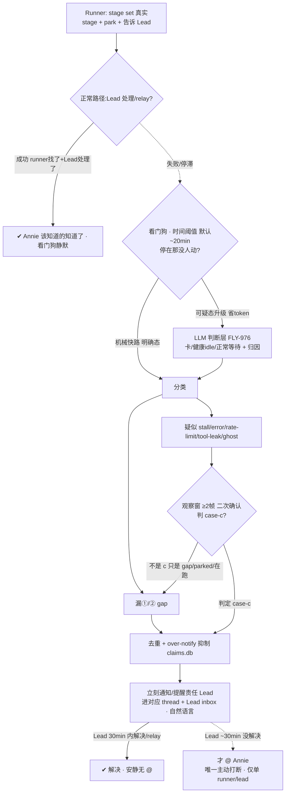
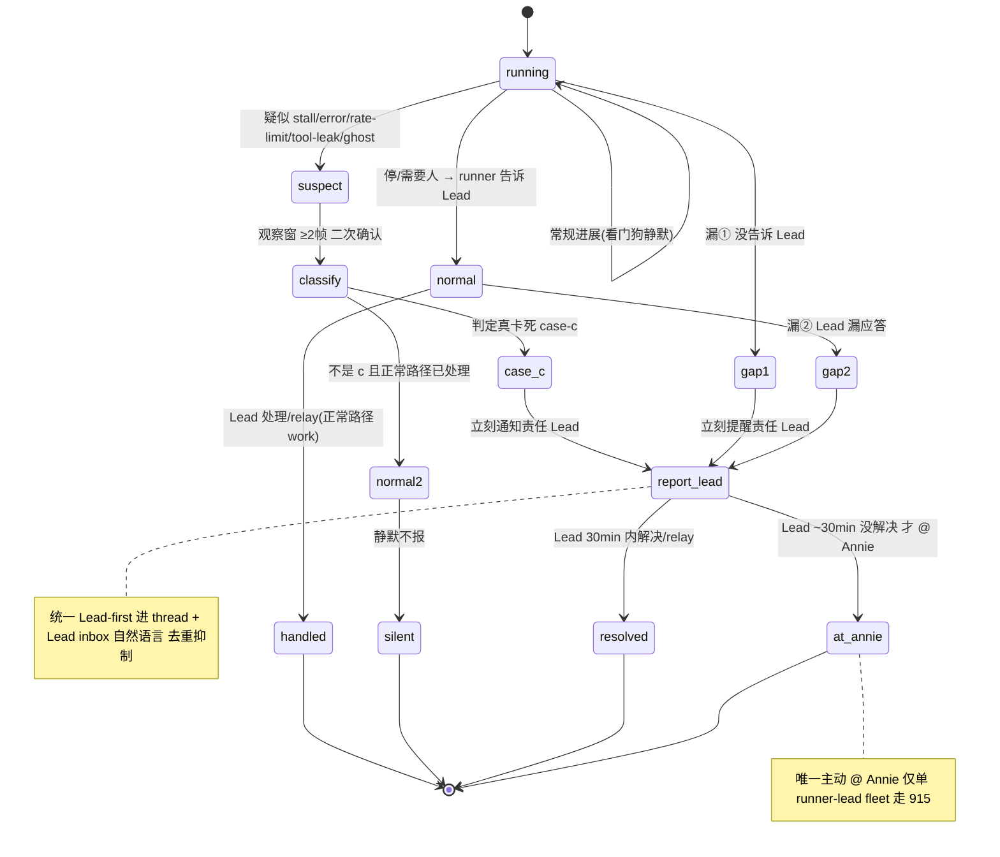

# FLY-942 Watchdog + Lead 主动汇报机制 — PRD(DRAFT · 骨架,逐块跟 Annie converge 中)

Issue: FLY-942 (https://linear.app/geoforge3d/issue/FLY-942/watchdog-lead-主动汇报机制-产品设计-prd让-annie-不再当人肉-qa)
日期: 2026-07-07
基于: exploration.md(本文件夹)、FLY-878/915/927/941/964/975/976 关联 issue、Annie 2026-07-07 深度 review
母 Epic: FLY-989 Watchdog + 主动汇报 稳定化 EPIC (https://linear.app/geoforge3d/issue/FLY-989) — 本 PRD(FLY-942)= 该 Epic 的「主动汇报 + 检测」产品定义 PRD;Epic consolidate 878/975/976/927/915/970/973/941/964,以后发现一个提一个、定期 iterate。FLY-989 归 FLY-774 稳定化 EPIC 底下。

> **状态**:**G1 + G2 全 converged(Annie 逐块拍定,2026-07-07~08)+ Codex design-review APPROVED(3 轮:R1 7 项 → R2 3 项 → R3 approved)**。G1 检测层:兜两漏 + 时间阈值 + FLY-976 LLM 判断层读 per-pane 富态判三态(C 绝不漏)。G2 汇报层(Annie 2026-07-08 大幅砍简单 + 定稿升级流):**全进对应 [FLY-XX] thread、自然语言;无 founder 频道 / 无决策卡 / 无 digest;统一 Lead-first —— 检测(两漏 / 真卡死 case-c)都先立刻通知责任 Lead → Lead ~30min 没解决才 @ Annie**(fleet 级走 915)。→ **Annie lgtm 定稿(2026-07-08)** + Codex design-review 3 轮 APPROVED;build-issue 提案见 `build-issues-draft.md`(4 个 detection BI,交 Tadashi;927:detection→942/channel→915)。**入库走 approve_to_ship gate → Annie 亲批 → :cool: 合并**(ship 仍 founder-gated)。
> **北极星:准确性 = 三态判对**((a) 在跑长turn / (b) 正常parked 不误报、(c) 真卡死 不漏报;读 per-pane 富态 token-flow+FSM 态,非粗信号)**+ Annie 四病症**(①误报=混淆a/b ②分发→consolidate ③漏报=漏c ④噪音)。主动汇报只有在检测足够准时才成立 —— "状态显示骗你一次你就再也懒得看"。两半同等重要:**① 检测层(准)+ ② 主动汇报层(兜漏、全进对应 thread 自然语言、极少 @)**。

---

## 0. 一句话

runner 干完一轮 parked、或真卡住时,正常路径(runner 告诉 Lead → Lead 处理/relay)自己 work;**看门狗只在正常路径漏了(runner 没找 Lead / Lead 漏应答)、或真 stall,且超时间阈值没人动时,把状态用自然语言进对应 [FLY-XX] thread、先提醒责任 Lead;唯一主动 @ Annie = 真卡死 / Lead 接不住**,让 Annie 不用每 30–60min 人肉巡查。把"扫描/检测"变成看门狗的系统级职责(可扩展,新 Lead 不必会巡查),把 Lead 从"巡查工"变成"第一响应人";用**时间阈值 + 去重/抑制 + 全进对应 thread(自然语言)+ 真卡死绝不漏** 同时满足"绝不静默停着没人发现" ⨯ "Annie 离开数小时也不刷屏"(**无 digest / 无频道 / 无卡片**,Annie 2026-07-08 简化)。

## 1. Problem / Users / Goals

- **Problem**:runner 经常干完一轮 parked(等 founder 拍板)或真卡住,没人主动汇报 → Annie 被迫人肉巡查每个 runner(人肉 QA);要她拍的决策埋在长消息、不进对应 thread、不够醒目。且现有看门狗**不准**(漏报真 stall / 误报健康 runner / alive-flag 不可信 / 归因错措辞),不准 → Annie 更得自己盯。
- **Users**:**Annie(founder)** 只在"真需要她拍 / 真卡了"时被精准醒目叫到,其余不打扰,离开数小时回来一眼看清"哪些在等我";**Lead** 从"要会巡查"解放为"看门狗一响我第一个排查",自愈或 relay;**Runner / Watchdog / Bridge** = 状态的产生 / 检测 / 投递。
- **Goals**:① **准**(北极星):检测漏报近零、误报可容忍低、归因/措辞按真实 stage 不猜。② **绝不静默**:任何需人介入的停止,系统一定让"该负责的人"知道。③ **不刷屏**:无新状态变化=无新通知。④ **决策进对应 thread**:一事一帖(自然语言,非固定卡片)。⑤ **可扩展**:检测是系统级看门狗的活,不靠每 Lead 手动扫。
- **Non-goals(划走给别 issue,本 PRD 只定产品行为,不重做)**:
  - 检测**实现**(park 元组 / 真实 stage 归因 / @-target / 时间阈值)= **FLY-927 Watchdog v2**(In Progress;注:927 现用 1h,本 PRD 收敛为 878 的 ~20min 可配,Qe/eng 对齐)。
  - 看门狗 **LLM 判断层实现** = **FLY-976** eng(Tadashi);本 PRD 定"要什么判断行为"。
  - 告警频道架构 / bot 工单队列 / 发送方门禁 / profile 切换 = **FLY-915**(Annie 已 lgtm)。本 PRD 复用其 thread 落点。
  - tool-call-leak 检测 = **FLY-941**(检测清单里的一类)。
  - 状态**持久显示**(置顶/标题/4 态/返工)= **FLY-964**。本 PRD push 与其同源。
  - eng 实现细节 = Tadashi。

## 2. 核心架构:正常路径自洽,看门狗时间阈值兜"漏"(Annie 2026-07-07 revise)

> **⚠️ 早稿"球换手就 push / park 立即 push"被 Annie 否掉。** 正常路径(runner 报 stage/park + 告诉 Lead → Lead 处理/relay)自己就 work;看门狗**只兜它的两类失败(漏),且超时间阈值才响**(不即时)。

> fleet 级(一大片同挂)不走这 30min → FLY-915 即时 Alerts + infra bot。

**两半各自的价值**:检测层保证"准"(北极星,否则汇报不可信);汇报层保证"进 thread、自然语言、极少 @"。**准确性 = 三态判对(C 绝不漏)+ Annie 四病症**。**汇报 = 全进对应 thread、自然语言;唯一主动 @ = 真卡死/Lead 接不住**(Annie 2026-07-08 简化)。**同源**——都从 `flywheel-comm stage set` 真实 stage + park 元组派生 → 与 FLY-964 显示永不打架,归因永不靠猜。

---

## 3. ① 检测层(准确性 = 北极星)

### 3.0 核心病:分不清三种"看起来 idle"(Cass 亲历 + Tadashi code/运营)
现 watchdog = 多组件(`RunnerIdleWatchdog`/`LeadWatchdog`/`HeartbeatService`/`GatePoller`/`stuck-detector`)**各扫各的**,靠**粗信号**(idle 时长 / 无 `stage_changed` / message 模式匹配 / alive-flag,stale+机械)。**分不清三态**:

| 态 | 真相 | 现状误判 | 例 |
|---|---|---|---|
| **(a) 在跑长 turn** | pane token 在流 | **误报** | FLY-545 48min implement 狂吐 token 却报 stuck |
| **(b) 正常 parked 等 gate** | awaiting_review + 明确 park | **误报** | parked 等 founder 被当卡 |
| **(c) 真卡死** | error + 空 prompt + 不恢复 | **漏报** | FLY-975/546 error-then-idle 被当 HEALTHY |

粗信号混三态 → 误报(a)(b)+漏报(c);codex-hold 罐头"等很久"不分正常 hold vs 真卡(FLY-863 半修 / 912)。**核心跃迁 = 从"粗信号机械匹配"→"读 per-pane 富态"(token-flow + 会话 FSM 态)区分 a/b/c** = 自动化 Tadashi 手动 fleet-scan。

### 3.1 北极星验收 = 三态判对(带优先级)+ Annie 四病症 ✅ G1 定案
**准 = 三态判对,且带优先级(Annie 拍)**:
- **(c) 真卡死 = 头号北极星,绝不放过(100% 不漏)** —— 报错+空prompt+不恢复 / rate-limit冻 / `/compact` 死等。检测第一优先 = 可靠认出 C。**漏 C = 直接逼 Annie 人肉巡查。**
- **(a) 在跑长 turn 被误报 = 可容忍、低优先** —— 用户一看知道是假的、不处理;修但非 top。
- **(b) 正常 parked 等她 = 不是误报、是 feature,要 surface** —— parked 等她 + 没人告诉她 → watcher surface 正是最该做的(接汇报层 gap② Lead-漏应答)。看门狗不把 (b) 当"卡"告警,但汇报层要兜"parked-等-founder 却没人转"。
- **北极星 = C 绝不漏 >> A/B。**

映射 Annie 四病症:
- **① 误报** = 混淆 a/b(把在跑/合法 parked 当卡);机械匹配旧 msg、遇新 error 认不出 → **坐实 FLY-976 LLM 判断层**。
- **② 分发不合理**:有的报给 Lead[好]、有的进 alert room[被忽略] → **consolidate 接收点**。
- **③ 漏报** = 漏 c(真 stuck 没反应,FLY-975/546)。
- **④ 噪音过多**:对错的问题狂发(FLY-871 / ghost FLY-970)。
- 底层:**alive-flag 不可信**(alive=true 却登出/卡菜单/冻结 FLY-909)→ 必须 capture pane;**归因不靠猜**(FLY-912)。
- 一句话:**watchdog 说卡就是真卡、说健康就是真健康;报了就是该报的、报到的就是看得到的。**

### 3.2 准确性机制 ✅ **Annie 拍:走 FLY-976 LLM 判断层**(读 per-pane 富态判 a/b/c)
- **机械快路**(零 token,便宜初筛):真实 stage / park 元组明判明确态。
- **LLM 判断层**(可疑才升级,省 token,FLY-976):读 pane 富态(token-flow + FSM 态)+ 真实 stage + park 元组 → 判 **a working / b parked / c stuck** + 归因(球在谁)+ 建议动作(nudge/respawn/切账号/@人)。正是 546 那种"报错后静默 idle"机械分不清、LLM 能。

  **LLM 判断层设计定案(Annie 2026-07-08 拍)**:
  1. **便宜小模型**(Haiku 档 / Codex 便宜档)—— 只是读文字做个判断,不重。
  2. **跑在 Codex 上、不是 Claude(关键设计理由)**:Claude 是全系统的**瓶颈**(runner 天天撞 Claude 周限额),看门狗的判断再叠 Claude = 跟 runner 抢额度;**Codex 周限额用不完、错开跑**,把判断放 Codex 不占 runner 的 Claude 额度。
  3. **读文字、不看图**:判断读的是 capture-pane 的**文字**(token 流 / 错误串 / 静默),不是截图,纯文字推理(呼应 §3.2b"帧"= 文字比对)。
  4. **generic 模型 + 好 prompt**:不 fine-tune、不需深度懂系统;prompt 里写清"看什么信号、卡长啥样、健康长啥样"。
  5. **ad-hoc、无状态调用**:看门狗(常驻)遇可疑 pane 时**临时叫一次**,**不单独养常驻判断 bot**。
- **观察窗 + 二次确认(Tadashi 补,机制关键)**:三态判定最难是**边界** —— 长 turn 里瞬时空 prompt(看着 idle、下秒又吐)、error-but-looks-parked(报错后停在类 park 静默态)。→ 检测用**观察窗 + 二次确认**,**不是单帧快照**。**分类器最小契约(Codex R1 MED-5,只定契约不写实现)**:
  - **≥2 帧,间隔有界**(不是单帧);
  - **输入 = live-region diff + token-flow(在不在吐)+ 会话 FSM 态 + 最近 CommDB 事件(ask/park/stage)+ 已过时长**(单看 idle 有无不够 —— 现 `isIdleHealthyPane` 就是单帧、且现 `stuck-candidate` 明说漏掉"输出仍在变的卡"如 retry loop/spinner);
  - **不确定时 → `fail-suspicious` 附 pane 原文上报,绝不静默压掉**(降级变糙、不吞)。
  - 目的:别把恢复中的长 turn 当卡死(护 a)、也别把真卡死当短暂空(护 C)。直接服务"C 绝不漏"。
- **配套 lead 协议(FLY-937)**:Lead 收 stuck 报警**先 capture pane 验当下**(不信 stale alive-flag/commit);**报警默认可信、值得查,不默认误报**。自动看门狗读 capture-pane 判 frozen/rate-limit = **FLY-778**。
- **降级永不静默**(FLY-878 标签分层):认不出→AI 兜底;仍不确定→`fail-suspicious` 附 pane 原文上报(标签变糙、绝不吞)。
- 边界:判断层**实现** = FLY-976 eng + 937 lead 协议 + 778;本 PRD 定"要这种理解 + 输出契约"。

### 3.2b 判死:c 真卡死怎么判 + 每类历史漏报的检测逻辑(全 code-grounded)

**现状两个结构性盲点(为什么机械必漏)**:
1. **单帧 + stagnant-fingerprint**:`isIdleHealthyPane`(`LeadWatchdog.ts:811-826`)是纯 `(pane)=>bool` 单帧判定 —— 无 blocked-keyword(只 4 种:rate/usage/login-expired/permission,`:137-153`)+ 无 working-marker(`esc to interrupt`/`Compacting`,`:683-687`)+ 有 idle-anchor(`ctx N%`/`⏵⏵ bypass`/`? for shortcuts`,`:696-702`)→ 判 healthy。**它自己承认**(`:677-681`):"冻结在 extended-thinking 后 与 idle-after-thinking 单帧无法区分,favouring no-spam 压掉"。而 runner 侧 `stuck-candidate`(`:16-20`)承认**漏掉输出还在变的卡**(retry loop / spinner)。→ 两头都漏:冻结后像 idle(546/837 silent)+ 变但循环同一错误(910 ENOENT / spinner)。
2. **到 founder 慢(~75min 是乐观下限,实际可 ~2h+)**:RunnerIdleWatchdog 轮询 `DEFAULT_IDLE_POLL_MS = 3_600_000`(~1h,FLY-628 band-aid,`stuck-escalation.ts:88` / `plugin.ts:5261`)+ stagnation `STUCK_THRESHOLD_MS = 600_000`(10min)+ Lead grace `LEAD_GRACE_MS = 300_000`(5min)。**注(Codex R1)**:`stuck-candidate` **首次** poll 见某输出只起 episode,**下次** poll 见同输出才按 10min 阈值判候选 —— ~1h poll 下"确认 stagnant"要相邻两次 poll,采样边界最坏 **~2h+** 才到 founder,且仅对 stagnant 输出(变但打转的更漏)。→ 远达不到"不再每 30-60min 巡查"。

> **澄清"帧"(Annie 2026-07-08)**:"帧" = 终端 pane 的**文字内容在两个时间点各抓一次做比对**(**不是 video / 图像**,不需要看视频)。机械快筛做**便宜的文字 diff / token 数 / 关键词**判明确态;只有**拿不准的才升级 LLM 判断层**读富态。全程文字,不涉图像/视频。

**c 真卡死判定信号契约(新设计,喂 FLY-976/927)**:读**观察窗 ≥2 帧**(= 两个时间点的文字快照比对),综合:
- **token-flow**(真在产出 vs 没动)—— 关键:区分"真产出"与"变但循环同一错误"(bytes 变 ≠ 在进展);
- **FSM 态**(running / awaiting_review / park…)+ 真实 stage;
- **错误串扩充**(现只认 4 种)→ 加 `Server error mid-response`(546/975)、`Not logged in`(910 auth,现只认 `login…expired`/`reauth` 漏掉它)、`ENOENT`/hook-fail(910 worktree);
- **静默 delta**(空 `❯` prompt + hash 不变 + 无 inbound N 分钟)—— 单帧分不清,跨帧能;
- **重复错误签名 delta**(同一错误类反复出现即使 bytes 变)—— stagnant-fingerprint 结构上看不见;
- 二次确认 = **LLM 判断层**读上述富态输出「a working / b parked / c stuck」+ 归因 + 建议动作;**不确定 → `fail-suspicious` 附 pane 原文,不静默**。

**每类历史漏报:机械为什么漏 → 新设计怎么抓(code-grounded)**:
| case | pane 长什么样 | 机械为什么漏(code) | 新设计怎么抓 |
|---|---|---|---|
| **FN2** 546/975 error-then-idle | `Server error mid-response` 后回到空 `❯`(有 `ctx N%`)静默 22min | ① 错误串不在 BLOCKED_KEYWORDS ② isIdleHealthyPane 见 `ctx N%` idle-anchor + 无 working-marker → 判 healthy | 跨帧**静默 delta**(hash 不变 + 无 inbound)+ 认 `Server error` 串 |
| **FN3** 837 /compact | live 变体显 `Compacting`(会报);**silent 变体**回到空 idle box 底层不 resume | silent 变体无 marker → 单帧判 healthy | 跨帧**无进展 delta**(同 FN2) |
| **FN4** 574 draft-not-sent | Lead pane 正常 idle;**非 pane 可观测** | 交付层失败,不是 pane 态;无"意图发 X vs 实际发出"对账 | **传输层信号**:send-confirmation / outbox 对账(mailbox `writeVerified` / notifier POST 结果),**非 pane** |
| **FN0** 910 auth | 空 idle box,底层 `Not logged in` | `Not logged in` 无 matcher(只认 login…expired/reauth);liveness=alive 过 | 认 `Not logged in` 串 + 读 pane 非 alive-flag |
| **FN1** 910 worktree 删 | 反复滚动、不断变的 `ENOENT` 错误行 | ① liveness=alive 过 ② 输出一直变 → fingerprint 每轮变 → `output_changing` 排除,永不到 10min 阈值(正是它自认漏的 retry-loop)③ 无 ENOENT 处理 | **重复错误签名 delta**(变但循环同错)+ 认 `ENOENT` |
| **FP0/FP1** 长 turn 误报 | 在跑长 turn(有 `esc to interrupt` 或 token 在吐) | 单帧偶发瞬时空 prompt / 无 stage_changed → 误判 stuck | 观察窗 ≥2 帧见 token-flow 在动 → 判 a working,不报 |

> **升级流(检测 → @Annie)对比**:现状 ~75min 起(乐观下限;实际因 stagnant 需两次 poll 确认可 ~2h+,见 §3.2b 注)(1h 轮询→10min stagnation→5min Lead grace→founder page,`founder-thread-notifier` @founder 进 issue thread,`:459`)。**新设计(Annie 2026-07-08 定稿)= 统一 Lead-first + ~30min**:检测(case-c 或 两漏)那刻 → **立刻通知责任 Lead**(进对应 thread + Lead inbox)→ **Lead ~30min 没解决 → 才 @ Annie**(`founder-thread-notifier` founder @)。比现状 ~75min 快、且不当场轰炸 Annie;fleet 级(一片同挂)走 915 不走这 30min。

### 3.2c 机制 spec 四块(AS-IS / TO-BE delta / scenario 表 / UML)—— Annie 要"一条条看清"

> AS-IS(现在怎么跑)见 §3.0 + §3.2b;此处给 **TO-BE delta**(一处处 from→to)+ **scenario 处理机制表**(每情况:输入信号→判定→动作→通知谁)。Annie 面向图文版 = `watchdog-design-review.html`(含渲染的时序图)。

**TO-BE delta(要改哪几处,一条条 from→to)**:
| 哪一块(现有位置) | 现在(AS-IS) | 改成(TO-BE) |
|---|---|---|
| `isIdleHealthyPane`(`LeadWatchdog.ts:811-826`) | 单帧判定 | 跨 ≥2 帧比对(文字 diff / token / 静默 delta) |
| `BLOCKED_KEYWORDS`(`:137-153`) | 4 种(rate/usage/login-expired/permission) | + `Server error mid-response` / `Not logged in` / `ENOENT` |
| `stuck-candidate`(`:16-26`) | 只认 stagnant-fingerprint(屏幕没动) | + 重复错误签名(变但循环同错)+ token-flow(真产出 vs 打转) |
| 可疑态处理 | 机械直接压掉当 healthy | 升级 **FLY-976 LLM 判断层**(便宜小模型 Haiku/Codex 便宜档、**跑 Codex 不占 Claude 额度**、读文字不看图、generic+好 prompt、ad-hoc 无状态)判 a/b/c;不确定 → `fail-suspicious` 附原文、不静默 |
| 轮询 cadence(`DEFAULT_IDLE_POLL_MS` ~1h) | ~1h 抓屏 | 廉价 gap 扫描每 N min(读 CommDB 不抓 pane)+ pane 帧尽快 |
| 升级流 | ~75min 起(乐观下限,实际可 ~2h+:1h poll + stagnant 需两次 poll 确认 + 5min grace) | **统一 Lead-first + ~30min**:发现→立刻通知 Lead→Lead ~30min 没解决→@Annie |
| liveness | 信"进程活"当 healthy | 读 pane 真状态,不信 alive-flag |

**scenario 处理机制表(每情况:输入信号 → 判定 → 动作 → 通知谁)**:
| 情况 | 输入信号 | 判定 | 看门狗动作 | 通知谁 |
|---|---|---|---|---|
| 正常等 review/founder(已 surface + Lead 处理) | FSM=awaiting_review/park + 正常路径已动 | b parked | 静默 | 不通知 |
| 长 turn 在跑 | token 在吐 / working-marker | a working | 不报 | 不通知 |
| 真卡死 case-c | 跨帧无进展 + 空框 / 认得的错误串 | c stuck | 立刻通知 Lead → 30min 没解决 → @Annie | Lead 先 → Annie(30min后) |
| 漏① runner 没找 Lead | parked/需人但无对 Lead 通信 | 漏① | 提醒 Lead → 30min → @Annie | Lead → Annie |
| 漏② Lead 漏应答 | runner 找了 Lead、Lead 超时未理 | 漏② | 再提醒 Lead → 30min → @Annie | Lead → Annie |
| FN2 546/975 报错后静默 | `Server error` 后回空框、跨帧不变 | c | 同真卡死 | Lead → Annie |
| FN3 837 /compact 卡 | compact 后回空框、跨帧无进展 | c | 同真卡死 | Lead → Annie |
| FN4 574 草稿没发出 | "发了" vs "送达" 对不上(非 pane) | 发送失败 | 传输层对账(send-confirm) | Lead |
| FN0 910 登出 | 认 `Not logged in` 串 | c | 同真卡死 | Lead → Annie |
| FN1 910 目录删 | 反复刷 `ENOENT`(变但循环同错) | c | 重复错误签名 → 同真卡死 | Lead → Annie |
| FP0/FP1 915 长 turn(曾误报) | 跨帧见 token 在动 | a working | 不报 | 不通知 |
| ghost 僵尸 | status=running 但进程/pane 死 | 僵尸 | 检测+清+over-notify 抑制 | (清理) |

**UML(时序图)**:见 `watchdog-design-review.html` §④(已渲染 PNG 内嵌);逻辑同 §6 状态机 + §2 数据流图。

### 3.3 看门狗抓什么(catalog,超时间阈值才响;喂 FLY-927/976)
| 检测类 | 判定(准确性要点) | 先报谁 | 归属 |
|---|---|---|---|
| **漏① runner 没找 Lead** | parked/需要人,但无对 Lead 的通信 | 责任 Lead | **878 s1** |
| **漏② Lead 漏应答** | runner 找了 Lead,Lead 超应答时效未理 | 提醒该 Lead | **878 s3 / HL** |
| 真 stall / error | capture pane:冻住 + 无进展(非健康 idle);`Server error mid-response` 不得被 `isIdleHealthyPane` 压掉 | owner Lead | 878/**975 必修** |
| rate-limit / 冻结 / 登出 | capture pane 认菜单/登出(**非 alive-flag**);理想自动切账号 | owner Lead/infra | alive-flag 家族 |
| tool-call-leak | 输出含未执行的 invoke 文字块 | owner Lead | **FLY-941** |
| dead-but-registered ghost | status=running 但 alive=false 僵尸 | 系统(检测+清+抑制) | **FLY-970/973** |

> 注:"干完 parked 等 founder"/"需 founder 决策"是**正常路径**surface 的状态(runner→Lead→relay 或系统直投 thread),**看门狗只在它超阈值停滞时**才按 漏①/漏② 兜。

### 3.3b 三种新失败模式 = 显式检测目标 + consumed-ack 契约(Peter roundtable 2026-07-09;PR-C / FLY-1048 D7 依赖本节)

**背景(为什么加这节)**:Leads 会汇报"runner 在跑",但那 runner 其实死了 / 根本没接住任务 —— 只能人肉翻 pane 才发现。全团队都踩(Peter GeoForge3D 真复现 + 我 Flywheel 侧一夜三踩)。根因 = **状态信号会撒谎**(`alive=true` / `parked-alive` / `status=executing` / 配额 % 都可能与真实 tmux/进程脱节)+ **投递 ≠ 接收**(Lead `send` 了 brief,没信号说 runner 读了/开工了)。把这三种模式**显式列为检测目标**,补进 §3.3 catalog:

| 检测类(新) | 判定(准确性要点) | 阈值 | 先报谁(走 §4.3 已批三级路由) | 依赖的可信信号 |
|---|---|---|---|---|
| **M1 死 pane + 未读 brief** | 有未读 brief / 在办任务,但 pane **真的死了**(实探 pane/进程,非缓存 flag) | pane-dead 即判(非时间阈值);**未读 brief** 超 **~consumed-ack 超时** | owner Lead 立刻 → ~30min 未解决 → @Annie(§4.3) | infra 真探活(**FLY-820/823**)+ consumed-ack |
| **M2 零进展 N 分** | 在办任务、pane 活着,但 **N 分钟零进展**(非健康 idle、非正常 parked) | **~20min**(与首个 Lead 提醒 ≤~20min 对齐,§4.6);global+per-project 可配 | owner Lead → 30min → @Annie(§4.3) | pane 帧 ≥2 帧 delta(§3.2/W3)+ 活进程探针 |
| **M3 状态信号过期** | `alive` / `executing` / 配额 % 等**被 cache 的信号与真实脱节** —— 本身不直接告警,而是**让 M1/M2/两漏的判定不许信 cache**,必须取真信号 | 不独立计时;作**判定前置**(判任何"卡"前先核 ground truth) | 不直接 surface;喂给上面各类的判定 | infra 真探活(**FLY-820/823**)+ FSM/land-status/heartbeat |

**⚠️ consumed-ack 契约(delivered ≠ consumed —— 本 PRD 收编为检测输入,不单开 issue)**:
- Lead / 系统 `send` 一条 brief/指令 = **已投递(delivered)**;runner 在下一个 loop tick 真读到 = **已消费(consumed)**,回一个 **consumed-ack**。
- 检测目标:**"已投递但超 ~N 分钟未被消费"= 死信箱信号**(就是 turtle runner 那次的时序坑)。喂 M1(死 pane)+ 独立"未消费超时"告警。
- **归属**:consumed-ack 的**产生** = infra(Tadashi;runner loop 回执);942 **消费**它做检测。不单开 issue(Cass/Tadashi 2026-07-09 定)。

**⚠️ 准确性硬约束(北极星 = C 绝不漏,但也绝不假警健康 runner)**:判 M2"零进展"前,**必须先看有没有活着的子进程**(codex-companion / build / pnpm / 长 xhigh 思考)。实测假阳两例(2026-07-09,FLY-1044/1045 在跑长 Codex xhigh review 时 pane 数分钟无输出被误判零进展)。→ 检测层判"零进展"= pane 帧无 delta **且** 无活跃子进程 **且** 无 live-region/token-flow 迹象(≥2 帧二次确认)。[已由 FLY-1048 PR-A 的 `frozen-extended-thinking` fixture 验证:该态 → 不告警、升 suspicious 给 LLM judge,不静默也不假警。]

**契约:看门狗订阅可信信号、不自己钻 tmux 探活**(与 §8 分工 + 1048 plan D5 一致):真探活(pane/进程存活)= **infra(FLY-820/823)**;consumed-ack 产生 = infra;942/看门狗**只订阅这些可信信号 + reconcile 事件做主动 surface**,自己不实探 tmux。infra 先把信号变真,watchdog 才准。

**路由 = 复用 §4.3(无需新 founder 决策)**:M1/M2 都走已批的"owner Lead 立刻 → ~30min 未解决 → @Annie"三级路由;M3 是判定前置不独立 surface;consumed-ack 超时并入 M1。fleet 级(一大片同时挂)照旧走 FLY-915,不走 30min。→ 三模式是**插进已批路由**,不改 §4.3 框架。

**姊妹项(infra 侧,Tadashi)**:FLY-820/823(alive 真探活)· FLY-1042/1050(tmux 没了但 FSM 卡 non-terminal 的 ghost/QA reconcile)· FLY-778(durable 健康扫描)。本节只定**产品行为**(检测目标 + 阈值 + surfacing),infra 落法由 Tadashi 定。

### 3.4 over-notify 抑制(治 ghost 刷屏)+ 治源头〔Q9〕
- **抑制**:已知 / 正在清 / 已升级的问题**绝不 re-alert**(FLY-970 死着还一直 fire session_stuck)。复用去重设施 + 对"清理中"ghost 加抑制态。
- **治源头(auto-QA-spawn gate)= follow-up ref,不在 942 build**(§9 已移出):FLY-970 ghost 根因 = product/no-three-stage issue 被错误 auto-spawn QA → 此类 issue 不该自动 spawn QA(归 **FLY-579/707**)。942 只把它列为相邻需求。
- 清理机制 / 子 session scope 归属 = eng(FLY-973:归 parent lead 非一律 eng);归约束 = FLY-962/978。**均 follow-up,非 942 build。**

### 3.5 mid-turn hard-stop(相邻能力)= follow-up 独立 issue,不在 942 build
现状 queued STOP 只在 turn 边界生效 → runner 烧完 token 做完不想要的才停(FLY-915 v2 就多做了个 PRD+PR)。需求:能 kill 当前 turn。实现 = harness/eng,**独立 issue**(§9 已移出 942 build);待 Annie 定是否纳入 942 scope(默认不纳入)。

---

## 4. ② 主动汇报层(Annie 2026-07-08 定稿:全进 thread、自然语言、极少 @)

> **⚠️ Annie 大幅砍简单**:所有汇报进相关 [FLY-XX] thread、用**自然语言**(Lead 现已做得好的那样)。**不搞独立 founder 频道、不搞决策卡固定模板、不搞每日 digest。** 早稿的 founder 频道 / 决策卡 / digest 设计全**作废**。

### 4.1 两界面,同源
| | 是什么 | 谁看 | 触发 |
|---|---|---|---|
| 持久显示(FLY-964,pull) | 置顶/标题恒在、静默刷新 | 想看时扫 | 每生命周期事件重算 |
| 看门狗兜漏(本 PRD,时间阈值) | 正常路径失败(两漏+stall)超阈值 → 进对应 thread、自然语言 | Lead 先接;真卡/接不住才 @ Annie | 停在那没人动 + 超阈值 |

### 4.2 全进对应 [FLY-XX] thread、自然语言(不搞频道/卡片/digest)
- **要 Annie 拍的决定** → 直接进**该 issue 的 thread**、自然语言(她:需要她决定的本就跟某 issue 相关,发对应 thread 就行)。**不搞独立 founder 频道 / 开放队列。**
- **Lead 替她拍的可回退小决定** → 该 thread 一条**安静帖、不 @ 她**(她选安静帖,不是 digest)。
- **日常 问 / 答 / FYI** → thread、安静、**无 @**。
- 形态 = **自然语言**,**不要固定卡片格式、不要 digest**。

### 4.3 升级流:统一 Lead-first + ~30min 超时才 @ Annie(Annie 2026-07-08 定稿)
> **⚠️ 这条推翻了早稿的"真卡死当场立刻 @"**(Annie 2026-07-08 改)。**统一规则**:看门狗检测到需人介入的态(真卡死 case-c 或 两漏),**一律先立刻通知责任 Lead** → **Lead ~30min 没解决/没反应 → 才 @ Annie**。这是系统唯一主动 @ Annie 的路径(针对单个 runner/lead 卡死)。

| 态 | 时序(统一) |
|---|---|
| **真卡死 case-c** | 判定那刻**立刻通知责任 Lead**(Lead 按 937 capture pane 去修)→ **~30min 未解决 → @ Annie** |
| **两漏**(runner 没找 Lead / Lead 漏应答) | 先私下**提醒责任 Lead** → **~30min 超时 → @ Annie** |
| 日常 问/答/FYI/Lead 替拍安静帖 | 进对应 thread、安静、**永不 @** |

- **绝不漏 = "~30min 内 Lead 没解决就 @ Annie"保证**(不再靠 immediate @;北极星框架随之改,见 §3.1/§4.4)。
- **~30min** = Lead 处理宽限(global+per-project 可配);检测→通知 Lead 是立刻(检测本身的 cadence 见 §4.6)。

> **边界(重要,Annie 划)**:**全局/fleet 级(一大片 runner/lead 同时挂)不走这 30min** —— 那是 **FLY-915** 的活(即时 Alerts + infra bot 队列)。942 的 ~30min **只管单个 runner/lead 卡死**。

### 4.4 反刷屏 ⨯ 绝不静默(靠检测 + 30min Lead-then-@,不靠 digest)
- **不刷屏**:日常无 @;去重 + over-notify 抑制;正常路径 work 时静默;@ Annie 稀有(只在 Lead ~30min 没解决时)。
- **绝不静默**:靠**准检测(两漏 + case-c 100% 不漏)+ ~30min 内 Lead 没解决就 @ Annie**(**不靠 digest** —— Annie 明确不要)。→ 不再靠 immediate @、也不靠 digest 网底,而是"检测准 + Lead-first + 30min 兜底 @"。

### 4.5 Lead 响应契约 + Lead-提醒 transport(Codex R1 HIGH-2)
看门狗检测到两漏 + stall(§3.3),**责任 Lead 第一响应人**:① 排查 ② 自愈 ③ 真需 Annie 拍 → 在对应 thread 用**自然语言**surface(不是固定卡片)④ **绝不静默**(留痕)。
- **Lead-提醒的投递契约(不是 founder-thread-notifier —— 那是 founder-only,只 @ ownerUserId)**:
  - **目标 Lead** = 按 parent issue 的 dept label 解析出的 owner Lead(非一律 eng)。
  - **投递** = 进对应 [FLY-XX] thread 一条帖 **+ 经现有 Lead inbox/mailbox 机制通知该 Lead**(复用 FLY-161 `runner_question`→Lead inbox / FLY-168 mailbox wake;**不复用 founder-only 的 `founder-thread-notifier`**)。
  - **ACK/凭据** = Lead 的 disposition/回应(自愈记录 / relay / 明确 dismiss)。
  - **升级** = Lead ~30min 没解决 / 无 ACK / 不可达 → **@ Annie**。
- **统一 Lead-first + ~30min(Annie 2026-07-08)**:漏① / 漏② / 真卡死 case-c **都先立刻通知/提醒责任 Lead** → **Lead ~30min 没解决 → 才 @ Annie**(经 `founder-thread-notifier` founder @ 那条路)。case-c 不再"当场立刻 @",与两漏统一。

### 4.6 检测 cadence / 时延契约(Codex R1 HIGH-3:阈值必须绑到真实轮询)
**现状**:Runner idle/stuck 轮询默认 **~1h**(`DEFAULT_IDLE_POLL_MS = 3_600_000`;stuck 首检也放宽到 ~1h);现有 10min stagnant 阈值受该轮询驱动。→ **光在纸上写 20min 阈值、但仍每小时看一眼 runner,达不到"不再每 30–60min 巡查"。** 阈值必须绑 cadence:
- **廉价 gap/state 扫描**(读 CommDB `runner_declared_states` / ask 记录 / stage,**不抓 pane**)每 N 分钟(便宜、可高频)→ 判两漏(①②)。
- **pane 观察帧**(capture pane,较贵)在 M 分钟内取 ≥2 帧(用于 case-c 富态判定,§3.2)。
- **检测那刻即立刻通知责任 Lead**;**Lead ~30min 没解决 → @ Annie**(30min = global+per-project 可配的 Lead 宽限)。
- 若昂贵 pane capture 现实上仍 ~1h,则 20min 只保证廉价 gap 检测,case-c pane 诊断时延更粗 —— **eng 需定 scheduler**(见 W-cadence)。**验收写明 max 检测时延**,不留 cadence 隐式。

> 早稿 `mockup.html` 的决策卡/digest 形态已被 Annie 简化为**自然语言进 thread**;mockup 仅存历史,PRD 以本节为准。

---

## 5. 组件职责 + 数据流

| 组件 | 职责 | 状态 |
|---|---|---|
| Runner | `stage set` 报真实 stage(`stage.ts`→`stage_changed`→`sessions.session_stage`);干完 `park`(CommDB `runner_declared_states`) | 已建;⚠️ park 后现状静默 |
| Watchdog | 检测/分类(球在谁)/去重;park 元组+@-target+阈值=FLY-927;LLM 判断=FLY-976 | 部分已建;927/976 计划中 |
| Bridge | 检测到(两漏 / case-c)→ **立刻通知责任 Lead**(进对应 thread + **Lead inbox/mailbox FLY-161/168**,不用 founder-only 的 `founder-thread-notifier`);**Lead ~30min 没解决 → @ Annie**(经 `founder-thread-notifier` founder @ 那条路);去重 claims.db | Lead inbox/去重已建;三态判定 + observation window + 30min Lead-grace 计时 + Lead-ACK 契约要补(**无卡片/无 digest**) |
| Lead | 第一响应人(§4.7) | 契约要形式化 |
| FLY-964 显示 | 同源持久显示 | 不重做 |

数据流:`runner 状态变 → stage set(真实stage)+park+告诉 Lead → [正常路径:Lead 处理/relay 成功→看门狗静默] / [失败→Watchdog 观察窗读 pane 富态判三态/分类(两漏+case-c)/去重 → 立刻通知责任 Lead(thread + Lead inbox,自然语言)→ Lead ~30min 没解决 → 才 @ Annie]`(fleet 级走 915)

## 6. 状态机(时间阈值 + 兜两漏 + stall)

## 7. Success metrics(北极星)= 三态判对(带优先级)+ 用例集 ✅ G1 定案
**主指标 + 优先级(Annie 拍)**:**(c) 真卡死绝不漏(100%)>> (a) 在跑可容忍误报 >> (b) parked 要 surface(进 thread)**。
> 澄清:**(b) parked 仅在"需要人且正常路径没处理"时才 surface**(已被 Lead 处理的 parked 保持静默);**(c) case-c 与两漏统一走 Lead-first + ~30min**(检测→立刻通知 Lead→Lead ~30min 没解决才 @ Annie;Annie 2026-07-08 定稿,§4.3)。
> **命名(Codex R1 MED-4)**:用例前缀 **FP(误报组)/ FN(漏报组)/ R(汇报)/ L(Lead 协议)**,**与三态 a/b/c 无关**(避免旧 A/B 标签与状态 a/b 混淆)。

**检测用例(4 FP + 5 FN = 9;Cass 亲历 + Tadashi 踩坑 + dogfood)**:
| # | case | 真态 | 现状 | 验收 |
|---|---|:--:|---|---|
| **FP0 🐕** | 本 942 runner 长 draft turn(无 stage_changed)被误报 `session_stuck`;HL capture 见在动、可容忍未转 Annie | a | 误报 | 不判 stuck(dogfood:写 PRD 的 runner 被它要治的 watchdog 误报) |
| **FP1 🐕** | 915 runner 23min 长 turn 被误报 `session_stuck`;HL capture-pane 核实在动 → 正确抑制、没惊动 Annie(= 人工版 937) | a | 误报 | 不判 stuck(**A 可容忍**活例) |
| **FP2** | 零-commit 只读/QA run 被判 stuck(FLY-798「没commit=stuck」) | a/b | 误报 | 不判 stuck(可容忍偶发) |
| **FP3** | 长操作 idle-timeout 误杀(等 codex/build/test,慢但在动) | a | 误报误杀 | 不判 stuck(观察窗护) |
| **FN0 🐕** | 910 runner alive=true 但 auth 挂(`Not logged in`)→ 机械当 healthy | c | **漏报** | **100% 判 stuck**(liveness≠healthy,须读 pane) |
| **FN1 🐕** | 910 runner tmux 活但 cwd(worktree)被删 → hook `ENOENT` 死循环;机械 liveness 当 healthy | c | **漏报** | **100% 判 stuck**(pane 重复 ENOENT = 活死) |
| **FN2** | error-then-idle → HEALTHY(FLY-546/975:`Server error mid-response` 后停空 `❯`) | c | **漏报** | **100% 判 stuck** |
| **FN3** | `/compact` 静默 stall(FLY-837,进程 alive 活死) | c | **漏报** | **100% 判 stuck** |
| **FN4** | Lead draft-not-sent(FLY-574,status 绿但发不出) | c | **漏报** | **100% 判 stuck** |

> **Tadashi 踩坑史(喂 FP 组)**:历史最密坑 = **长 turn 被误报 `session_stuck`**(案例 `4661ccad` / `b7b4b54d` / `0b01ff5f`);最脆点 = **`isIdleHealthyPane` 单帧判定**分不清"长 turn 瞬时空 prompt" vs "真卡" → 正是 FP 组 + 观察窗二次确认要治的。

**汇报用例(gap/parked → 通知目标;Codex R1 MED-4 补,直接测汇报层)**:
| # | 场景 | 期望 |
|---|---|---|
| **R1** | parked 等 founder + 已 surface 到 thread + Lead 处理了 | 看门狗**静默**(不报,正常路径) |
| **R2** | parked/需要人 + runner 没告诉 Lead(漏①) | 提醒 Lead(thread + Lead inbox) |
| **R3** | 漏② Lead 漏应答,提醒后 ~30min 仍没解决 | **@ Annie** |
| **R4** | 真卡死 case-c:立刻通知 Lead → Lead ~30min 没解决 | **@ Annie**(与两漏统一,非当场 @) |

**Lead 协议用例(937)**:**L1** = Lead 见「刚 commit」机械 dismiss 真 stuck(07-06 rate-limit;watchdog 对/Lead 错)→ **937:capture pane 验当下、报警默认可信、不默认误报**。

**共同根子** = 判断靠机械信号/alive-flag/idle 有无、**不读 pane 当下** → 读 per-pane 富态 + 观察窗二次确认后全判对。**FN 组(FN0-FN4,真态 c)必须 100% 不漏 + `fail-suspicious` 兜底;FP 组(FP0-FP3)可容忍偶发误报;汇报按 R1-R4 判对。语料随事故增补。**

四病症验收(并轨):
- **② 分发命中**:所有汇报进**对应 [FLY-XX] thread**(自然语言)→ 100%;进被忽略的 alert room = 0;主动 @ Annie 仅限"Lead ~30min 没解决"(单 runner/lead)。
- **④ 噪音**:同一/错误问题的重复告警 → 去重+抑制后趋零;日常无 @、正常路径 work 时零打扰。
- 附:归因准确(措辞/球在谁 与真实 stage 一致 → 100%);可扩展(新 Lead 零配置被覆盖)。

## 8. 边界 / 分工
- **942**(本 PRD)= 检测(要检测什么 + 准确性)+ 主动汇报(founder 体验:何时/怎么 surface)。
- **⚠️ 边界澄清(Codex R1 LOW-7)**:FLY-942 的"无频道/无卡片/无 digest"**只砍它自己给 runner 主动汇报造的 founder 收件面**;**FLY-915 的 `#flywheel-alerts` infra bot 工单队列 + `#flywheel-notify` infra digest 是另一条独立管线,不受本 PRD 影响、也不被本 PRD 复用回来**。别把 942 读成废掉 915 的 infra alert 管线。
- **927** = 检测实现(park 元组/归因/@-target/阈值)。**976** = LLM 判断层实现(读 per-pane 富态判 a/b/c)。**937** = lead 收 stuck 报警 capture-pane 验当下协议。**778** = 自动看门狗读 capture-pane 判 frozen/rate-limit。**915** = 通知管线(频道/工单/门禁/profile 切换)。**941** = tool-leak 检测。**964** = 持久显示。**973** = 子 session scope 归属(归 parent lead)。**962/978** = 归档约束 / 死态清理根治。**579/707** = auto-QA-spawn gate(治 ghost 源头)。

## 9. Build workstreams(**只提议,不 create-issue**;定稿后交 Tadashi 拆)
| # | workstream | 对应节 | 依赖 |
|---|---|---|---|
| W1 | **统一升级流**:检测(两漏 + case-c)→ **立刻通知责任 Lead**(进对应 thread + **Lead inbox/mailbox FLY-161/168**,不用 founder-only notifier)→ **Lead ~30min 没解决 → @ Annie**(经 `founder-thread-notifier` 仅 founder @);fleet 级排除(走 915) | §4.2/4.3/4.5 | Lead inbox/mailbox + founder-thread-notifier(founder @)|
| W-cadence | scheduler/时延契约:廉价 gap 扫描每 N 分钟 + pane 帧 M 分钟内 ≥2 帧 + 首个 Lead 提醒 ≤ ~20min(现 `DEFAULT_IDLE_POLL_MS` ~1h 需改) | §4.6 | scheduler / poll |
| W3 | 检测准确性:读 per-pane 富态判 a/b/c(LLM 判断层)+ 观察窗二次确认(≥2 帧 + live-region/token-flow/FSM/近事件)+ isIdleHealthyPane 修 + lead 协议 | §3.0–3.3 | **FLY-976 / 975 / 937 / 778 / 927** |
| W4 | **仅** over-notify 抑制(ghost 已知/正清理不 re-alert)+ owner 归属链 | §3.4 | 970/973 |
| W5 | **三新失败模式检测**(M1 死pane+未读brief / M2 零进展N分 / M3 状态信号过期)+ consumed-ack 检测输入;判定前先核 ground truth + 活进程探针(防长-Codex 假阳) | **§3.3b** | infra 真探活 **820/823** + consumed-ack(infra 产生) |

> **W5 = FLY-1048 PR-C 依赖本节(D7)。** PR-A(机械层,含 frozen-extended-thinking 假阳护栏)已 merge;PR-C 落 W5 的通知面 + 阈值,以 §3.3b 为准。

> **移出 942 build(Codex R1 MED-6,除非 Annie 再确认纳入)**:auto-QA-spawn gate = **FLY-579/707**;ghost 清理/scope = **970/973/962/978**;mid-turn hard-stop = **独立 issue**(§3.5,harness 能力,待 Annie 定 scope)。942 只列它们为**需求/依赖**,不在本 PRD build。
> **砍掉的(Annie 2026-07-08 简化)**:决策卡固定格式、🟡 类型、consolidate 独立 founder 频道/开放队列、每日 digest —— 全部作废,汇报回归"进对应 thread、自然语言"。

## 10. 决策进度 ✅ **全 converged(G1 + G2 已拍定)**
**G1 · 框架 + 检测准确性 ✅ Annie 拍(2026-07-07 深度 review)**:
- 框架:① 不是 push-every-ball-change → 兜两漏;② 不是立即 push → 时间阈值型。
- 准确性 = **FLY-976 LLM 判断层**(读 per-pane 富态判 a/b/c)+ 观察窗二次确认;北极星 = **三态判对(C 绝不漏 100%)+ 四病症**;用例集 = 检测 9(FP0-3/FN0-4)+ 汇报 R1-4 + Lead 协议 L1(§7)。

**G2 · 汇报层 ✅ Annie 定稿(2026-07-08,大幅砍简单)**:
- **全进对应 [FLY-XX] thread、自然语言**;**无 founder 频道 / 无决策卡模板 / 无 digest**。
- Qa 接收点 = 进该 issue thread(砍 founder 频道/开放队列);Qb 决策卡 = **砍**(自然语言);Qc Lead 替拍可回退 = **安静帖不 @**;Qd digest = **砍**。
- **唯一主动 @ Annie = 真卡死 case-c / Lead 接不住。**

**边界/scope**(同 §8/§9):942 build = 检测准确性 + **统一升级流(两漏+case-c → 立刻通知 Lead → Lead ~30min 没解决 → @Annie)** + over-notify 抑制(仅 §3.4 那条)。**fleet 级 = 915,不在 942。****移出 942 build → follow-up**:auto-QA-spawn gate(579/707)、ghost 清理/scope(970/973/962/978)、mid-turn hard-stop(独立 issue,待 Annie 定 scope)。942↔915(通知管线)独立。

→ **全 converged。下一步:codex design-review → 拆 build issue 给 Tadashi(不 create-issue,draft,ship 仍 founder-gated)。**
