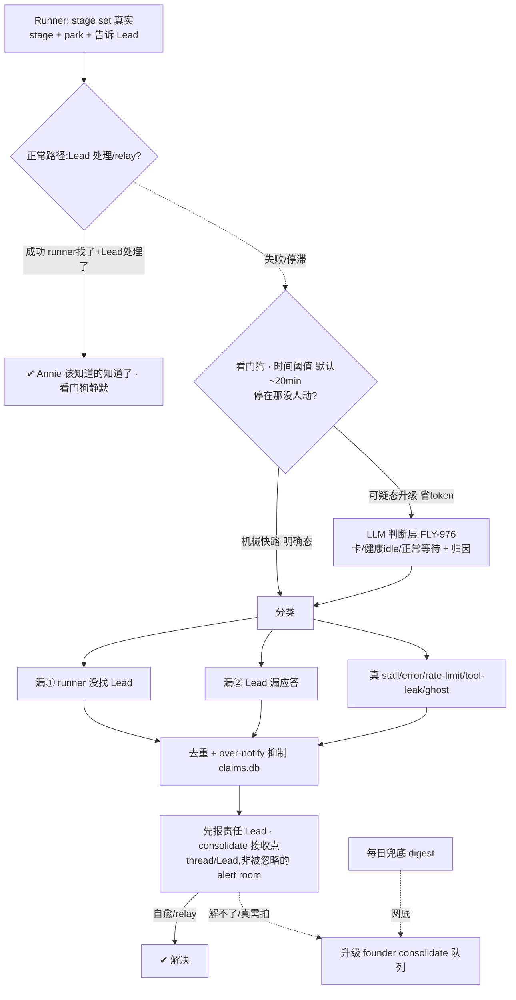

# FLY-942 Watchdog + Lead 主动汇报机制 — PRD(DRAFT · 骨架,逐块跟 Annie converge 中)

Issue: FLY-942 (https://linear.app/geoforge3d/issue/FLY-942/watchdog-lead-主动汇报机制-产品设计-prd让-annie-不再当人肉-qa)
日期: 2026-07-07
基于: exploration.md(本文件夹)、FLY-878/915/927/941/964/975/976 关联 issue、Annie 2026-07-07 深度 review
母 Epic: FLY-989 Watchdog + 主动汇报 稳定化 EPIC (https://linear.app/geoforge3d/issue/FLY-989) — 本 PRD(FLY-942)= 该 Epic 的「主动汇报 + 检测」产品定义 PRD;Epic consolidate 878/975/976/927/915/970/973/941/964,以后发现一个提一个、定期 iterate。FLY-989 归 FLY-774 稳定化 EPIC 底下。

> **状态**:DRAFT。**Annie 已深度 review 并 revise 框架 + 拍 G1(2026-07-07)**:① 汇报层不是 push-every-ball-change → **看门狗兜两漏**(runner 没找 Lead / Lead 漏应答);② 不是立即 push → **时间阈值型**;③ 准确性走 **FLY-976 LLM 判断层**,北极星验收 = **四病症**。**剩余 Qa–Qg 待逐块 converge**(见 §10)。**不 ship / 不 merge / 不 create-issue**。
> **北极星:准确性 = 三态判对**((a) 在跑长turn / (b) 正常parked 不误报、(c) 真卡死 不漏报;读 per-pane 富态 token-flow+FSM 态,非粗信号)**+ Annie 四病症**(①误报=混淆a/b ②分发→consolidate ③漏报=漏c ④噪音)。主动汇报只有在检测足够准时才成立 —— "状态显示骗你一次你就再也懒得看"。两半同等重要:**① 检测层(准)+ ② 主动汇报层(兜漏、consolidate、不刷屏)**。

---

## 0. 一句话

runner 干完一轮 parked、或真卡住时,正常路径(runner 告诉 Lead → Lead 处理/relay)自己 work;**看门狗只在正常路径漏了(runner 没找 Lead / Lead 漏应答)、或真 stall,且超时间阈值没人动时,准确地把带类型状态报给对的人(先责任 Lead、consolidate 接收点)**,让 Annie 不用每 30–60min 人肉巡查。把"扫描/检测"变成看门狗的系统级职责(可扩展,新 Lead 不必会巡查),把 Lead 从"巡查工"变成"第一响应人";用**时间阈值 + 去重/抑制 + consolidate + 每日兜底 digest** 同时满足"绝不静默停着没人发现" ⨯ "Annie 离开数小时也不刷屏"。

## 1. Problem / Users / Goals

- **Problem**:runner 经常干完一轮 parked(等 founder 拍板)或真卡住,没人主动汇报 → Annie 被迫人肉巡查每个 runner(人肉 QA);要她拍的决策埋在长消息、不进对应 thread、不够醒目。且现有看门狗**不准**(漏报真 stall / 误报健康 runner / alive-flag 不可信 / 归因错措辞),不准 → Annie 更得自己盯。
- **Users**:**Annie(founder)** 只在"真需要她拍 / 真卡了"时被精准醒目叫到,其余不打扰,离开数小时回来一眼看清"哪些在等我";**Lead** 从"要会巡查"解放为"看门狗一响我第一个排查",自愈或 relay;**Runner / Watchdog / Bridge** = 状态的产生 / 检测 / 投递。
- **Goals**:① **准**(北极星):检测漏报近零、误报可容忍低、归因/措辞按真实 stage 不猜。② **绝不静默**:任何需人介入的停止,系统一定让"该负责的人"知道。③ **不刷屏**:无新状态变化=无新通知。④ **决策醒目进 thread**:一事一卡。⑤ **可扩展**:检测是系统级看门狗的活,不靠每 Lead 手动扫。
- **Non-goals(划走给别 issue,本 PRD 只定产品行为,不重做)**:
  - 检测**实现**(park 元组 / 真实 stage 归因 / @-target / 时间阈值)= **FLY-927 Watchdog v2**(In Progress;注:927 现用 1h,本 PRD 收敛为 878 的 ~20min 可配,Qe/eng 对齐)。
  - 看门狗 **LLM 判断层实现** = **FLY-976** eng(Tadashi);本 PRD 定"要什么判断行为"。
  - 告警频道架构 / bot 工单队列 / 发送方门禁 / profile 切换 = **FLY-915**(Annie 已 lgtm)。本 PRD 复用其 thread 落点。
  - tool-call-leak 检测 = **FLY-941**(检测清单里的一类)。
  - 状态**持久显示**(置顶/标题/4 态/返工)= **FLY-964**。本 PRD push 与其同源。
  - eng 实现细节 = Tadashi。

## 2. 核心架构:正常路径自洽,看门狗时间阈值兜"漏"(Annie 2026-07-07 revise)

> **⚠️ 早稿"球换手就 push / park 立即 push"被 Annie 否掉。** 正常路径(runner 报 stage/park + 告诉 Lead → Lead 处理/relay)自己就 work;看门狗**只兜它的两类失败(漏),且超时间阈值才响**(不即时)。



**两半各自的价值**:检测层保证"准"(北极星,否则汇报不可信);汇报层保证"兜漏、醒目、不刷屏"。**准确性 = Annie 四病症**(①误报 ②分发不合理→consolidate ③漏报 ④噪音)。**同源**——都从 `flywheel-comm stage set` 的真实 stage + park 元组派生 → 与 FLY-964 显示永不打架,归因永不靠猜。

---

## 3. ① 检测层(准确性 = 北极星)

### 3.0 核心病:分不清三种"看起来 idle"(Cass 亲历 + Tadashi code/运营)
现 watchdog = 多组件(`RunnerIdleWatchdog`/`LeadWatchdog`/`HeartbeatService`/`GatePoller`/`stuck-detector`)**各扫各的**,靠**粗信号**(idle 时长 / 无 `stage_changed` / message 模式匹配 / alive-flag,stale+机械)。**分不清三态**:

| 态 | 真相 | 现状误判 | 例 |
|---|---|---|---|
| **(a) 在跑长 turn** | pane token 在流 | **误报** | FLY-545 48min implement 狂吐 token 却报 stuck |
| **(b) 正常 parked 等 gate** | awaiting_review + 明确 park | **误报** | parked 等 founder 被当卡 |
| **(c) 真卡死** | error + 空 prompt + 不恢复 | **漏报** | FLY-975/546 error-then-idle 被当 HEALTHY |

粗信号混三态 → 误报(a)(b)+漏报(c);codex-hold 罐头"等很久"不分正常 hold vs 真卡(FLY-863 半修 / 912)。**核心跃迁 = 从"粗信号机械匹配"→"读 per-pane 富态"(token-flow + 会话 FSM 态)区分 a/b/c** = 自动化 Tadashi 手动 fleet-scan。

### 3.1 北极星验收 = 三态判对(带优先级)+ Annie 四病症 ✅ G1 定案
**准 = 三态判对,且带优先级(Annie 拍)**:
- **(c) 真卡死 = 头号北极星,绝不放过(100% 不漏)** —— 报错+空prompt+不恢复 / rate-limit冻 / `/compact` 死等。检测第一优先 = 可靠认出 C。**漏 C = 直接逼 Annie 人肉巡查。**
- **(a) 在跑长 turn 被误报 = 可容忍、低优先** —— 用户一看知道是假的、不处理;修但非 top。
- **(b) 正常 parked 等她 = 不是误报、是 feature,要 surface** —— parked 等她 + 没人告诉她 → watcher surface 正是最该做的(接汇报层 gap② Lead-漏应答)。看门狗不把 (b) 当"卡"告警,但汇报层要兜"parked-等-founder 却没人转"。
- **北极星 = C 绝不漏 >> A/B。**

映射 Annie 四病症:
- **① 误报** = 混淆 a/b(把在跑/合法 parked 当卡);机械匹配旧 msg、遇新 error 认不出 → **坐实 FLY-976 LLM 判断层**。
- **② 分发不合理**:有的报给 Lead[好]、有的进 alert room[被忽略] → **consolidate 接收点**。
- **③ 漏报** = 漏 c(真 stuck 没反应,FLY-975/546)。
- **④ 噪音过多**:对错的问题狂发(FLY-871 / ghost FLY-970)。
- 底层:**alive-flag 不可信**(alive=true 却登出/卡菜单/冻结 FLY-909)→ 必须 capture pane;**归因不靠猜**(FLY-912)。
- 一句话:**watchdog 说卡就是真卡、说健康就是真健康;报了就是该报的、报到的就是看得到的。**

### 3.2 准确性机制 ✅ **Annie 拍:走 FLY-976 LLM 判断层**(读 per-pane 富态判 a/b/c)
- **机械快路**(零 token,便宜初筛):真实 stage / park 元组明判明确态。
- **LLM 判断层**(可疑才升级,省 token,FLY-976):读 pane 富态(token-flow + FSM 态)+ 真实 stage + park 元组 → 判 **a working / b parked / c stuck** + 归因(球在谁)+ 建议动作(nudge/respawn/切账号/@人)。正是 546 那种"报错后静默 idle"机械分不清、LLM 能。
- **观察窗 + 二次确认(Tadashi 补,机制关键)**:三态判定最难是**边界** —— 长 turn 里瞬时空 prompt(看着 idle、下秒又吐)、error-but-looks-parked(报错后停在类 park 静默态)。→ 检测用**观察窗 + 二次确认(多帧/时间窗)**,**不是单帧快照**:别把恢复中的长 turn 当卡死(护 a)、也别把真卡死当短暂空(护 C)。这条直接服务"C 绝不漏"。
- **配套 lead 协议(FLY-937)**:Lead 收 stuck 报警**先 capture pane 验当下**(不信 stale alive-flag/commit);**报警默认可信、值得查,不默认误报**。自动看门狗读 capture-pane 判 frozen/rate-limit = **FLY-778**。
- **降级永不静默**(FLY-878 标签分层):认不出→AI 兜底;仍不确定→`fail-suspicious` 附 pane 原文上报(标签变糙、绝不吞)。
- 边界:判断层**实现** = FLY-976 eng + 937 lead 协议 + 778;本 PRD 定"要这种理解 + 输出契约"。

### 3.3 看门狗抓什么(catalog,超时间阈值才响;喂 FLY-927/976)
| 检测类 | 判定(准确性要点) | 先报谁 | 归属 |
|---|---|---|---|
| **漏① runner 没找 Lead** | parked/需要人,但无对 Lead 的通信 | 责任 Lead | **878 s1** |
| **漏② Lead 漏应答** | runner 找了 Lead,Lead 超应答时效未理 | 提醒该 Lead | **878 s3 / HL** |
| 真 stall / error | capture pane:冻住 + 无进展(非健康 idle);`Server error mid-response` 不得被 `isIdleHealthyPane` 压掉 | owner Lead | 878/**975 必修** |
| rate-limit / 冻结 / 登出 | capture pane 认菜单/登出(**非 alive-flag**);理想自动切账号 | owner Lead/infra | alive-flag 家族 |
| tool-call-leak | 输出含未执行的 invoke 文字块 | owner Lead | **FLY-941** |
| dead-but-registered ghost | status=running 但 alive=false 僵尸 | 系统(检测+清+抑制) | **FLY-970/973** |

> 注:"干完 parked 等 founder"/"需 founder 决策"是**正常路径**surface 的状态(runner→Lead→relay 或系统直投 thread),**看门狗只在它超阈值停滞时**才按 漏①/漏② 兜。

### 3.4 over-notify 抑制(治 ghost 刷屏)+ 治源头〔Q9〕
- **抑制**:已知 / 正在清 / 已升级的问题**绝不 re-alert**(FLY-970 死着还一直 fire session_stuck)。复用去重设施 + 对"清理中"ghost 加抑制态。
- **治源头(auto-QA-spawn gate)**:FLY-970 ghost 根因 = product/no-three-stage issue 被错误 auto-spawn QA。需求:此类 issue 不该自动 spawn QA(接 FLY-579 auto-QA gate / FLY-707 opt-in)。
- 清理机制 / 子 session scope 归属 = eng(FLY-973:归 parent lead 非一律 eng);归约束 = FLY-962/978。

### 3.5 mid-turn hard-stop(相邻能力,标边界)〔Q10〕
现状 queued STOP 只在 turn 边界生效 → runner 烧完 token 做完不想要的才停(FLY-915 v2 就多做了个 PRD+PR)。需求:能 kill 当前 turn。实现 = harness/eng,可能独立 issue;待 Annie 定是否纳入 942 scope。

---

## 4. ② 主动汇报层(兜漏,不是 push-every-change)

### 4.1 两界面,同源
| | 是什么 | 谁看 | 触发 |
|---|---|---|---|
| 持久显示(FLY-964,pull) | 置顶/标题恒在、静默刷新 | 想看时扫 | 每生命周期事件重算 |
| 看门狗兜漏(本 PRD,**时间阈值**) | 正常路径失败(两漏+stall)超阈值 → 报 Lead(consolidate) | Lead 先接;解不了才到 Annie | 停在那没人动 + 超阈值 |

### 4.2 正常路径 vs 看门狗兜漏(Annie revise 1)
- **正常路径**(看门狗不插手):runner 报 stage/park + 告诉 Lead → Lead 处理/relay。runner 找了 + Lead 处理了 = 完成,看门狗静默。
- **看门狗只兜两漏 + stall**(§3.3):漏① runner 没找 Lead / 漏② Lead 漏应答 / 真 stall。**其余换手不管。** → 早稿"球换手就 push"作废。

### 4.3 时间阈值,不即时(Annie revise 2)
Lead 忙、10min 后处理完全 OK → 看门狗**不在事发那刻响**,设可配阈值(878 默认 ~20min,global+per-project)判"是不是停在那没人动了"。超阈值才响。→ 早稿"park 立即 push"作废。

### 4.4 报给谁 = consolidate 接收点(Annie 病症②)+ 阶梯
- **先报责任 Lead**(不先戳 Annie);解不了才升级 founder。
- **consolidate**:统一到实际被看到的点 —— issue 相关→对应 thread;Lead 相关→该 Lead;founder 兜底→一个 consolidated"你的开放队列"(**非**被忽略的 alert room)。
- **去重 + over-notify 抑制**:同一漏只报一次(claims.db/episode-latch);已知/正清理的 ghost 绝不 re-alert。
- **每日兜底 digest**:兜住漏掉的,绝不静默烂掉。

### 4.5 它到 Annie 时的形态(mockup 见 `mockup.html`)
- **决策卡**〔Qb〕:`🔴 [FLY-XXX] 需要你拍:<一句话> — A/B — 建议 X(一句理由)`;一事一卡、绝不批量。复用 GatePoller + founder-thread fallback + ✅-reaction 升级版(现状只有 free-text gate body)。
- **干完等你拍**:`✅ [FLY-XXX] 干完了,等你拍 X`。
- **🟡 Lead 已替你决定**〔Qc:rec 只进 digest/安静帖,不 ping〕:`🟡 …(可回退)FYI`。
- **何时到 Annie** 由"正常路径 + 看门狗兜漏"决定,不是每次即时 push。

### 4.6 每日兜底 digest〔Qd〕
内容=当前所有"在等你"开放项(谁在跑 / 谁 parked 等你 / 谁真卡·Lead 在处理 / 什么要你决策 / Lead 已替你决);每日 1 次;落点=consolidate 队列(待 Annie 定,Qa)。与 FLY-915 #flywheel-notify 系统 digest 不同——这是 founder 面向"你的开放队列"。

### 4.7 Lead 响应契约 + relay 延迟看门(漏②)
看门狗一响,**责任 Lead 第一响应人**:① 第一个排查 ② 能自愈的自愈 ③ 真需 Annie 拍 → relay 决策卡 ④ **绝不静默**(留 ACK/自愈/relay 痕迹)。
- **两条投递路径**:**路径 A**(机器可明判态 → 系统直接 surface 到对应 thread,不依赖 Lead 手转 = 消灭漏①风险;**仍走时间阈值**)/ **路径 B**(需 Lead 塑形 → Lead 中转,看门狗盯 relay 延迟 = 漏②;超应答时效未转 → 先私下 nudge Lead,FLY-878 s3;HL 今天漏转 978 就是这条)。

---

## 5. 组件职责 + 数据流

| 组件 | 职责 | 状态 |
|---|---|---|
| Runner | `stage set` 报真实 stage(`stage.ts`→`stage_changed`→`sessions.session_stage`);干完 `park`(CommDB `runner_declared_states`) | 已建;⚠️ park 后现状静默 |
| Watchdog | 检测/分类(球在谁)/去重;park 元组+@-target+阈值=FLY-927;LLM 判断=FLY-976 | 部分已建;927/976 计划中 |
| Bridge | 把结构化状态自动投 thread(复用 `founder-thread-notifier`)+ 决策卡渲染 + 去重(claims.db)+ 每日 digest | 通知器/去重已建;✅即时/🟡类型/决策卡/per-runner digest 要补 |
| Lead | 第一响应人(§4.7) | 契约要形式化 |
| FLY-964 显示 | 同源持久显示 | 不重做 |

数据流:`runner 状态变 → stage set(真实stage)+park+告诉 Lead → [正常路径:Lead 处理/relay 成功→看门狗静默] / [失败→Watchdog 时间阈值检测/分类(两漏+stall)/去重 → 先报 Lead(consolidate)→ 解不了升级 founder] + 每日 digest 兜底`

## 6. 状态机(时间阈值 + 兜两漏 + stall)

```mermaid
stateDiagram-v2
  [*] --> running
  running --> running: 常规进展(看门狗静默)
  running --> normal: 停/需要人 → runner 告诉 Lead
  normal --> handled: Lead 处理/relay(正常路径 work)
  handled --> [*]

  running --> gap1: 漏① 没告诉 Lead
  normal --> gap2: 漏② Lead 漏应答
  running --> stall: 真 stall/error/rate-limit/tool-leak/ghost

  gap1 --> watch: 时间阈值计时(默认~20min)
  gap2 --> watch
  stall --> watch
  watch --> silent: 阈值内被处理 → 静默不报
  watch --> report_lead: 超阈值没人动 → 报责任 Lead(consolidate)
  report_lead --> resolved: Lead 自愈/relay
  report_lead --> esc_founder: 解不了/真需拍 → 升级 founder consolidate 队列
  resolved --> [*]
  esc_founder --> [*]

  note right of watch: 去重+抑制:同一漏只报一次;ghost 不 re-alert
  note right of report_lead: 每日 digest 兜底所有"在等你"开放项
```

## 7. Success metrics(北极星)= 三态判对(带优先级)+ 六 test case ✅ G1 定案
**主指标 + 优先级(Annie 拍)**:**(c) 绝不漏(100%)>> (a) 可容忍误报 >> (b) 要 surface(feature)**。

**真实 test case = 北极星验收(Cass 亲历 + Tadashi 印证 + 本 PRD dogfood)**:
| # | case | 真态 | 现状误判 | 验收标准 |
|---|---|:--:|---|---|
| **A0 🐕 dogfood** | **本 942 PRD 的 runner 在长 draft turn(无 stage_changed)被现有机械 watchdog 误报 `session_stuck`**;HL 手动 capture 见在动、按 A-可容忍未转 Annie(= 人工版 937 协议) | a | 误报 | 不判 stuck —— **写 PRD 的 runner 本身被它要治的 watchdog 误报 = 最好的 dogfood** |
| **A1** | 零-commit 只读/QA run 被判 stuck(FLY-798「没 commit=stuck」认不出非-commit 工作) | a/b | 误报 | 不判 stuck(可容忍偶发) |
| **A2** | 长操作 idle-timeout 误杀(等 codex/build/test,慢但在动) | a | 误报误杀 | 不判 stuck(观察窗护住) |
| **A3** | Lead 见「刚 commit」机械 dismiss 了真 stuck(07-06 rate-limit;watchdog 对/Lead 错) | c | 被 Lead 误 dismiss | **937 协议:capture pane 验当下,报警默认可信** |
| **B1** | error-then-idle → HEALTHY(FLY-546/975) | c | **漏报** | **100% 判 stuck** |
| **B2** | `/compact` 静默 stall(FLY-837,进程 alive 活死) | c | **漏报** | **100% 判 stuck** |
| **B3** | Lead draft-not-sent(FLY-574,status 绿但发不出) | c | **漏报** | **100% 判 stuck** |

**共同根子** = 判断靠机械信号/alive-flag/idle 有无、**不读 pane 当下** → 读 per-pane 富态 + 观察窗二次确认后全判对。**C 类(B1/B2/B3)必须 100% 不漏;A 类(A1/A2)可容忍误报;B 类(parked)要 surface。**

四病症验收(并轨):
- **② 分发命中**:输出到"实际被看到"的接收点(thread/Lead/consolidate 队列)→ 100%;进被忽略的 alert room = 0。
- **④ 噪音**:同一/错误问题的重复告警 → 去重+抑制后趋零;正常路径 work 时零打扰。
- 附:归因准确(措辞/球在谁 与真实 stage 一致 → 100%);可扩展(新 Lead 零配置被覆盖)。

## 8. 边界 / 分工
- **942**(本 PRD)= 检测(要检测什么 + 准确性)+ 主动汇报(founder 体验:何时/怎么 surface)。
- **927** = 检测实现(park 元组/归因/@-target/阈值)。**976** = LLM 判断层实现(读 per-pane 富态判 a/b/c)。**937** = lead 收 stuck 报警 capture-pane 验当下协议。**778** = 自动看门狗读 capture-pane 判 frozen/rate-limit。**915** = 通知管线(频道/工单/门禁/profile 切换)。**941** = tool-leak 检测。**964** = 持久显示。**973** = 子 session scope 归属(归 parent lead)。**962/978** = 归档约束 / 死态清理根治。**579/707** = auto-QA-spawn gate(治 ghost 源头)。

## 9. Build workstreams(**只提议,不 create-issue**;converge 定稿后交 Tadashi 拆)
| # | workstream | 对应节 | 依赖 |
|---|---|---|---|
| W1 | 时间阈值兜两漏(漏①没找 Lead / 漏② Lead 漏应答)+ 决策卡固定格式 + 🟡 类型 | §4.2–4.5/4.7 | founder-thread-notifier |
| W2 | consolidate 接收点(先报 Lead → founder 队列,非被忽略 alert room) | §4.4 | FLY-915 落点 |
| W3 | per-runner "你的开放队列" 每日兜底 digest | §4.6 | DigestService/StandupService |
| W4 | 检测准确性:读 per-pane 富态判 a/b/c(LLM 判断层)+ isIdleHealthyPane 修 + capture-pane + lead 协议 | §3.0–3.3 | **FLY-976 / 975 / 937 / 778 / 927** |
| W5 | over-notify 抑制(ghost)+ auto-QA-spawn gate 治源头 + mid-turn hard-stop | §3.4/3.5 | 970/973/579 + harness |

## 10. 决策进度
**G1 · 框架 + 检测准确性 ✅ Annie 已拍(2026-07-07 深度 review)**:
- 框架 revise:① 不是 push-every-ball-change → 兜两漏;② 不是立即 push → 时间阈值型。
- Q1 准确性机制 = **FLY-976 LLM 判断层**;Q2 北极星验收 = **四病症**;Q3 阈值 = **时间阈值型**(878 ~20min,非即时)。

**剩余(下一轮逐块)**:
| Q | 决策 | rec | 状态 |
|---|---|---|---|
| Qa | consolidate 接收点具体在哪 | thread/Lead/founder"你的开放队列",非 alert room | 待 Annie |
| Qb | 决策卡字段 | 一句话—A/B—建议X,一事一卡绝不批量 | 待 Annie |
| Qc | 🟡 Lead 已替你决定:digest vs 安静帖 | 只进 digest/安静帖,不 ping | 待 Annie |
| Qd | digest 内容/落点/时点 | 开放队列;每日1次;落点=Qa | 待 Annie |
| Qe | 942↔915 边界 | 942 检测+兜漏;915 通知管线 | 待 Annie |
| Qf | ghost 检测+抑制 + auto-QA-spawn gate | 检测+抑制=942;清理/gate=eng | 待 Annie |
| Qg | mid-turn hard-stop scope | 需求列入,实现 eng/独立 issue | 待 Annie |
