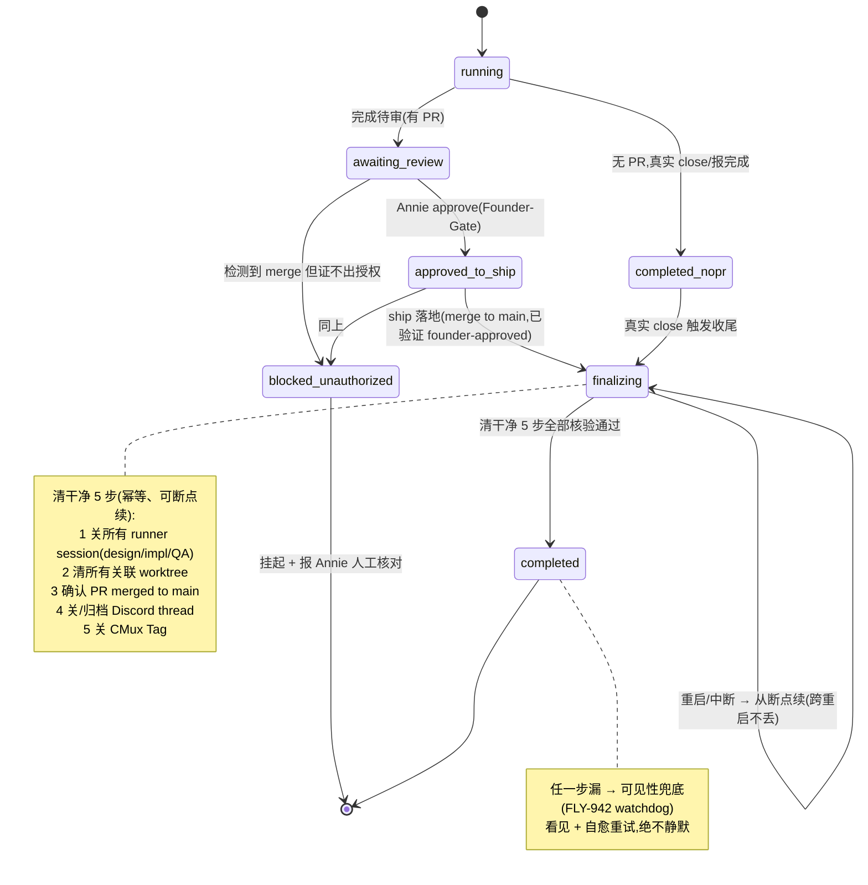
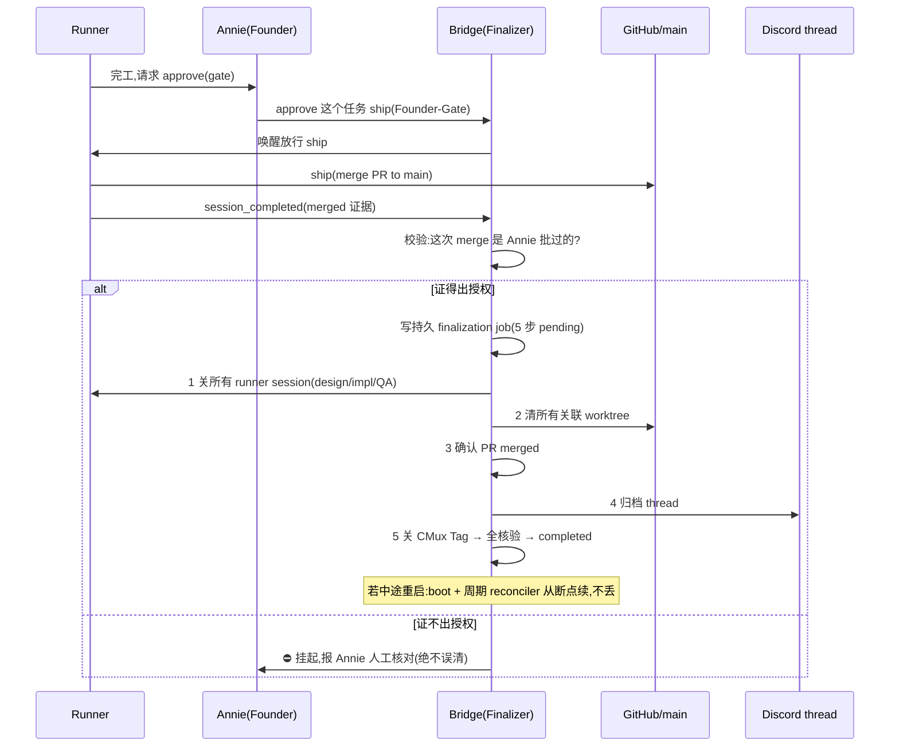

# FLY-978 完成后清理下线逻辑 / 解耦重启 — PRD（产品需求文档）

Issue: FLY-978 (https://linear.app/geoforge3d/issue/FLY-978/infrareliability-完成后的清理下线逻辑-解耦重启done-merge-清-runnerworktree)
日期: 2026-07-07
基于: exploration.md（现状调研）、decisions-log.md（Annie 拍板记录）

> 状态：draft（待 Honey Lemon codex design-review → Annie 最终 review）。本 PRD 只定**产品行为 +
> 机制**;具体 eng 设计与实现 = Tadashi。block 1 给 2-3 个实现方案供 Annie 挑;block 5 标『待定』。

---

## 1. 背景与问题

**这是 FLY-964「状态显示正确性」的头号根治,也是 Annie 最大的日常困扰:** 一件事做完了,但『桩没被
正确清、thread 没归档』→ ① session 桩还挂着显示成还在跑(ghost,如 FLY-970);② thread 越堆越多。

**Annie 的诊断(经代码核对,非常准):** 「done → 清 runner/worktree → 归档 thread」本该是自动级联,
但**中间耦合了一个『重启』步骤**;我们又很少为小改动重启整个系统 → 级联经常走不完 → 最后往往变成
Lead 手动 merge + 手动让 runner 下线。

**代码现状(exploration.md 详,三方独立核对):**

- **收尾其实早已实现,但不可靠。** FLY-638(#378)做了「done → 转 completed → 关 runner → 拆
  cmux/viewer → prune DB」;FLY-369(#304/#353)做了「close → archive」级联。它们不是没做。
- **不可靠的根因 = 收尾被绑在两个不该绑的时机上:**
  1. 唯一的事务性收尾管线 `runPostShipFinalization` 硬 gate 在「干净的 merge 完成事件」;一旦是手动 /
     GitHub 直接 merge 或缺证据,就落到限流的 external-merge sweeper 或**只在 Bridge 重启才跑的 boot-only
     兜底**(worktree Layer B、tab/viewer/CommDB reaper 等)。
  2. **更尖的杀手:Flywheel 自己 merge 完会顺手排一次重启(deploy == restart),那次重启反而会
     race / 打断正在收尾的清理**——`restart-services.sh` 自己承认那 2 次 0-sample 只是「stabilization
     window, NOT a completion barrier」;收尾的原子 claim 行可能已插入 → 重启后重放被丢弃 → **级联
     永不重跑 → 永久 ghost,现有任何 reconciler 都治不了。**
- **净结论:四大类资源(Terminal tab · viewer tmux · worktree · CommDB 桩)实际上只有靠 Bridge 重启
  才被回收;一个没发完成事件就死掉的 runner,根本没有 inline 翻状态的路。**

**978 的独门活(区别于 638/369):让收尾不依赖、也不被重启打断,且覆盖所有 merge 路径。**

---

## 2. 北极星 / 目标（Annie 拍板 = A）

**North Star = 『done 必清必归档、一次不漏』**(可靠不漏为目的,解耦重启为手段)。
**外加一层『残留可见性』兜底:** 万一真漏了,要能被**看见 + 自愈重试**,绝不静默 —— 这层由
**FLY-942 watchdog** 承接(978 只负责把「done 但未清干净」的信号喂给它,不在 978 重造检测)。

一句话验收:**每个 ship 落地的任务,清干净 5 步全绿、零 ghost;Annie 不再需要手动清桩 / 手动归档。**

---

## 3. Non-goals（本 PRD 不做）

- **不重造检测 / watchdog**:残留的检测 + 告警归 **FLY-942 / FLY-927 Watchdog v2**;978 只产出「未清干净」
  信号供其消费。
- **不改 merge / ship gate 的授权语义**:merge 仍 founder-gated(见 §6 gate 硬约束),978 不放宽授权。
- **不修显示 bug**:阶段线不翻(FLY-962)归 962;978 只保证「清干净后状态不再显示成还在跑」。
- **不在本 issue 真建 eng issue / 不 ship / 不清 / 不 merge / 不归档**:只出 PRD + 拆分方案。

---

## 4. 用户与场景

- **Annie(founder):** 最大受益人。今天她要人肉巡查 + 手动清桩 / 手动归档;目标后她只在 ship gate 点头,
  其余自动、可靠、看得见。
- **Leads:** 今天要手动 merge + 手动让 runner 下线;目标后 ship 落地即自动收尾,Lead 不再补手工活。
- **Runners:** 完成 → ship(经 gate)→ 自动被收尾,不再残留 ghost 桩 / 活 thread。

---

## 5. 需求 —— Block 1：清理级联解耦重启（核心）

### 5.1 行为契约

- **自动 ship = 唯一主路径。** 手动 / 直接在 GitHub 上 merge 当 **0.01% 边缘兜底**(能被收敛清理,或在
  证不出授权时挂起报 Annie,见 §6),不是常规路径。
- **ship 一落地(merge 到 main 且已验证 founder-approved)→ 当场可靠清干净(§7 五步)+ 跨重启不丢。**
  「跨重启不丢」= 无论 6h 常规重启还是 ad-hoc 手动重启在收尾中途发生,收尾都能从断点续、最终收敛到
  5 步全绿;绝不出现「claim 插了但被打断就永不重跑」。

### 5.2 三个实现方案（供 Annie 挑；eng 细节 = Tadashi）

> 都满足「落地即清 + 跨重启不丢 + 严格 Founder-Gate」;区别在 **稳健度 vs 改动量**。

**方案 1 —— 持久化收尾状态机（durable finalization state machine）【我推荐】**
把「收尾」变成一条**持久化任务**(每个任务一条),5 步各打**独立 checkpoint**、每步**幂等**。一个专门的
finalizer:① ship 落地事件上**当场**跑;② Bridge 启动时 + **每隔几分钟**周期重扫未完成的收尾,从「上次
做到哪步」**接着做**。
- 优:一次不漏最强;根治「claim 插了被打断永不重跑」;5 步状态天然可观测 → 直接喂可见性兜底(942)。
- 代价:改动最大(新持久 job 表 + finalizer + drain)。

**方案 2 —— 幂等重放 +『收尾未完成』marker（中量）**
保留现有 inline 收尾管线,但把「完成判据」从「claim 插入」改成「**5 步全部经独立核验为真**」。落地时写一个
持久 `finalization-pending` marker;一个 reconciler(**inline + 每分钟周期,不再 boot-only**)不断补跑缺失
的步、直到 marker 被核验清掉。
- 优:复用现有管线,改动中等;marker 天然抗重启。
- 代价:靠「核验」而非「断点」,极端交错下可能重复跑某步(幂等兜底)。

**方案 3 —— 重启加屏障 + 兜底去 boot 化（最小改动 / 偏补丁）**
deploy 侧把 idle-wait 从「session 数=0」改成「**真收到 finalization-done**」屏障;并把现在**只在 boot 跑**的
兜底(worktree Layer B / tab / viewer / CommDB reaper)改成**短周期**(heartbeat / GatePoller)跑。
- 优:改动最小、见效快。
- 代价:屏障有 5 分钟强制重启上限,极端下仍可能被打断;是硬化而非根治,「一次不漏」保证弱于方案 1/2。

**推荐:方案 1**(最贴「一次不漏」北极星);方案 2 可作中间态;方案 3 只作快速缓解 / 过渡。

---

## 6. 需求 —— Gate（硬约束）：严格 Founder-Gate

- **只有 Annie 明确 approve 某任务可 ship,才由 Runner/Lead 执行 ship + 清理。**
- **证不出授权就挂起报她 —— 绝不把没授权的 merge 当完成清掉 / 归档。** 判据复用现有
  `verifyApproval` / founder-attributed `{approved:true}` + `pr_head_sha` 精确匹配(见 exploration §4)。
- merge 门本身不变:产品 issue = Annie / Lead review;eng = ship gate。**merge 落地后**的清理 + 归档
  才自动补上、Annie 不用再点第二次。
- 手动 / GitHub merge 的边缘情形:能证得出这次 merge 是 Annie 批过的 → 自动收敛清理;证不出 → **挂起 +
  报 Annie 人工核对**(呼应现有 external-merge-reconcile 的 rogue-merge 告警语义)。

---

## 7. 需求 —— Block 4：清干净验收清单（5 条全满足，缺一不可）

一个任务「清干净」当且仅当以下 5 条**全部完成且可核验**:

1. **关该任务所有 runner session** —— 三段式 impl / design / QA 的 session 都要关(不是只关主 session)。
2. **清该任务所有关联 worktree** —— 一个不留。
   > ⚠️ 语义待 eng 核实:Annie 说『这三个 worktree』;代码里三段式常**共享一个** worktree。PRD 按真实机制
   > 写成「清掉该任务**所有**关联 worktree(1 个共享 or N 个 per-phase,取决于 three-stage keep-alive 配置)」,
   > 给 Tadashi 的 build issue 里点明这个歧义,别照字面锁死『恰好 3 个』。
3. **PR merged to main**(有 PR 的任务)。
4. **关 / 归档 Discord thread**。
5. **关 CMux Tag**(cmux window / tag)。

**没有 PR 的任务(QA / 文档 / 纯配置):** 触发清理绑**『真实的 close / 完成动作』**(显式 close 或 runner
报完成),**不**光凭 Linear 翻 Done 就归档(防止把还在讨论的 Done 线程误归档,呼应 FLY-962)。

---

## 8. 需求 —— Block 3：重启 = 独立、定时的事（与清理解耦）

- **Flywheel 主机(core):每 6h、且『有变更』才重启;保留 ad-hoc 手动重启。**
- **卫星机 / 普通项目:每日检测新 release**(有则上)。普通项目的清理**根本不等重启**(merge 落地当场清)。
- **核心不变量(硬):6h 常规 + ad-hoc 手动重启,都不能 race / 打断正在收尾的清理。** 清理做成
  durable / resumable,重启只用来换代码、绝不吃掉清理。
- **cross-ref 多机部署 PRD**(卫星机 / 主机拓扑、release 检测节奏在那边定;978 只约束「重启不 race 清理」)。

---

## 9. 状态机（session 生命周期 + 收尾）



---

## 10. 事件时序图（含重启durability）



---

## 11. 重启调度（与清理解耦，独立定时）

```mermaid
flowchart TD
    subgraph 重启 = 独立定时(与清理解耦)
      H[Flywheel 主机] --> H1[每 6h:有变更才重启]
      H --> H2[保留 ad-hoc 手动重启]
      S[卫星机/普通项目] --> S1[每日检测新 release,有则上]
    end
    H1 --> INV
    H2 --> INV
    INV[核心不变量:6h 常规 + ad-hoc 都不能 race/打断正在收尾的清理<br/>清理 durable/resumable,重启只换代码、不吃清理]
```

---

## 12. 验收标准（可衡量：done 必清必归档、一次不漏）

1. **每个 ship 落地的任务,清干净 5 步全部完成**,且各有审计事件可证(session closed / worktree removed /
   PR merged / thread archived / cmux closed 各一条)—— **零 ghost 残留**。
2. **重启不吃清理**:无论 6h 常规还是 ad-hoc 重启在收尾中途发生,没有一个任务的收尾被永久打断;重启后
   reconciler 能把未完成收尾补齐,收敛到 5 步全绿。
3. **覆盖所有 merge 路径**:自动 ship(主路径)+ 手动 / GitHub merge(边缘)都能被收敛清理,或在证不出授权
   时挂起报 Annie(不静默、不误清)。
4. **Founder-Gate 硬保证**:没有一个未授权的 merge 被当完成清掉 / 归档。
5. **可见性兜底**:万一漏,FLY-942 watchdog 在阈值内把它作为「done 但未清干净」暴露 + 自愈重试。
6. **体感度量**:一段时间内『ghost 残留数』趋 0;『Annie 手动清桩 / 手动归档次数』趋 0(= 困扰消失)。

---

## 13. Block 5：误归档护栏 —— 待定（Annie 未定，别写死）

『还在讨论的 Done issue 不该被急着归档』的护栏细节(阈值 / 是否要「无其它 active runner + 真 wrap-up」双条件 /
是否允许 Discord 自动 unarchive 兜底)**标为待定·Annie 未定**。现有机制已有 `no-other-active` + 「绑真实 close
而非 Linear-Done」的护栏(见 §7、FLY-369),978 先不改写、不写死;等 Annie 拍。

---

## 14. Open Questions（写 PRD 时浮出，待 review 收敛）

1. **block 1 方案**:方案 1 / 2 / 3 由 Annie 挑(我推荐 1)。
2. **worktree 数量语义**(§7 note):三段式共享 or per-phase,eng 核实后定「所有关联 worktree」的确切集合。
3. **block 5 误归档护栏**:待 Annie 定。
4. **可见性兜底与 942 的接口**:978 产出的「未清干净」信号的确切格式 / 落点,与 FLY-942 对齐。
5. **完成事件缺证据(evidence-gap)的收敛**:exploration §3.2 场景 1「完成时无 merge 证据」的 heal 路径,是否
   并入选定方案(方案 1/2 天然覆盖;方案 3 需额外补)。

---

## 15. 交接 —— Build-issue 拆分方案（给 Tadashi；先出方案，暂不 create）

> PRD 定稿(Annie 挑定 block-1 方案)后,再把下列拆成 eng issue(Flywheel 标签)交 Tadashi。

- **E1（block 1 核心）**:按选定方案实现「可续 / 跨重启不丢的 ship 收尾管线」—— 5 步幂等 + 断点续 + 覆盖所有
  merge 路径。根治 exploration §2.5 killer + §3.2 六类 ghost。扩展而非重造 FLY-638/369。
- **E2（block 3）**:重启解耦 + 独立定时 —— 主机 6h-有变更 + ad-hoc;卫星每日;落实「重启不 race 清理」不变量
  (deploy 屏障 / 清理 durable 二选一或并用,取决于 E1 方案)。cross-ref 多机部署 PRD。
- **E3（block 4）**:5 步清干净收口 —— 把 tab / viewer / CommDB / worktree 兜底从 boot-only 改成事件 + 短周期;
  统一「清干净」核验;没-PR 绑真实 close。
- **E4（gate）**:严格 Founder-Gate 收尾 —— 只在证得出 founder-approve 才清 + 归档,证不出挂起报 Annie(复用
  verifyApproval)。
- **E5（可见性兜底 → 归 FLY-942）**:「done 但未清干净」暴露 + 自愈,归 942 watchdog(cross-ref,不在 978 建)。
- **block 5 误归档护栏**:待 Annie 定后再拆。

**PM 验收 = 未来 FLY-830**(本 issue 不做)。

---

## 16. 关联 issue

FLY-964(状态显示正确性,978 是头号根治)· FLY-970(ghost 实例)· FLY-638(inline 收尾,已做但不可靠)·
FLY-369(close→archive 级联,已做)· FLY-942(watchdog / 可见性兜底 + 主动汇报)· FLY-975(watchdog 盲区)·
FLY-962(显示 bug + 误归档担忧,次要)· 多机部署 PRD(重启拓扑 cross-ref)。
