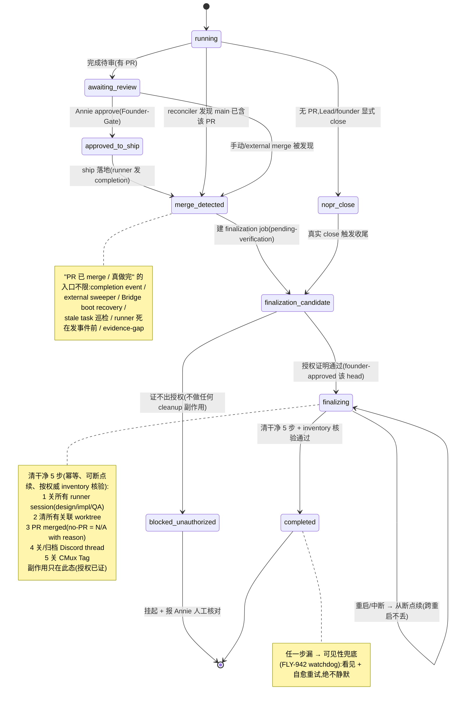
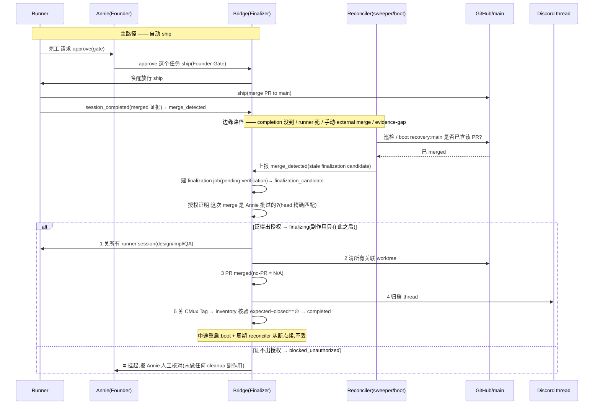
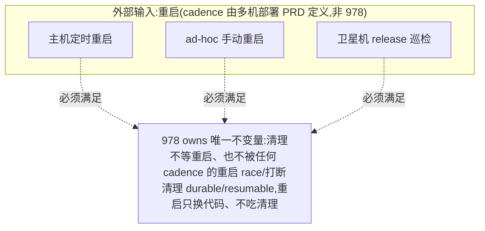

# FLY-978 完成后清理下线逻辑 / 解耦重启 — PRD（产品需求文档）

Issue: FLY-978 (https://linear.app/geoforge3d/issue/FLY-978/infrareliability-完成后的清理下线逻辑-解耦重启done-merge-清-runnerworktree)
日期: 2026-07-07
基于: exploration.md（现状调研）、decisions-log.md（Annie 拍板记录）

> 状态：draft（codex design-review R2 findings 已收 → 待 Honey Lemon 复跑 codex → Annie 最终 review）。
> 本 PRD 只定**产品行为 + 机制**;具体 eng 设计与实现 = Tadashi。block 1 给候选实现方案供 Annie 挑
> (方案 1/2 为候选,方案 3 仅 mitigation);block 5 标『待定』。

---

## 1. 背景与问题

**这是 FLY-964「状态显示正确性」的头号根治,也是 Annie 最大的日常困扰:** 一件事做完了,但『桩没被
正确清、thread 没归档』→ ① session 桩还挂着显示成还在跑(ghost,如 FLY-970);② thread 越堆越多。

**Annie 的诊断(经代码核对,非常准):** 「done → 清 runner/worktree → 归档 thread」本该是自动级联,
但**中间耦合了一个『重启』步骤**;我们又很少为小改动重启整个系统 → 级联经常走不完 → 最后往往变成
Lead 手动 merge + 手动让 runner 下线。

**代码现状(exploration.md 详,三方独立核对):**

- **收尾其实早已实现,但不可靠。** FLY-638(#378)做了「done → 转 completed → 关 runner → 拆
  cmux/viewer → prune DB」;FLY-369(#304/#353)做了「close → archive」级联。它们不是没做。
- **不可靠的根因 = 收尾被绑在两个不该绑的时机上:**
  1. 唯一的事务性收尾管线 `runPostShipFinalization` 硬 gate 在「干净的 merge 完成事件」;一旦是手动 /
     GitHub 直接 merge 或缺证据,就落到限流的 external-merge sweeper 或**只在 Bridge 重启才跑的 boot-only
     兜底**(worktree Layer B、tab/viewer/CommDB reaper 等)。
  2. **更尖的杀手:Flywheel 自己 merge 完会顺手排一次重启(deploy == restart),那次重启反而会
     race / 打断正在收尾的清理**——`restart-services.sh` 自己承认那 2 次 0-sample 只是「stabilization
     window, NOT a completion barrier」;收尾的原子 claim 行可能已插入 → 重启后重放被丢弃 → **级联
     永不重跑 → 永久 ghost,现有任何 reconciler 都治不了。**
- **净结论:四大类资源(Terminal tab · viewer tmux · worktree · CommDB 桩)实际上只有靠 Bridge 重启
  才被回收;一个没发完成事件就死掉的 runner,根本没有 inline 翻状态的路。**

**978 的独门活(区别于 638/369):让收尾不依赖、也不被重启打断,且覆盖所有 merge 路径。**

---

## 2. 北极星 / 目标（Annie 拍板 = A）

**North Star = 『done 必清必归档、一次不漏』**(可靠不漏为目的,解耦重启为手段)。
**外加一层『残留可见性』兜底:** 万一真漏了,要能被**看见 + 自愈重试**,绝不静默 —— 这层由
**FLY-942 watchdog** 承接(978 只负责把「done 但未清干净」的信号喂给它,不在 978 重造检测)。

一句话验收:**每个 ship 落地的任务,清干净 5 步全绿、零 ghost;Annie 不再需要手动清桩 / 手动归档。**

---

## 3. Non-goals（本 PRD 不做）

- **不重造检测 / watchdog**:残留的检测 + 告警归 **FLY-942 / FLY-927 Watchdog v2**;978 只产出「未清干净」
  信号供其消费。
- **不改 merge / ship gate 的授权语义**:merge 仍 founder-gated(见 §6 gate 硬约束),978 不放宽授权。
- **不修显示 bug**:阶段线不翻(FLY-962)归 962;978 只保证「清干净后状态不再显示成还在跑」。
- **不定义重启 cadence 的权威值**:重启频率 / 触发(主机节奏、卫星机 release 巡检、ad-hoc)是部署政策,
  归**多机部署 PRD**;978 只定义『重启与清理解耦』的不变量(§8),cadence 值 cross-ref,防两份 PRD drift。
- **不在本 issue 真建 eng issue / 不 ship / 不清 / 不 merge / 不归档**:只出 PRD + 拆分方案。

---

## 4. 用户与场景

- **Annie(founder):** 最大受益人。今天她要人肉巡查 + 手动清桩 / 手动归档;目标后她只在 ship gate 点头,
  其余自动、可靠、看得见。
- **Leads:** 今天要手动 merge + 手动让 runner 下线;目标后 ship 落地即自动收尾,Lead 不再补手工活。
- **Runners:** 完成 → ship(经 gate)→ 自动被收尾,不再残留 ghost 桩 / 活 thread。

---

## 5. 需求 —— Block 1：清理级联解耦重启（核心）

### 5.1 行为契约

- **自动 ship = 唯一主路径。** 手动 / 直接在 GitHub 上 merge 当 **0.01% 边缘兜底**(能被收敛清理,或在
  证不出授权时挂起报 Annie,见 §6),不是常规路径。
- **ship 一落地(merge 到 main 且已验证 founder-approved)→ 当场可靠清干净(§7 五步)+ 跨重启不丢。**
  「跨重启不丢」= 无论何种 cadence 的重启(定时 / ad-hoc)在收尾中途发生,收尾都能从断点续、最终收敛到
  5 步全绿;绝不出现「claim 插了但被打断就永不重跑」。(cadence 具体值见 §8 / 多机部署 PRD。)

### 5.2 三个实现方案（供 Annie 挑；eng 细节 = Tadashi）

> 都满足「落地即清 + 跨重启不丢 + 严格 Founder-Gate」;区别在 **稳健度 vs 改动量**。

**方案 1 —— 持久化收尾状态机（durable finalization state machine）【我推荐】**
把「收尾」变成一条**持久化任务**(每个任务一条),5 步各打**独立 checkpoint**、每步**幂等**。一个专门的
finalizer:① ship 落地事件上**当场**跑;② Bridge 启动时 + **每隔几分钟**周期重扫未完成的收尾,从「上次
做到哪步」**接着做**。
- 优:一次不漏最强;根治「claim 插了被打断永不重跑」;5 步状态天然可观测 → 直接喂可见性兜底(942)。
- 代价:改动最大(新持久 job 表 + finalizer + drain)。

**方案 2 —— 幂等重放 +『收尾未完成』marker（中量）**
保留现有 inline 收尾管线,但把「完成判据」从「claim 插入」改成「**5 步全部经独立核验为真**」。落地时写一个
持久 `finalization-pending` marker;一个 reconciler(**inline + 每分钟周期,不再 boot-only**)不断补跑缺失
的步、直到 marker 被核验清掉。
- 优:复用现有管线,改动中等;marker 天然抗重启。
- 代价:靠「核验」而非「断点」,极端交错下可能重复跑某步(幂等兜底)。

**方案 3 —— 重启加屏障 + 兜底去 boot 化（仅 mitigation / 过渡，不满足北极星）**
> ⚠️ **不与方案 1/2 同列为「满足北极星」的候选。** 它自己承认屏障有 **5 分钟强制重启上限、极端下仍可能被
> 打断**,因此**不满足『一次不漏』**;只作为快速缓解 / 过渡,或与方案 1/2 叠加。
deploy 侧把 idle-wait 从「session 数=0」改成「**真收到 finalization-done**」屏障;并把现在**只在 boot 跑**的
兜底(worktree Layer B / tab / viewer / CommDB reaper)改成**短周期**(heartbeat / GatePoller)跑。
- 优:改动最小、见效快。
- 代价:屏障有 5 分钟强制重启上限,极端下仍可能被打断 → **不满足『一次不漏』**。

**满足北极星的候选 = 方案 1 或 方案 2**(供 Annie 挑,我推荐**方案 1**);**方案 3 不是候选**,只作快速缓解 /
过渡 / 叠加。

---

## 6. 需求 —— Gate（硬约束）：严格 Founder-Gate

- **只有 Annie 明确 approve 某任务可 ship,才由 Runner/Lead 执行 ship + 清理。**
- **证不出授权就挂起报她 —— 绝不把没授权的 merge 当完成清掉 / 归档。** 判据复用现有
  `verifyApproval` / founder-attributed `{approved:true}` + `pr_head_sha` 精确匹配(见 exploration §4)。
- merge 门本身不变:产品 issue = Annie / Lead review;eng = ship gate。**merge 落地后**的清理 + 归档
  才自动补上、Annie 不用再点第二次。
- 手动 / GitHub merge 的边缘情形:能证得出这次 merge 是 Annie 批过的 → 自动收敛清理;证不出 → **挂起 +
  报 Annie 人工核对**(呼应现有 external-merge-reconcile 的 rogue-merge 告警语义)。
- **副作用顺序(硬,防重启误清):** finalization job 可以先建成 `blocked` / `pending-verification`,
  但**任何 cleanup 副作用(关 runner / 删 worktree / 归档 thread / 关 CMux)必须发生在授权证明通过之后**。
  **绝不允许「先入队做清理、后核验授权」**—— 否则重启在中途打断,可能把一次未授权的 merge 误清掉。
  (对应状态机:只有 `finalization_candidate` 通过授权证明进入 `finalizing` 后才有副作用。)

---

## 7. 需求 —— Block 4：清干净验收清单（5 条全满足，缺一不可）

**可测性前提 —— 权威资源清单(authoritative inventory):** 进入 `finalizing` 时,冻结(或可从持久记录重建)
一份该任务的**权威资源清单**:task id · PR id · 所有 phase / run session ids · worktree registry ·
**Discord thread(`discord_thread_id` / channel / message / archive target)** · CMux tag registry。
**验收判据 = expected set − closed set == ∅**(期望关闭集 减 已关闭集 为空)。**thread 必须进这份清单** ——
第 4 步要归档它、验收又是 expected−closed==∅,不列进来就只能证明「归档了我后来找到的 thread」、不能证明
「一个不漏」;确无 thread 时也要显式标 `not_applicable_with_reason` 或 `missing_inventory_blocked`,
**不能静默通过**。没有这份清单,只能证明「关了我看见的」、无法证明「一个不漏」,零 ghost 不可判定。

一个任务「清干净」当且仅当以下 5 条(按权威清单)**全部完成且可核验**:

1. **关该任务所有 runner session** —— 三段式 impl / design / QA 的 session 都要关(不是只关主 session)。
2. **清该任务所有关联 worktree** —— 一个不留。
   > ⚠️ 语义待 eng 核实:Annie 说『这三个 worktree』;代码里三段式常**共享一个** worktree。PRD 按真实机制
   > 写成「清掉该任务**所有**关联 worktree(1 个共享 or N 个 per-phase,取决于 three-stage keep-alive 配置)」,
   > 给 Tadashi 的 build issue 里点明这个歧义,别照字面锁死『恰好 3 个』。
3. **PR merged to main** —— **仅对有 PR 的任务**;`no_pr_task ⇒ pr_step = not_applicable_with_reason`
   (显式标 N/A + 理由,不计入「漏」,也不阻塞验收)。
4. **关 / 归档 Discord thread**。
5. **关 CMux Tag**(cmux window / tag)。

**没有 PR 的任务(QA / 文档 / 纯配置):** 触发清理绑**『真实的 close / 完成动作』**,**不**光凭 Linear 翻 Done
就归档(呼应 FLY-962)。**保守默认(close authority):no-PR 任务的 cleanup + 归档需要 Lead / founder 的
显式 close,不能光凭 runner self-report** —— 防止 runner 一自报完成就把还在讨论的东西清掉 / 归档。**此条与
block 5 误归档护栏同源**,待 Annie 正式定 block 5 时一并收口(§13)。

---

## 8. 需求 —— Block 3：重启与清理解耦（重启 = 外部输入；978 只保『不变量』）

**在 978 里,重启(regular 定时 + ad-hoc 手动)是一个『外部输入』—— 它的 cadence / 触发由『多机部署 PRD』
权威定义,978 不复述、不写死任何具体值。** 978 在本 block 唯一定义的是一个不变量:

- **不变量(硬):清理不等重启、也不被任何 cadence 的重启 race / 打断。** 无论重启因何触发、以何频率、何时
  发生(定时 / ad-hoc 都算),清理都做成 durable / resumable,重启只用来换代码,绝不吃掉正在收尾的清理。
- 推论:普通项目的清理**根本不等重启**(merge 落地当场清);Flywheel 主机的定时 / ad-hoc 重启也一样 ——
  收尾能从断点续、收敛到 5 步全绿。

**cadence 具体值 = cross-ref『多机部署 PRD』(尚未开),仅供参考、非 978 定义:** 主机 6h-变更才重启、卫星机
日巡 release、ad-hoc 手动重启。978 对这些**只提一个要求:任何一种都必须满足上面的不变量**;具体频率变了也
不影响 978(正是解耦的意义)。

---

## 9. 状态机（session 生命周期 + 收尾）

> 关键:**任何**能发现「PR 已 merge / 任务真做完」的入口(runner 完成事件、external sweeper、Bridge boot
> recovery、stale task 巡检、runner 死在发事件前、evidence-gap)都汇聚到同一个 `merge_detected` →
> `finalization_candidate` 入口,先过授权证明,再进 `finalizing`。这就是「覆盖所有 merge 路径」的落点。

---

## 10. 事件时序图（主路径 + reconciler 发现路径；含重启 durability）

---

## 11. 重启与清理解耦（978 owns 不变量；重启 = 外部输入，cadence 见多机部署 PRD）

> cadence 具体值 cross-ref『多机部署 PRD』(尚未开);978 不写死 cadence,只要求任何重启都满足上方不变量,
> 避免两份 PRD 各定义一遍 cadence 造成 drift。

---

## 12. 验收标准（可衡量：done 必清必归档、一次不漏）

1. **每个 ship 落地的任务,清干净 5 步全部完成**,以 §7 权威资源清单判定 **expected − closed == ∅**,且各步
   有审计事件可证(session closed / worktree removed / PR merged 或 N/A / thread archived / cmux closed)
   —— **零 ghost 残留、可判定**(不是「关了我看见的」,是「按权威清单一个不漏」)。
2. **重启不吃清理**:无论何种 cadence 的重启(定时 / ad-hoc)在收尾中途发生,没有一个任务的收尾被永久
   打断;重启后 reconciler 能把未完成收尾补齐,收敛到 5 步全绿。
3. **覆盖所有 merge 路径**:自动 ship(主路径)+ 手动 / GitHub merge / completion 事件没到 / runner 死在发事件
   前 / evidence-gap(边缘)都经 reconciler 汇聚到 `finalization_candidate` → 被收敛清理,或在证不出授权时
   挂起报 Annie(不静默、不误清)。
4. **Founder-Gate 硬保证**:没有一个未授权的 merge 被当完成清掉 / 归档。
5. **可见性兜底**:万一漏,FLY-942 watchdog 在阈值内把它作为「done 但未清干净」暴露 + 自愈重试。
6. **体感度量**:一段时间内『ghost 残留数』趋 0;『Annie 手动清桩 / 手动归档次数』趋 0(= 困扰消失)。

---

## 13. Block 5：误归档护栏 —— 待定（Annie 未定，别写死）

『还在讨论的 Done issue 不该被急着归档』的护栏细节(阈值 / 是否要「无其它 active runner + 真 wrap-up」双条件 /
是否允许 Discord 自动 unarchive 兜底)**标为待定·Annie 未定**。现有机制已有 `no-other-active` + 「绑真实 close
而非 Linear-Done」的护栏(见 §7、FLY-369),978 先不改写、不写死;等 Annie 拍。

---

## 14. Open Questions（写 PRD 时浮出，待 review 收敛）

1. **block 1 方案**:方案 1 / 2 由 Annie 挑(我推荐 1;方案 3 非候选,见 §5.2)。
2. **worktree 数量语义**(§7 note):三段式共享 or per-phase,eng 核实后定「所有关联 worktree」的确切集合。
3. **block 5 误归档护栏 + no-PR close authority**:待 Annie 定;§7 的「no-PR 需 Lead/founder 显式 close」是
   保守默认先兜着(§13)。
4. **可见性兜底与 942 的接口**:978 产出的「未清干净」信号的确切格式 / 落点,与 FLY-942 对齐。

> 注:原「完成事件缺证据(evidence-gap)的收敛」已不再是 open question —— 它现在是状态机(§9/§10)里
> 由 reconciler 汇聚到 `finalization_candidate` 的显式覆盖态,不再悬空(codex R2 blocker 2 已收)。

---

## 15. 交接 —— Build-issue 拆分方案（给 Tadashi；先出方案，暂不 create）

> PRD 定稿(Annie 挑定 block-1 方案)后,再把下列拆成 eng issue(Flywheel 标签)交 Tadashi。

- **E1（block 1 核心）**:按选定方案实现「可续 / 跨重启不丢的 ship 收尾管线」—— 5 步幂等 + 断点续 + 覆盖所有
  merge 路径。根治 exploration §2.5 killer + §3.2 六类 ghost。扩展而非重造 FLY-638/369。
- **E2（block 3）**:落实「重启与清理解耦」不变量 —— 无论何种 cadence 的重启都不 race / 打断清理。
  **durable / resumable finalization 是 mandatory(硬不变量靠它保);deploy 屏障只能作额外 mitigation,
  不得替代 durable finalization**(呼应 §5.2 —— 方案 3 非候选、只作过渡)。**重启 cadence 具体值归多机部署
  PRD,不在此 issue 定义**;cross-ref 之。
- **E3（block 4）**:5 步清干净收口 —— 把 tab / viewer / CommDB / worktree 兜底从 boot-only 改成事件 + 短周期;
  统一「清干净」核验;没-PR 绑真实 close。
- **E4（gate）**:严格 Founder-Gate 收尾 —— 只在证得出 founder-approve 才清 + 归档,证不出挂起报 Annie(复用
  verifyApproval)。
- **E5（可见性兜底 → 归 FLY-942）**:「done 但未清干净」暴露 + 自愈,归 942 watchdog(cross-ref,不在 978 建)。
- **block 5 误归档护栏**:待 Annie 定后再拆。

**PM 验收 = 未来 FLY-830**(本 issue 不做)。

---

## 16. 关联 issue

FLY-964(状态显示正确性,978 是头号根治)· FLY-970(ghost 实例)· FLY-638(inline 收尾,已做但不可靠)·
FLY-369(close→archive 级联,已做)· FLY-942(watchdog / 可见性兜底 + 主动汇报)· FLY-975(watchdog 盲区)·
FLY-962(显示 bug + 误归档担忧,次要)· 多机部署 PRD(重启拓扑 cross-ref)。
